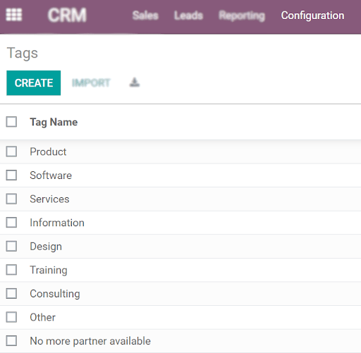
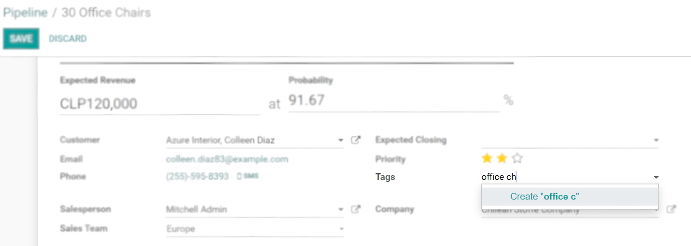
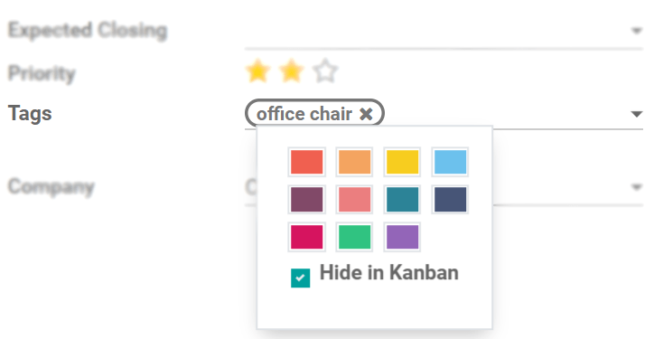
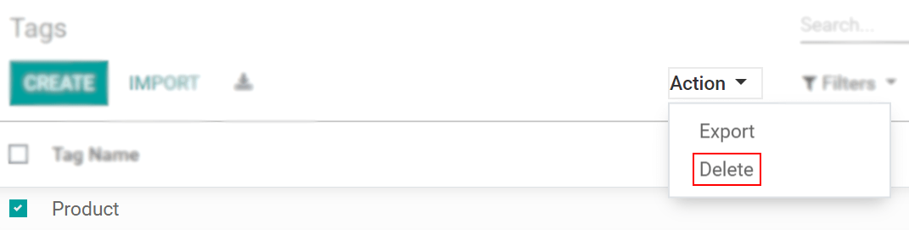
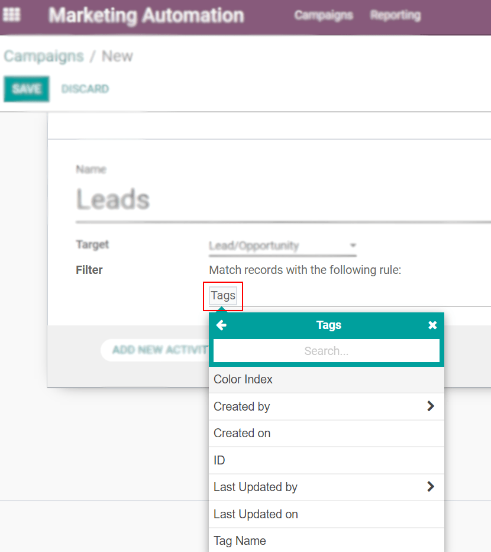
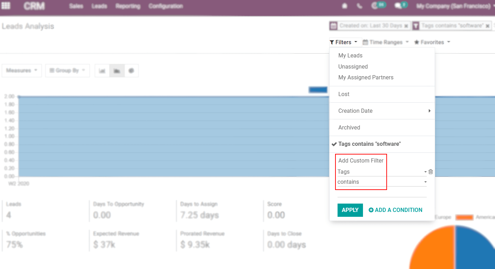

====
Tags
====

Tags work like keywords or labels that will help you to categorize your work, as well as make
objectives and goals clearer and available for everyone instantly. They are also a useful source of
filtering, helping you boost productivity.

Where can I use and how do I create tags?
=========================================

| Tags can be used in numerous applications going from *CRM*, *Project*, *Contacts*, *Marketing
  Automation*, etc.
| On *CRM* for instance, under :menuselection:`CRM --> Configuration --> Tags` you can create new or
  edit existing ones.

You can also create them on the fly.

Choose specific colors for each tag to help identify them, or *Hide in Kanban*, simply by
clicking on the tag once it is created.

Remove tags from a task or from the database
============================================

Click on the *x* to delete a tag from a specific task or contact. To delete it from your
database, go to :menuselection:`CRM --> Configuration --> Tags --> Action --> Delete`.

Use tags as a parameter
=======================

On the *Marketing Automation* application, for example, you can re-use tags as a parameter to
specify a niche of records for your campaign.

Use tags for reporting
======================

To get the information you need in an organized format and for a specific purpose, you can also
add tags.

