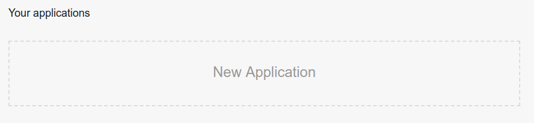
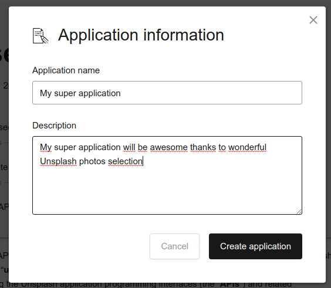
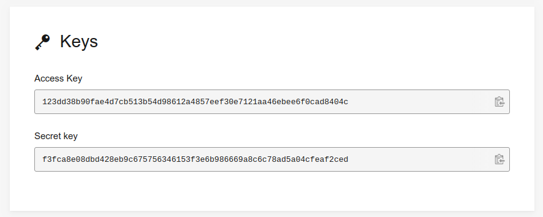

=======================================================
How to generate an Unsplash access key
=======================================================

.. tip::
  **As an SaaS user**, you are ready to use Unsplash. You won't need to follow this guide to set up Unsplash informations, since you will use our own Odoo Unsplash key in a transparent way.

Generate an Unsplash access key for **non-Saas** users
======================================================

- Create an account on `Unsplash.com <https://unsplash.com/join>`_.

- Go to your `applications dashboard <https://unsplash.com/oauth/applications>`_ and click on **New Application**.

- Accept the conditions and click on **Accept terms**.

.. image:: media/accept_terms.png
    :align: center

- You will be prompted to insert an **Application name** and a **Description**. Please prefix your application name by "**Odoo:** " so that Unsplash can recognize it as an Odoo instance. Once done, click on **Create application**.

- You should be redirected to your application details page. Scroll down a bit to find your **access key**.

.. warning::
  **As a non-SaaS user**, you won't be able to register for a production Unsplash key and will be limited to your test key that has a restriction of 50 Unsplash requests per hour.

.. seealso::
    * :doc:`unsplash_application_id`
