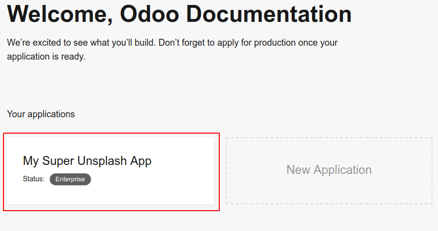
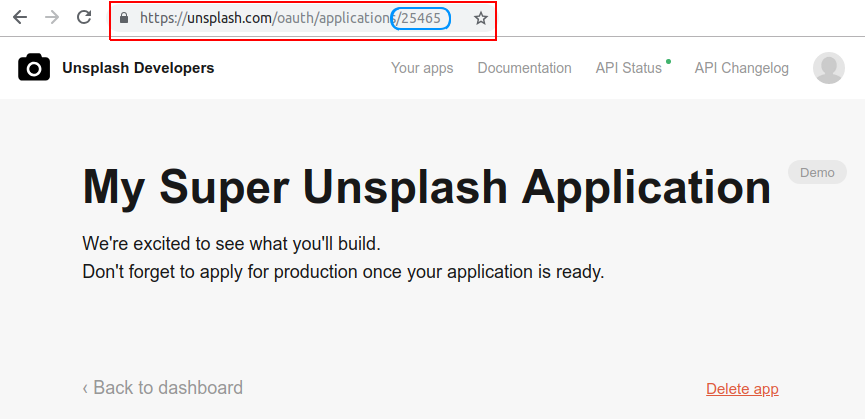

=======================================================
How to generate an Unsplash application ID
=======================================================

.. tip::
  You should first create and set up your Unsplash application with this tutorial: :doc:`unsplash_access_key`.

- Go to your `applications dashboard <https://unsplash.com/oauth/applications>`_ and click on your newly created Unsplash application under **Your applications**.

- You will be redirected to your application details page. The **application ID** will be visible in your browser's URL. The URL should be something like ``https://unsplash.com/oauth/applications/<application_id>``

.. warning::
  **As a non-SaaS user**, you won't be able to register for a production Unsplash key and will be limited to your test key that has a 50 Unsplash requests per hour restriction.
