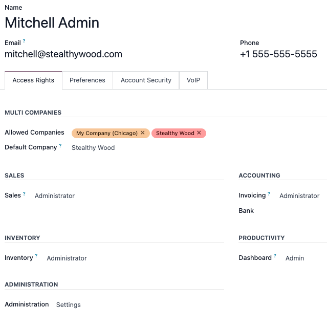
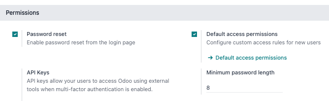
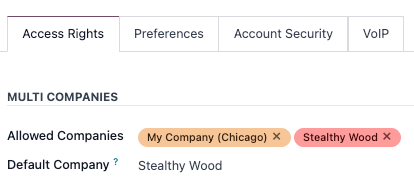

:show-content:

=====
Users
=====

Odoo defines a *user* as someone who has access to a database. An administrator can add as many
users as the company needs and, in order to restrict the type of information each user can access,
rules can be applied to each user. Users and access rights can be added and changed at any point.

.. seealso::
   - :doc:`users/language`
   - :doc:`users/access_rights`
   - :ref:`access-rights/superuser`
   - :ref:`access-rights/groups`

.. _users/add-individual:

Add individual users
====================

To add new users, navigate to :menuselection:`Settings app --> Users section --> Manage Users`, and
click on :guilabel:`New`.

Fill in the form with all the required information. Under the :doc:`Access Rights
<users/access_rights>` tab, choose the group within each application the user can have access to.

The list of applications shown is based on the applications installed on the database.

After filling out all the necessary fields on the page, manually :guilabel:`Save`. An invitation
email is automatically sent to the user, using the email in the :guilabel:`Email Address` field. The
user must click on the link included in the email to accept the invitation, and to create a database
login.

.. warning::
   If the company is on a monthly subscription plan, the database automatically updates to reflect
   the added users. If the company is on a yearly or multi-year plan, an expiration banner appears
   in the database. An upsell quotation can be created by clicking the banner to update the
   subscription. Alternatively, `send a support ticket <https://www.odoo.com/help>`_ to resolve the
   issue.

User type
---------

:guilabel:`User Type` can be selected from the :guilabel:`Access Rights` tab of the user form,
accessible via :menuselection:`Settings app --> Users section --> Manage Users`.

There are three types of users: :guilabel:`Internal User`, :guilabel:`Portal`, and
:guilabel:`Public`.

.. image:: users/user-type.png
   :align: center
   :alt: View of a user's form in developer mode emphasizing the user type field in Odoo.

.. tip::
   Users are considered internal database users. Portal users are external users, who only have
   access to the database portal to view records. See the documentation on :doc:`users/portal`.

   Public users are those visiting websites, via the website's frontend.

The :guilabel:`Portal` and :guilabel:`Public` user options do **not** allow the administrator to
choose access rights. These users have specific access rights pre-set (such as, record rules and
restricted menus), and usually do not belong to the usual Odoo groups.

.. _users/deactivate:

Deactivate users
================

To deactivate (i.e. archive) a user, navigate to :menuselection:`Settings app --> Users section -->
Manage Users`. Then, tick the checkbox to the left of the user(s) to be deactivated.

After selecting the appropriate user to be archived, click the :guilabel:`⚙️ Actions` icon, and
select :guilabel:`Archive` from the resulting drop-down menu. Then, click :guilabel:`OK` from the
:guilabel:`Confirmation` pop-up window that appears.

.. danger::
   **Never** deactivate the main/administrator user (admin). Making changes to admin users can have
   a detrimental impact on the database. This includes *impotent admin*, which means that no user in
   the database can make changes to the access rights. For this reason, Odoo recommends contacting
   an Odoo Business Analyst, or our Support Team, before making changes.

Error: too many users
---------------------

If there are more users in an Odoo database than provisioned in the Odoo Enterprise subscription,
the following message is displayed.

.. image:: users/add-more-users.png
   :align: center
   :alt: Too many users on a database error message.

When the message appears, the database administrator has 30 days to act before the database expires.
The countdown is updated every day.

To resolve the issue, either:

- Add more users to the subscription by clicking the :guilabel:`Upgrade your subscription` link
  displayed in the message to validate the upsell quotation, and pay for the extra users.
- :ref:`Deactivate users <users/deactivate>`, and reject the upsell quotation.

.. warning::
   If the company is on a monthly subscription plan, the database automatically updates to reflect
   the added users. If the company is on a yearly or multi-year plan, an expiration banner appears
   in the database. An upsell quotation can be created by clicking the banner to update the
   subscription. Alternatively, users can `send a support ticket <https://www.odoo.com/help>`_ to
   resolve the issue.

Once the database has the correct number of users, the expiration message disappears automatically
after a few days, when the next verification occurs.

.. _users/passwords-management:

Password management
===================

Password management is an important part of granting users autonomous access to the database at all
times. Odoo offers a few different methods to reset a user's password.

.. tip::
   Odoo has a setting to specify the length needed for a password. This setting can be accessed by
   navigating to :menuselection:`Settings app --> Permissions` section, and entering the desired
   password length in the :guilabel:`Minimum Password Length` field. By default the value is `8`.

.. _users/reset-password:

Reset password
--------------

Sometimes, users might wish to reset their personal password for added security, so they are the
only ones with access to the password. Odoo offers two different reset options: one initiated by the
user to reset the password, and another where the administrator triggers a reset.

.. _users/reset-password-login:

Enable password reset from login page
~~~~~~~~~~~~~~~~~~~~~~~~~~~~~~~~~~~~~

It is possible to enable/disable password resets directly from the login page. This action is
completed by the individual user, and this setting is enabled by default.

To change this setting, go to :menuselection:`Settings app --> Permissions` section, activate
:guilabel:`Password Reset`, and then click :guilabel:`Save`.

On the login page, click :guilabel:`Reset Password` to initiate the password reset process, and have
a reset-token sent to the email on file.

.. image:: users/password-reset.png
   :align: center
   :alt: Login screen on Odoo.com with the password reset option highlighted.

.. _users/reset-password-email:

Send reset instructions
~~~~~~~~~~~~~~~~~~~~~~~

Go to :menuselection:`Settings app --> Users & Companies --> Users`, select the user from the list,
and click on :guilabel:`Send Password Reset Instructions` on the user form. An email is
automatically sent to them with password reset instructions.

.. note::
   The :guilabel:`Send Password Reset Instructions` button **only** appears if the Odoo invitation
   email has already been confirmed by the user. Otherwise, a :guilabel:`Re-send Invitation Email`
   button appears.

This email contains all the instructions needed to reset the password, along with a link redirecting
the user to an Odoo login page.

.. image:: users/password-reset-email.png
   :align: center
   :alt: Example of an email with a password reset link for an Odoo account.

.. _users/change-password:

Change user password
--------------------

Go to :menuselection:`Settings app --> Users & Companies --> Users`, and select a user to access its
form. Click on the :guilabel:`⚙️ Actions` icon, and select :guilabel:`Change Password` from, the
resulting drop-down menu. Enter a new password in the :guilabel:`New Password` column of the
:guilabel:`Change Password` pop-up window that appears, and confirm the change by clicking
:guilabel:`Change Password`.

.. image:: users/change-password.png
   :align: center
   :alt: Change a user's password on Odoo.

.. note::
   This operation only modifies the password of the users locally, and does **not** affect their
   odoo.com account.

   If the odoo.com password needs to be changed, use the :ref:`send the password reset instructions
   <users/reset-password-email>`. Odoo.com passwords grant access to the *My Databases* page, and
   other portal features.

After clicking :guilabel:`Change Password`, the page is redirected to an Odoo login page where the
database can be re-accessed using the new password.

.. _users/multi-companies:

Multi Companies
===============

The :guilabel:`Multi Companies` field on a user form allows an administrator to provide access to
multiple companies for users. To configure a multi-company environment for a user, navigate to the
desired user by going to: :menuselection:`Settings app --> Users section --> Manage users`. Then,
select the user to open their user form, and configure with multi-company access.

Under :guilabel:`Multi Companies` in the :guilabel:`Access Rights` tab, set the fields labeled
:guilabel:`Allowed Companies` and :guilabel:`Default Company`.

The :guilabel:`Allowed Companies` field can contain multiple companies. These are the companies the
user can access and edit, according to the set access rights. The :guilabel:`Default Company` is the
company the user defaults to, upon logging in each time. This field can contain only **one**
company.

.. warning::
   If multi-company access is not configured correctly, it could lead to inconsistent multi-company
   behaviors. Because of this, only experienced Odoo users should make access rights changes to
   users for databases with a multi-company configuration. For technical explanations, refer to the
   developer documentation on :doc:`../../../developer/howtos/company`.

.. seealso::
   :doc:`companies`

.. toctree::
   :titlesonly:

   users/language
   users/2fa
   users/access_rights
   users/portal
   users/facebook
   users/google
   users/azure
   users/ldap
