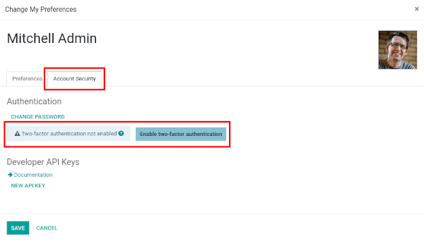
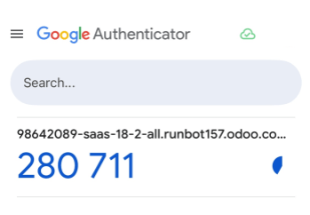

=========================
Two-factor Authentication
=========================

Two-factor authentication ("2FA") is a good way to improve the
security of an account, to make it less likely that an other person
will manage to log in instead of you.

Practically, it means storing a secret inside an *authenticator*
(usually your cell phone) and exchanging a code from the authenticator
when you try to log in.

This means an attacker needs *both* to have guessed (or found) your
password and to access (or steal) your authenticator, a more difficult
proposition than either one or the other.

Requirements
============

.. note:: These lists are just examples, they are not endorsements of
          any specific software.

If you don't already have one, you will need to choose an
authenticator.

Phone-based authenticators are the easiest and most common so we will
assume you'll pick and install one on your phone, examples include
`Authy <https://authy.com/>`_, `FreeOTP
<https://freeotp.github.io/>`_, `Google Authenticator
<https://support.google.com/accounts/answer/1066447?hl=en>`_,
`LastPass Authenticator <https://lastpass.com/auth/>`_, `Microsoft
Authenticator
<https://www.microsoft.com/en-gb/account/authenticator?cmp=h66ftb_42hbak>`_,
...; password managers also commonly include :abbr:`2FA (two-factor
authentication)` support e.g. `1Password
<https://support.1password.com/one-time-passwords/>`_, `Bitwarden
<https://bitwarden.com/help/article/authenticator-keys/>`_, ...

For the sake of demonstration we will be using Google Authenticator
(not because it is any good but because it is quite common).

Setting up two-factor authentication
====================================

Once you have your authenticator of choice, go to the Odoo instance
you want to setup :abbr:`2FA (two-factor authentication)`, then open
:guilabel:`Preferences` (or :guilabel:`My Profile`):

.. figure:: 2fa/preferences.png
    :align: center

Open the :guilabel:`Account Security` tab, then click the
:guilabel:`Enable two-factor authentication` button:

Because this is a security-sensitive action, you will need to input
your password:

.. figure:: 2fa/sec_enhanced.png
   :align: center

After which you will see this screen with a barcode:

.. figure:: 2fa/totp_scan.png
   :align: center

In most applications, you can simply *scan the barcode* via the
authenticator of your choice, the authenticator will then take care of
all the setup:

.. figure:: 2fa/scan_barcode.jpg
   :align: center

.. note::

   If you can not scan the screen (e.g. because you are doing this
   set-up on the same phone as the authenticator application), you can
   click the provided link, or copy the secret to manually set-up your
   authenticator:

   .. figure:: 2fa/secret_visible.png
      :align: center

   .. figure:: 2fa/input_secret.png
      :align: center

Once this is done, the authenticator should display a *verification
code* with some useful identifying information (e.g. the domain and
login for which the code is):

You can now input the code into the :guilabel:`Verification Code`
field, then click the :guilabel:`Enable two-factor authentication`
button.

Congratulation, your account is now protected by two-factor
authentication!

.. figure:: 2fa/totp_enabled.png
   :align: center

Logging in
==========

You should now :guilabel:`Log out` to follow along.

On the login page, input the username and password of the account for
which you set up :abbr:`2FA (two-factor authentication)`, rather than
immediately enter Odoo you will now get a second log-in screen:

.. figure:: 2fa/2fa_input.png
   :align: center

Get your authenticator, input the code it provides for the domain and
account, validate, and you're now in.

And that's it. From now on, unless you disable :abbr:`2FA (two-factor
authentication)` you will have a two-step log-in process rather than
the old one-step process.

.. danger:: Don't lose your authenticator, if you do, you will need an
            *Odoo Administrator* to disable :abbr:`2FA (two-factor
            authentication)` on the account.
