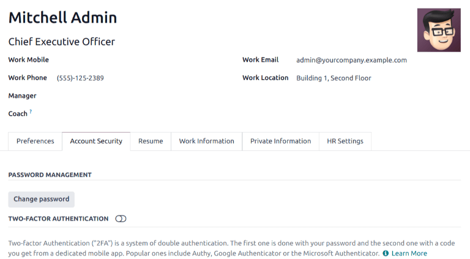
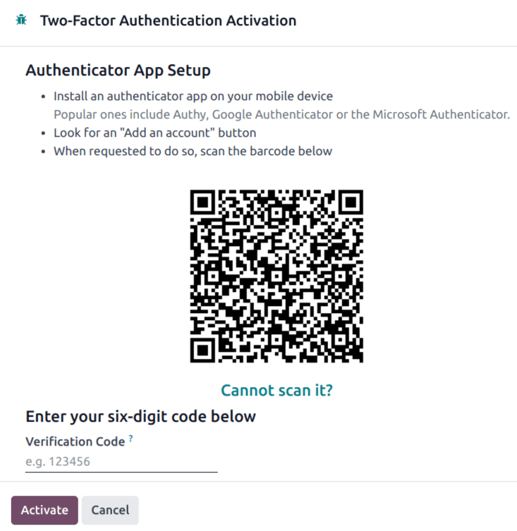
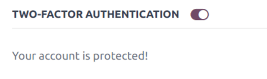
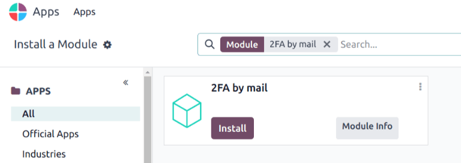
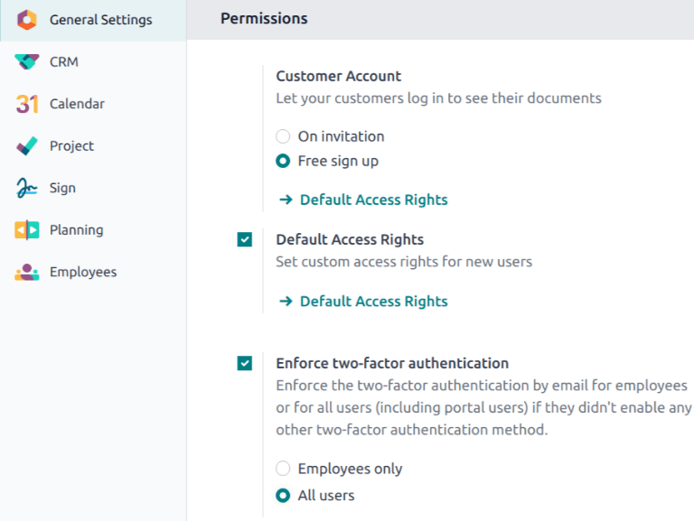

=========================
Two-factor authentication
=========================

.. |2fa| replace:: :abbr:`2FA (two-factor authentication)`
.. |QR| replace:: :abbr:`QR (Quick Response)` code

*Two-factor authentication (2FA)* is a way to improve security, and prevent unauthorized persons
from accessing user accounts.

Practically, |2fa| means storing a secret inside an *authenticator*, usually on a mobile phone, and
exchanging a code from the authenticator when trying to log in.

This means an unauthorized user would need to guess the account password *and* have access to the
authenticator, which is a more difficult proposition.

Requirements
============

.. important::
   These lists are just examples. They are **not** endorsements of any specific software.

Phone-based authenticators are the easiest and most commonly used. Examples include:

- `Authy <https://authy.com/>`_
- `FreeOTP <https://freeotp.github.io/>`_
- `Google Authenticator <https://support.google.com/accounts/answer/1066447?hl=en>`_
- `LastPass Authenticator <https://lastpass.com/auth/>`_
- `Microsoft Authenticator
  <https://www.microsoft.com/en-gb/account/authenticator?cmp=h66ftb_42hbak>`_

Password managers are another option. Common examples include:

- `1Password <https://support.1password.com/one-time-passwords/>`_
- `Bitwarden <https://bitwarden.com/help/article/authenticator-keys/>`_,

.. note::
   The remainder of this document uses Google Authenticator as an example, as it is one of the most
   commonly used. This is **not** an endorsement of the product.

Two-factor authentication setup
===============================

After selecting an authenticator, log in to Odoo, then click the profile avatar in the upper-right
corner, and select :guilabel:`My Profile` from the resulting drop-down menu.

Click the :guilabel:`Account Security` tab, then slide the :guilabel:`Two-Factor Authentication`
toggle to *active*.

This generates a :guilabel:`Security Control` pop-up window that requires password confirmation to
continue. Enter the appropriate password, then click :guilabel:`Confirm Password`. Next, a
:guilabel:`Two-Factor Authentication Activation` pop-up window appears, with a |QR|.

Using the desired authenticator application, scan the |QR| when prompted.

.. tip::
   If scanning the screen is not possible (e.g. the setup is being completed on the *same* device as
   the authenticator application), clicking the provided :guilabel:`Cannot scan it?` link, or
   copying the secret to manually set up the authenticator, is an alternative.

   .. figure:: 2fa/secret-visible.png
      :align: center

   .. figure:: 2fa/input-secret.png
      :align: center

Afterwards, the authenticator should display a *verification code*.

.. figure:: 2fa/authenticator.png
   :align: center

Enter the code into the :guilabel:`Verification Code` field, then click :guilabel:`Activate`.

Logging in
==========

To confirm |2fa| setup is complete, log out of Odoo.

On the login page, input the username and password, then click :guilabel:`Log in`. On the
:guilabel:`Two-factor Authentication` page, input the code provided by the chosen authenticator in
the :guilabel:`Authentication Code` field, then click :guilabel:`Log in`.

.. image:: 2fa/2fa-login.png
   :align: center
   :alt: The login page with 2fa enabled.

.. danger::
   If a user loses access to their authenticator, an administrator **must** deactivate |2fa| on the
   account before the user can log in.

Enforce two-factor authentication
=================================

To enforce the use of |2fa| for all users, first navigate to :menuselection:`Main Odoo Dashboard -->
Apps`. Remove the :guilabel:`Apps` filter from the :guilabel:`Search...` bar, then search for `2FA
by mail`.

Click :guilabel:`Install` on the Kanban card for the :guilabel:`2FA by mail` module.

After installation is complete, go to :guilabel:`Settings app: Permissions`. Tick the checkbox
labeled, :guilabel:`Enforce two-factor authentication`. Then, use the radio buttons to choose
whether to apply this setting to :guilabel:`Employees only`, or :guilabel:`All users`.

.. note::
   Selecting :guilabel:`All users` applies the setting to portal users, in addition to employees.

Click :guilabel:`Save` to commit any unsaved changes.
