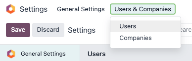
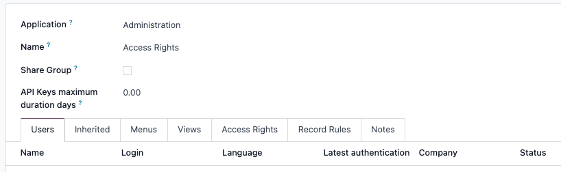

=============
Access rights
=============

*Access rights* are permissions that determine the content and applications users can access and
edit. In Odoo, these permissions can be set for individual users or for groups of users. Limiting
permissions to only those who need them ensures that users do not modify or delete anything they
should not have access to.

**Only** an *administrator* can change access rights.

.. danger::
   Making changes to access rights can have a detrimental impact on the database. This includes
   *impotent admin*, which means that no user in the database can make changes to the access rights.
   For this reason, Odoo recommends contacting an Odoo Business Analyst, or our Support Team, before
   making changes.

.. tip::
   A user **must** have the specific *Administration* access rights set on their user profile, in
   order to make changes on another user's settings for access rights.

   To access this setting, navigate to :menuselection:`Settings app --> Manage users --> select a
   user --> Access Rights tab --> Administration section --> Administration field`.

   Once at the setting, an already existing administrator **must** change the setting in the
   :guilabel:`Administration` field to :guilabel:`Access Rights`.

   Once complete, click :guilabel:`Save` to save the changes, and implement the user as an
   administrator.

Users
=====

The access rights for :ref:`individual users <users/add-individual>` are set when the user is added
to the database, but they can be adjusted at any point in the user's profile.

To make changes to a user's rights, click on the desired user to edit their profile.

On the user's profile page, in the :guilabel:`Access Rights` tab, scroll down to view the current
permissions.

For each app, use the drop-down menu to select what level of permission this user should have. The
options vary for each section, yet the most common are: :guilabel:`Blank/None`, :guilabel:`User: Own
Documents`, :guilabel:`User: All Documents`, or :guilabel:`Administrator`.

The :guilabel:`Administration` field in the :guilabel:`Access Rights` tab has the following options:
:guilabel:`Settings` or :guilabel:`Access Rights`.

.. image:: access_rights/user-permissions-dropdown-menu.png
   :alt: The Sales apps drop-down menu to set the user's level of permissions.

.. _access-rights/groups:

Create and modify groups
========================

*Groups* are app-specific sets of permissions that are used to manage common access rights for a
large amount of users. Administrators can modify the existing groups in Odoo, or create new ones to
define rules for models within an application.

To access groups, first activate Odoo's :ref:`developer mode <developer-mode>`, then go to
:menuselection:`Settings app --> Users & Companies --> Groups`.

.. image:: access_rights/click-users-and-companies.png
   :alt: Groups menu in the Users & Companies section of the Settings app of Odoo.

To create a new group from the :guilabel:`Groups` page, click :guilabel:`Create`. Then, from the
blank group form, select an :guilabel:`Application`, and complete the group form (detailed below).

To modify existing groups, click on an existing group from the list displayed on the
:guilabel:`Groups` page, and edit the contents of the form.

Enter a :guilabel:`Name` for the group and tick the checkbox next to :guilabel:`Share Group`, if
this group was created to set access rights for sharing data with some users.

.. important::
   Always test the settings being changed to ensure they are being applied to the correct users.

The group form contains multiple tabs for managing all elements of the group. In each tab, click
:guilabel:`Add a line` to add a new row for users or rules, and click the :icon:`fa-times`
:guilabel:`(cancel)` icon to remove a row.

- :guilabel:`Users` tab: lists the current users in the group. Users listed in black have
  administrative rights. Users without administrative access appear in blue. Click :guilabel:`Add a
  line` to add users to this group.
- :guilabel:`Inherited` tab: Inherited means that users added to this group are automatically added
  to the groups listed on this tab. Click :guilabel:`Add a line` to add inherited groups.

  .. example::
     For example, if the group *Sales/Administrator* lists the group *Website/Restricted Editor* in
     its :guilabel:`Inherited` tab, then any users added to the *Sales/Administrator* group
     automatically receive access to the *Website/Restricted Editor* group, as well.

- :guilabel:`Menus` tab: defines which models the group can have access to. Click
  :guilabel:`Add a line` to add a specific menu.
- :guilabel:`Views` tab: lists which views in Odoo the group has access to. Click :guilabel:`Add a
  line` to add a view to the group.
- :guilabel:`Access Rights` tab: lists the first level of rights (models) that this group has. The
  :guilabel:`Name` column represents the name for the current group's access to the model
  selected in the :guilabel:`Model` column.

  To link a new access right to a group, click :guilabel:`Add a line`. Select the appropriate model
  from the :guilabel:`Model` drop-down, then enter a name for the access right in the
  :guilabel:`Name` column. For each model, enable the following options as appropriate:

  - :guilabel:`Read`: Users can see the object's existing values.
  - :guilabel:`Write`: Users can edit the object's existing values.
  - :guilabel:`Create`: Users can create new values for the object.
  - :guilabel:`Delete`: Users can delete values for the object.

  .. tip::
     While there are no conventions for naming access rights, it is advisable to choose a name that
     identifies its purpose.

     For example, the access that purchase managers have to the :guilabel:`Contact` model could be
     named `res.partner.purchase.manager`. This consists of the technical name of the model,
     followed by a name identifying the group of users in question.

     .. image:: access_rights/name-field.png
        :alt: Name of access rights to a model.

     To find the model's technical name from the current view, first enter a placeholder text
     in the :guilabel:`Name` field, then click the :guilabel:`Model` name, then the
     :icon:`fa-arrow-right` :guilabel:`(Internal link)` icon.

- :guilabel:`Record Rules`: lists the second layer of editing and visibility rights.
  :guilabel:`Record Rules` overwrite, or refine, the group's access rights. Click :guilabel:`Add a
  line` to add a record rule to this group. For each rule, choose values for the following options:

  - :guilabel:`Apply for Read`.
  - :guilabel:`Apply for Write`.
  - :guilabel:`Apply for Create`.
  - :guilabel:`Apply for Delete`.

  .. important::
     Record rules are written using a *domain*, or conditions that filter data. A domain expression
     is a list of such conditions. For example:

     `[('mrp_production_ids', 'in', user.partner_id.commercial_partner_id.production_ids.ids)]`

     This record rule is to enable MRP consumption warnings for subcontractors.

     Odoo has a library of preconfigured record rules for ease of use. Users without knowledge of
     domains (and domain expressions) should consult an Odoo Business Analyst, or the Odoo Support
     Team, before making changes.

.. _access-rights/superuser:

Superuser mode
==============

*Superuser mode* allows the user to bypass record rules and access rights. To activate *Superuser
mode*, first, activate :ref:`developer mode <developer-mode>`. Then, navigate to the *debug* menu,
represented by a :icon:`fa-bug` :guilabel:`(debug)` icon, located in the top banner.

Finally, towards the bottom of the menu, click :guilabel:`Become Superuser`.

.. important::
   Only users with *Settings* access for the *Administration* section of the *Access Rights* (in
   their user profile) are allowed to log in to *Superuser mode*.

.. danger::
   *Superuser mode* allows for circumvention of record rules and access rights, and therefore,
   should be exercised with extreme caution.

   Upon exiting *Superuser mode*, users may be locked out of the database, due to changes that were
   made. This can cause *impotent admin*, or an administrator without the ability to change access
   rights/settings.

   In this case contact Odoo Support here: `new help ticket <https://www.odoo.com/help>`_. The
   support team is able to restore access using a support login.

To leave *Superuser mode*, log out of the account, by navigating to the upper-right corner, and
clicking on the :guilabel:`OdooBot` username. Then, select the :guilabel:`Log out` option.

.. tip::
   An alternative way to activate *Superuser mode* is to login as a superuser. To do that, navigate
   to the login screen, and enter the appropriate :guilabel:`Email` and :guilabel:`Password`.

   Instead of clicking :guilabel:`Login`, click :guilabel:`Log in as superuser`.
