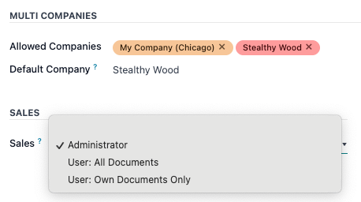
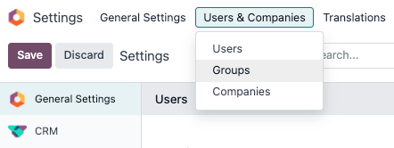

=============
Access Rights
=============

Access rights are permissions that determine what content/applications users can access and edit. In
Odoo, these permissions can be set for individual users or for groups of users. Limiting permissions
to only those who need them ensures that users do not modify or delete anything they should not have
access to. Additionally, only an *administrator* can change access rights.

.. important::
   Making changes to access rights can have a big impact on the database. For this reason, Odoo
   recommends contacting an Odoo Business Analyst or our Support Team before making changes.

Users
=====

The :ref:`Access Rights <users/add-individual>` for individual users are set when the user is added
to the database, but they can be adjusted at any point in the user's profile.

To make changes to a user's rights, first activate Odoo's :ref:`developer mode <developer-mode>`,
then go to :menuselection:`Settings --> Users & Companies --> Users`. Click on the user to edit.

.. image:: access_rights/navigate-to-users-menu.png
   :align: center
   :alt: In developer mode, go to the settings page and click Users and Companies, then Users.

At the user's profile page, click on the :guilabel:`Access Rights` tab and scroll down to view the
current permissions. For each app, use the dropdown to select what level of permission this user
should have (*Blank/None*, *User: Own Documents*, *User: All Documents*, or *Administrator*).

Creating and modifying groups
=============================

Groups are app-specific sets of permissions that are used to manage common access rights for a large
amount of users. Administrators can modify the existing groups in Odoo or create new ones to define
rules to models within an application.

To access groups, first activate Odoo's :ref:`developer mode <developer-mode>`, then go to
:menuselection:`Settings --> Users & Companies --> Groups`.

To create a new group, click :guilabel:`NEW`, select an application, and complete the New Group form
(detailed below). To modify existing groups, click on a group and edit the contents of the form.

.. important::
   Always test the settings being changed to ensure they are being applied to the correct users.

The group form contains multiple tabs for managing all elements of the group. In each tab, click
:guilabel:`Add a line` to add a new row for users or rules, and click the :guilabel:`X` icon to
remove a row.

.. image:: access_rights/groups-form.png
   :align: center
   :alt: Click each tab in the groups form to modify the settings of the group.

- **Users Tab**: Lists the current users in the group, users listed in black have administrative
  rights.
- **Inherited Tab**: Inherited means that users added to this group are automatically added to the
  ones listed on this tab. For example: If the group *Sales/Administrator* lists the group
  *Website/Restricted Editor* in its Inherited tab, then any users added to the
  *Sales/Administrator* group automatically receive access to the *Website/Restricted Editor* group
  as well.
- **Menus Tab**: Defines which menus/models the group can have access to.
- **Access Rights Tab**: Lists the first level of rights (models) that this group has access rights
  to. In this tab, the *Model* column represents the common name of the menu/model, and the *Name*
  column represents the technical name given to the model. For each model, enable the following
  options as appropriate:

  - :guilabel:`Read`: Users can see the object's existing values.
  - :guilabel:`Write`: Users can edit the object's existing values.
  - :guilabel:`Create`: Users can create new values for the object.
  - :guilabel:`Delete`: Users can delete values for the object.
- **Record Rules**: Lists the second layer of editing and visibility rights. Record Rules overwrite,
  or refine, the group's *Access Rights*. For each rule, choose values for the following options:

  - :guilabel:`Apply for Read`.
  - :guilabel:`Apply for Write`.
  - :guilabel:`Apply for Create`.
  - :guilabel:`Apply for Delete`.

.. important::
   Record rules are written using a *Domain*, or conditions that filter data. A domain expression is
   a list of such conditions. Users without knowledge of domains and domain expressions should
   consult an Odoo Business Analyst or our Support Team before making changes.
