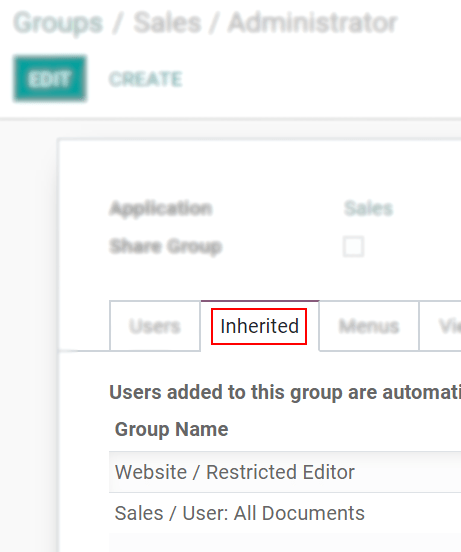

=============
Access Rights
=============

Activate the :ref:`developer mode <developer-mode>`, then go to :menuselection:`Settings --> Users &
Companies --> Groups`.

Groups
======

| When choosing the groups the user can have access under
  :ref:`Access Rights <users/add-individual>`, details of the rules and inheritances of that group
  are not shown, so this is when the menu *Groups* comes along. *Groups* are created to define rules
  to models within an application.
| Under *Users*, have a list of the current ones. The ones with administrative rights are shown
  in black.

*Inherited* means that users added to this application group are automatically added to the
following ones. In the example below, users who have access to the group *Administrator* of *Sales*
also have access to *Website/Restricted Editor* and *Sales/User: All Documents*.

.. important::
   Remember to always test the settings being changed in order to ensure that they are being applied
   to the needed and right users.

The *Menus* tab is where you define which menus (models) the user can have access to.

.. image:: access_rights/groups-menus.png
   :align: center
   :height: 330
   :alt: View of a group’s form emphasizing the tab menus in Odoo

*Access Rights* rules are the first level of rights. The field is composed of the object name, which
is the technical name given to a model. For each model, enable the following options as appropriate:

- *Read*: the values of that object can be only seen by the user.
- *Write*: the values of that object can be edited by the user.
- *Create*: values for that object can be created by the user.
- *Delete*: the values of that object can be deleted by the user.

.. image:: access_rights/groups-access-rights.png
   :align: center
   :alt: View of a group’s form emphasizing the tab access rights in Odoo

| As a second layer of editing and visibility rules, *Record Rules* can be formed. They overwrite,
  or refine, the *Access Rights*.
| A record rule is written using a *Domain*. Domains are conditions used to filter or searching
  data. Therefore, a domain expression is a list of conditions. For each rule, choose among the
  following options: *Read*, *Write*, *Create* and *Delete* values.

.. important::
   Making changes in access rights can have a big impact on the database. For this reason, we
   recommend you to contact your Odoo Business Analyst or our Support Team, unless you have
   knowledge about Domains in Odoo.
