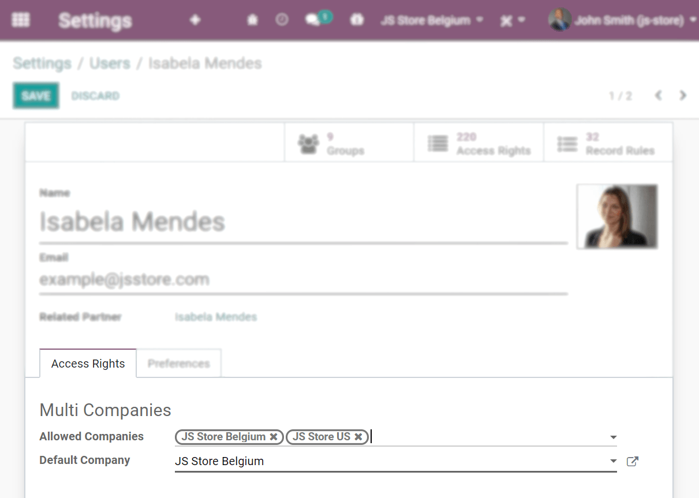

=========
Companies
=========

A centralized management environment allows you to select multiple companies simultaneously and set
their specific warehouses, customers, equipment, and contacts. It provides you the ability to
generate reports of aggregated figures without switching interfaces, which facilitates daily tasks
and the overall management process.

.. _companies/manage:

Manage companies and records
============================

Go to :menuselection:`Settings --> Manage Companies` and fill in the form with your company’s
information. If a *Parent Company* is selected, records are shared between the two companies (as
long as both environments are active).

.. image:: companies/create_js_store_us.png
   :align: center
   :alt: Overview of a new company's form in Odoo

.. tip::
   Activate the :ref:`developer mode <developer-mode>` to choose a *Favicon* for each of your
   companies, and easily identify them by the browser tabs. Set your favicons’ files size to 16x16
   or 32x32 pixels. JPG, PNG, GIF, and ICO are extensions accepted.

   .. image:: companies/favicon.png
      :align: center
      :height: 200
      :alt: View of a web browser and the favicon for a specific company chosen in Odoo

Switch between or select multiple companies by enabling their selection boxes to activate them. The
grayed company is the one which environment is in use. To switch environments, click on the
company’s name. In the example below, the user has access to three companies, two are activated, and
the environment in use is of *JS Store US*.

.. image:: companies/multi_companies_menu_dashboard.png
   :align: center
   :alt: View of the companies menu through the main dashboard in Odoo

Data such as Products, Contacts, and Equipment can be shared or set to be shown for a specific
company only. To do so, on their forms, choose between:

- *A blank field*: the record is shared within all companies.
- *Adding a company*: the record is visible to users logged in to that specific company.

.. image:: companies/product_form_company.png
   :align: center
   :alt: View of a product's form emphasizing the company field in Odoo Sales

Employees' access
=================

Once companies are created, manage your employees' :doc:`Access Rights <access_rights>`
for *Multi Companies*.

         in Odoo

| If a user has multiple companies *activated* on his database, and he is **editing** a record,
  the editing happens on the record's related company.
| Example: if editing a sale order issued under JS Store US while working on the JS Store Belgium
  environment, the changes are applied under JS Store US (the company from which the sale order
  was issued).
| When **creating** a record, the company taken into account is:

- The current company (the one active) or,
- No company is set (on products and contacts’ forms for example) or,
- The company set is the one linked to the document (the same as if a record is being edited).

Documents’ format
=================

To set documents' formats according to each company, *activate* and *select* the respective one and,
under *Settings*, click on *Configure Document Layout*.

.. image:: companies/document_layout.png
   :align: center
   :alt: View of the settings page emphasizing the document layout field in Odoo

Inter-Company Transactions
==========================

First, make sure each one of your companies is properly set in relation to:

- :doc:`Chart of Accounts <../../finance/accounting/get_started/chart_of_accounts>`
- :doc:`Taxes <../../finance/accounting/taxes>`
- :doc:`Fiscal Positions <../../finance/accounting/taxes/fiscal_positions>`
- :doc:`Journals <../../finance/accounting/bank>`
- :doc:`Fiscal Localizations <../../finance/fiscal_localizations>`
- :doc:`Pricelists <../../sales/sales/products_prices/prices/pricing>`

Now, activate the *Inter-Company Transactions* option under *Settings*. With the respective company
*activated* and *selected*, choose if you would like operations between companies to be synchronized
at an invoice/bills level or at a sales/purchase orders level.

- **Synchronize invoice/bills**: generates a bill/invoice when a company confirms a bill/invoice for
  the selected company.

  *Example:* an invoice posted on JS Store Belgium, for JS Store US, automatically creates a vendor
  bill on the JS Store US, from the JS Store Belgium.

.. image:: companies/invoice_inter_company.png
   :align: center
   :alt: View of an invoice for JS Store US created on JS Store Belgium in Odoo

- **Synchronize sales/purchase order**: generates a drafted purchase/sales order using the selected
  company warehouse when a sales/purchase order is confirmed for the selected company. If instead of
  a drafted purchase/sales order you rather have it validated, enable *Automatic Validation*.

  *Example:* when a sale order for JS Store US is confirmed on JS Store Belgium, a purchase order
  on JS Store Belgium is automatically created (and confirmed if the *Automatic Validation* feature
  was enabled).

.. image:: companies/purchase_order_inter_company.png
   :align: center
   :alt: View of the purchase created on JS Store US from JS Store Belgium in Odoo

.. note::
   Products have to be configured as *Can be sold* and must be shared between the companies.

.. tip::
   Remember to test all workflows as an user other than the administrator.

.. seealso::
   - :doc:`Multi-company Guidelines </developer/howtos/company>`
   - :doc:`../../finance/accounting/get_started/multi_currency`
