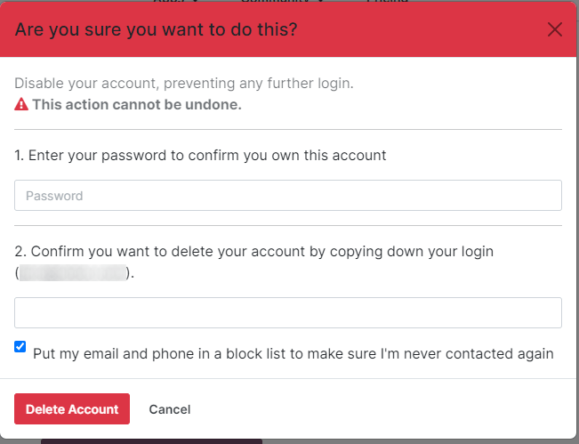

============================
Deleting an Odoo.com Account
============================

To delete your Odoo.com account, access the delete option by clicking on the user icon. The delete
option can be accessed by going to :menuselection:`My Account --> Edit Security Settings --> Delete
Account`. It can also be accessed by going to https://www.odoo.com/my/home.

.. danger::
   Deleting an Odoo account is irreversible. Take caution when performing this action as the
   Odoo.com account will not be retrievable.

Upon clicking the :guilabel:`Delete Account` button, a pop-up window will appear, asking you to
confirm the account deletion.

Confirm the deletion by entering the :guilabel:`password` and the :guilabel:`login` for the account
being deleted. Click the :guilabel:`Delete Account` button to confirm the deletion.
