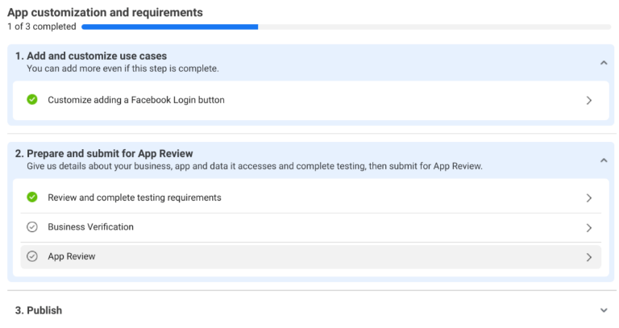
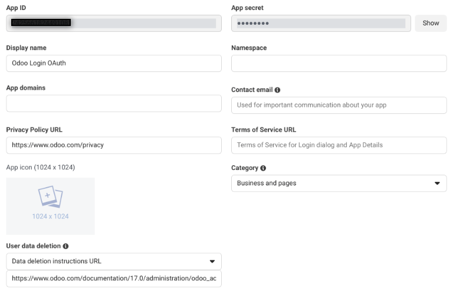
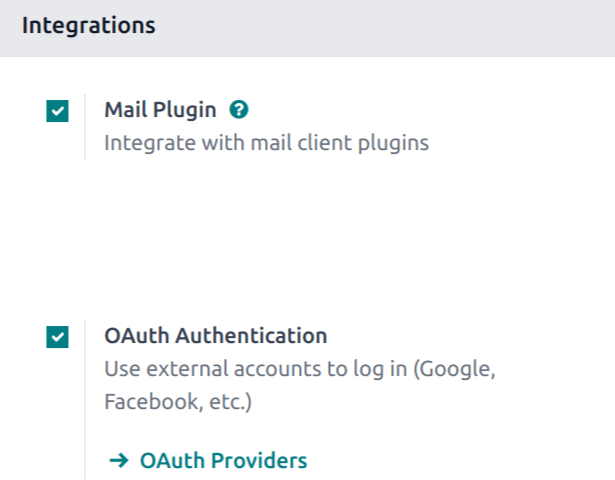
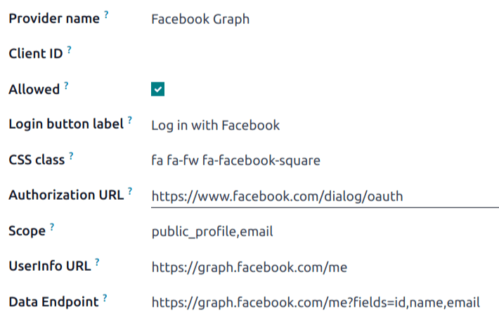

===============================
Facebook sign-in authentication
===============================

The *Facebook* OAuth sign-in function allows Odoo users to sign in to their database with their
Facebook account.

.. danger::
   Databases housed on Odoo.com should **not** use OAuth login for the owner or administrator of the
   database, as it would unlink the database from their Odoo.com account. If OAuth is setup for
   that user, the database can no longer be duplicated, renamed, or otherwise managed from the
   Odoo.com portal.

Meta for Developers setup
=========================

Go to `Meta for Developers <https://developers.facebook.com/>`_ and log in. Click :guilabel:`My
Apps`. On the :guilabel:`Apps` page, click :guilabel:`Create App`.

On the :guilabel:`Use cases` page, select :guilabel:`Authenticate and request data from users with
Facebook Login`, then click :guilabel:`Next`.

In the :guilabel:`Add an app name` field, enter `Odoo Login OAuth`, or a similar title.

.. note::
   The :guilabel:`App contact email` automatically defaults to the email address associated with the
   Meta account. If this email address is not regularly monitored, it may be wise to use another
   email address.

Click :guilabel:`Next`. Review the :guilabel:`Publishing requirements`, the :guilabel:`Meta
Platform Terms`, and :guilabel:`Developer Policies`. Then, click :guilabel:`Create app`.

.. important::
   Clicking :guilabel:`Create app` may require password re-entry.

Customize app
-------------

After the new app is created, the :guilabel:`Dashboard` page appears, with a list of steps to be
completed before the app can be published. From here, click :guilabel:`Customize adding a Facebook
Login button`.

On the :guilabel:`Customize` page, click :guilabel:`Settings`.

In the :guilabel:`Valid OAuth Redirect URIs` field, enter `https://<odoo base
url>/auth_oauth/signin`, replacing `<odoo base url>` with the URL of the applicable database.

.. example::
   If a database has the URL `https://example.odoo.com`, the URL
   `https://example.odoo.com/auth_oauth/signin` would be entered in the :guilabel:`Valid OAuth
   Redirect URIs` field.

Click :guilabel:`Save changes` when finished.

Configure settings
------------------

At the far left of the page, click :menuselection:`App settings --> Basic`. This page contains
additional settings that are required before the app can be submitted for approval.

In the :guilabel:`Privacy Policy URL` field, enter `https://www.odoo.com/privacy`.

.. note::
   `<https://www.odoo.com/privacy>`_ is the default privacy policy for databases hosted on Odoo.com.

Click the :guilabel:`App Icon` field to open a file upload window. From here, select and upload an
app icon.

In the :guilabel:`User data deletion` field, enter
`https://www.odoo.com/documentation/17.0/administration/odoo_accounts.html`.

.. note::
   This document provides instructions on how a user can delete their Odoo account.

Lastly, click the :guilabel:`Category` field, and select :guilabel:`Business and pages` from the
drop-down menu.

Click :guilabel:`Save changes`.

.. _users/app-id:

Capture app ID
--------------

After the app is created, and approved, select and copy the :guilabel:`App ID`. Paste this
information on a clipboard or notepad file, as it is needed in a later step to complete the setup.

Publish
-------

On the left side of the page, click :guilabel:`Publish`. Depending on the status of the connected
Facebook account, additional verification and testing steps may be required, and are listed on this
page.

After reviewing the information, click :guilabel:`Publish`.

.. seealso::
   Additional information regarding Meta App Development, including further details on building,
   testing, and use cases, can be found in the `Meta for developers documentation
   <https://developers.facebook.com/docs/development>`_.

Odoo setup
==========

First, activate :ref:`Developer mode <developer-mode/activation>`.

Navigate to the :menuselection:`Settings app`, and scroll down to the :guilabel:`Integrations`
section. There, tick the checkbox labeled, :guilabel:`OAuth Authentication`. Click :guilabel:`Save`.

Then, sign in to the database once the login screen loads.

After successfully logging in, navigate to :menuselection:`Settings app --> Users & Companies -->
OAuth Providers`. Click :guilabel:`Facebook Graph`.

In the :guilabel:`Client ID` field, enter the :ref:`App ID <users/app-id>` from the previous
section, then tick the :guilabel:`Allowed` checkbox.

