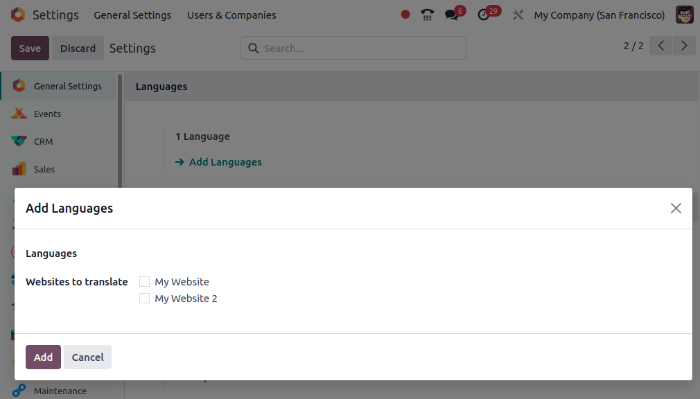
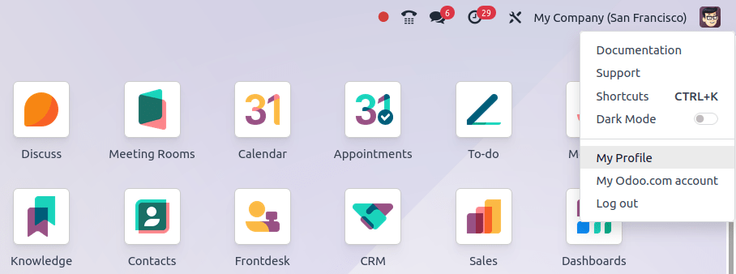
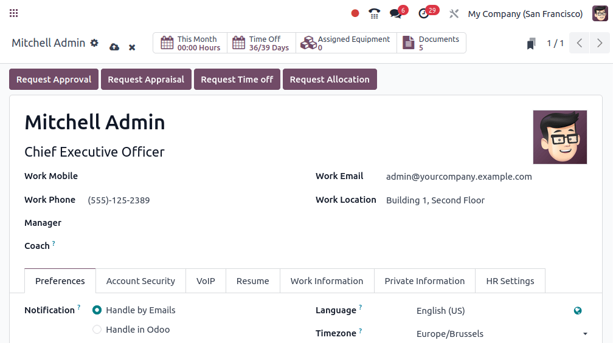
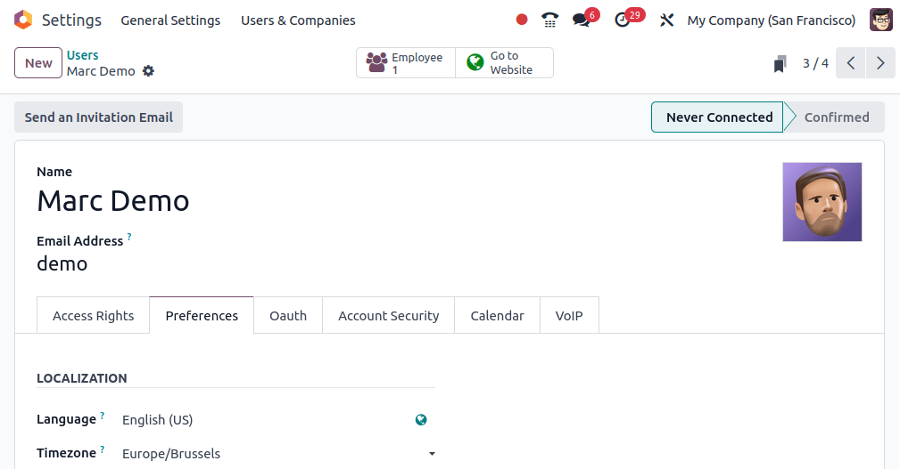

===============
Change language
===============

Odoo provides you with the option to manage Odoo in different languages,
and each user can use Odoo in their own language.

Load your desired language
==========================

The first thing to do is to load your desired language on your Odoo
instance.

From the general dashboard click on the **Settings** app; in the general settings page there will
be section titled **Languages**. Click **Add Languages** to be able to pick a language and install
it.

.. note::

    If you check the "Websites to translate" checkbox you will have the option
    to change the navigation language on your website.

Change your language
====================

You can change the user's language by going to the drop-down menu at the top right side of the
screen and choosing **My Profile**.

Then change the Language setting to your prefered language and either click the save icon or the
main dashboard button.

Change another user's language
==============================

Odoo also gives you the possibility for each user to choose their preferred language.

To change the language for a different user, choose :menuselection:`Users --> Users` from the
Settings app. Here you have a list of all users and you can choose the user who you'd like to
change the language for. Select the user and and under preferences, you can change the Language to
any previously installed language and click **SAVE**.

.. seealso::
    * :doc:`../../websites/website/configuration/translate`
