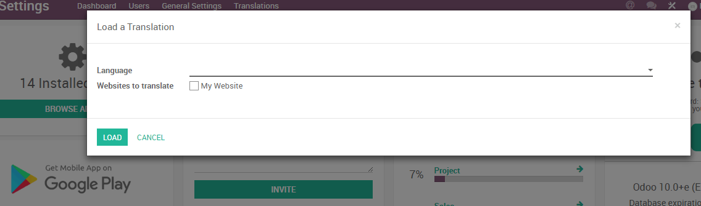
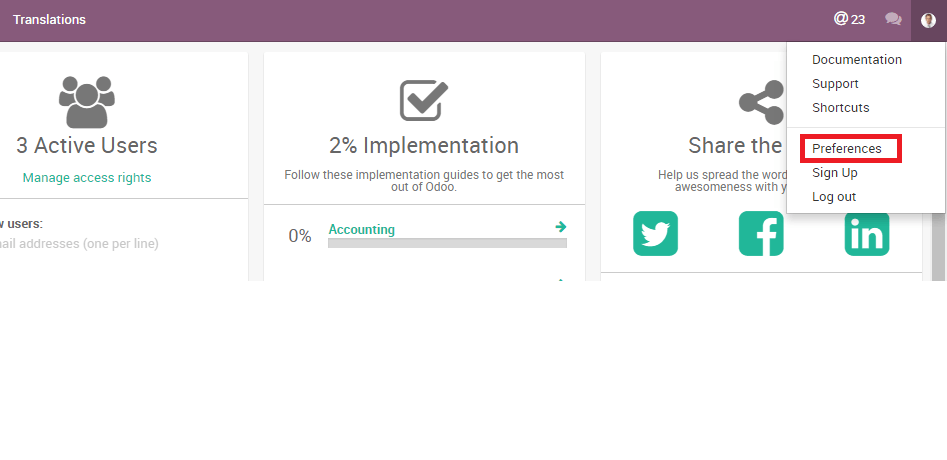
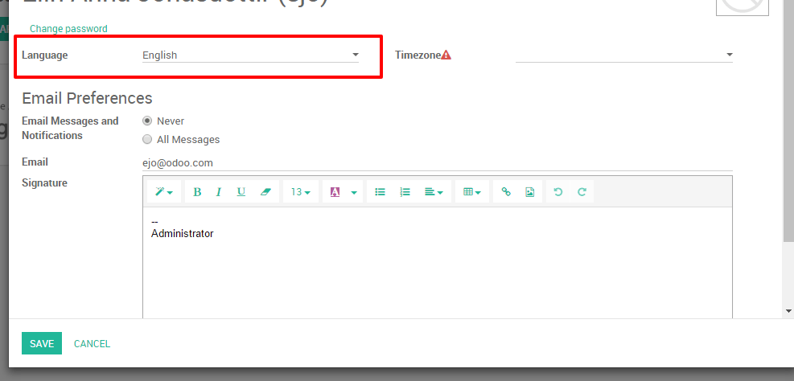
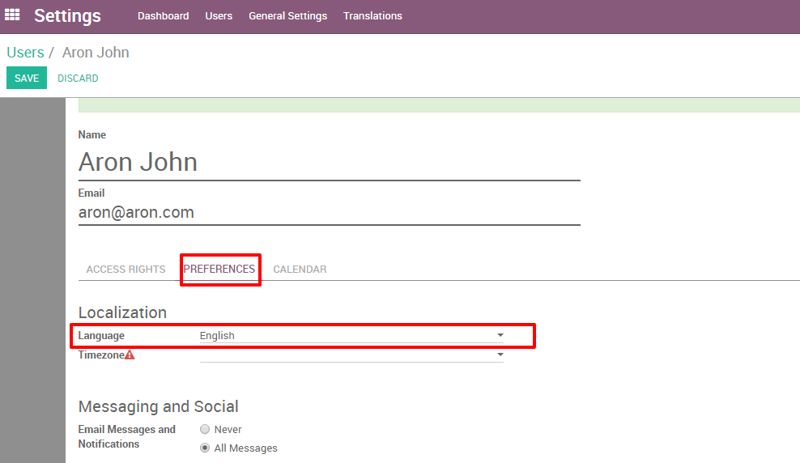

===============
Change language
===============

Odoo provides you with the option to manage Odoo in different languages,
and each user can use Odoo in his own language .

Load your desired language
==========================

The first thing to do is to load your desired language on your Odoo
instance.

From the general dashboard click on the **Settings** app; on the top
left of the page select :menuselection:`Translations --> Load a Translation`,
select a language to install and click on **LOAD.**

.. note::

    If you check the "Websites to translate" checkbox you will have the option
    to change the navigation language on your website.

Change your language
====================

You can change the language to the installed language by going to the
drop-down menu at the top right side of the screen, choose
**Preferences**.

Then change the Language setting to your installed language and click
**SAVE.**

Open a new menu to view the changes.

Change another user's language
==============================

Odoo also gives you the possibility for each user to choose his
preferred language.

To change the language for a different user, choose :menuselection:`Users --> Users`
from the Settings app. Here you have a list of all users and you can
choose the user who you'd like to change the language for. Select the
user and click on **Edit** in the top left corner. Under Preferences you
can change the Language to any previously installed language and click
**SAVE.**

.. seealso::
    * :doc:`../../websites/website/configuration/translate`
