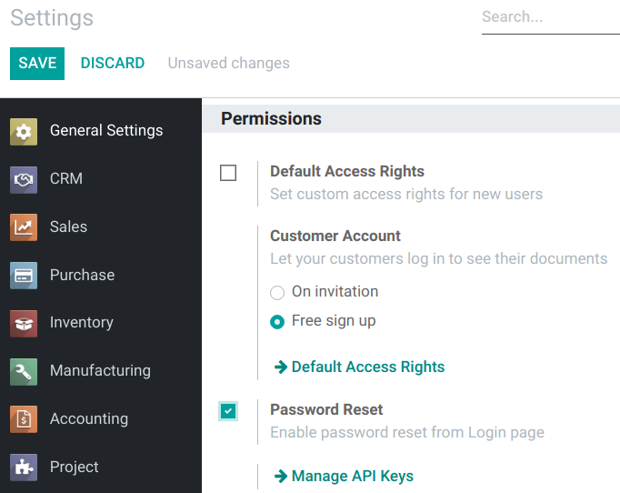
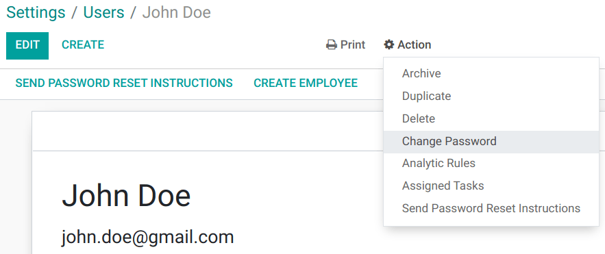

============
Manage users
============

Odoo defines a **user** as someone who has access to a database to perform daily tasks. You can add
as many users as you need and, in order to restrict the type of information each user can access,
rules can be applied. Users and access rights can be added and changed at any point.

.. seealso::
   - :doc:`language`
   - :doc:`access_rights`

.. _users/add-individual:

Add individual users
====================

Go to :menuselection:`Settings --> Manage Users` and click on *Create*.

.. image:: manage_users/manage-users.png
   :align: center
   :height: 280
   :alt: View of the settings page emphasizing the manage users field in Odoo

| Fill in the form with the needed information. Under the tab
  :doc:`Access Rights <access_rights>` choose the group within each application the user can
  have access to.
| The list of applications shown is based on the applications installed on the database.

.. image:: manage_users/new_user.png
   :align: center
   :alt: View of a user’s form emphasizing the access rights tab in Odoo

When you are done editing the page and have *Saved* it, an invitation email is automatically sent to
the user. The user must click on it to accept the invitation and create a login.

.. image:: manage_users/invitation-email.png
   :align: center
   :alt: View of a user’s form with a notification that the invitation email has been sent in Odoo

.. note::
   Remember that subscription prices follow the number of users. Refer to our
   `pricing page <https://www.odoo.com/pricing>`_
   for more information.

With the :ref:`developer mode <developer-mode>` activated, *User Types* can be selected.

.. image:: manage_users/user-type.png
   :align: center
   :height: 300
   :alt: View of a user’s form in developer mode emphasizing the user type field in Odoo

The *Portal* and *Public* options do not allow you to choose access rights. Members have specific
ones (such as record rules and restricted menus) and usually do not belong to the usual Odoo
groups.

.. _users/deactivate:

Deactivate users
================

Go to :menuselection:`Settings --> Users & Companies --> Users`, open the user you want to
deactivate, click on *Action*, and then on *Archive*.

.. danger::
   **Never** deactivate the main user (*admin*).

.. _users/passwords-management:

Passwords management
====================

.. _users/reset-password:

Reset passwords
---------------

.. _users/reset-password-login:

Enable password resets from login page
~~~~~~~~~~~~~~~~~~~~~~~~~~~~~~~~~~~~~~

It is possible to enable password resets directly from the login page.

To do so, go to :menuselection:`Settings --> Permissions`, activate **Password Reset** and *Save*.

.. _users/reset-password-email:

Send reset instructions to users
~~~~~~~~~~~~~~~~~~~~~~~~~~~~~~~~

Go to :menuselection:`Settings --> Users & Companies --> Users`, select the user out of the list and
click on *Send Password Reset Instructions* on its user form. An email is automatically sent to
them.

.. note::
   The *Send Password Reset Instructions* button only appears if the Odoo invitation email has
   already been confirmed by the user.

This email contains all the instructions needed to reset the password, along with a link redirecting
the user to an Odoo login page.

.. image:: manage_users/password-email.png
   :align: center
   :alt: Example of an email with a password reset link for an Odoo account

.. _users/change-password:

Change users’ passwords
-----------------------

Go to :menuselection:`Settings --> Users  & Companies --> Users` and select a user to access its
form. Click on the *Action* button and select *Change Password*.

Enter a new password and confirm by clicking on *Change Password*.

.. note::
   This operation only modifies the password of the users locally and does not affect their odoo.com
   account. If you want to change the odoo.com password, you can :ref:`send the password reset
   instructions <users/reset-password-email>`.

Click on *Change Password* one more time. You are then redirected to an Odoo login page where you
can reaccess your database using your new password.

.. _users/multi-companies:

Multi Companies
===============

The *Multi Companies* field allows you to set to which of the multiple companies database you hold
the user can have access.

.. note::
   Note that if not handled correctly, it may be the source of a lot of inconsistent multi-company
   behaviors. Therefore, a good knowledge of Odoo is required. For technical explanations refer
   to :doc:`this </developer/howtos/company>` documentation.

.. image:: manage_users/multi-companies.png
   :align: center
   :height: 300
   :alt: View of a user’s form emphasizing the multi companies field in Odoo

.. seealso::
   - :doc:`companies`
