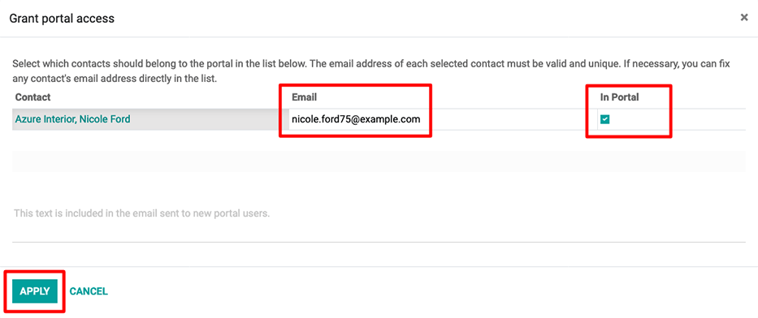

=============
Portal access
=============

Portal access is given to users who need the ability to view certain documents or information
within an Odoo database.

Some common use cases for providing portal access include allowing customers to read/view any or
all of the following in Odoo:

- leads/opportunities
- quotations/sales orders
- purchase orders
- invoices & bills
- projects
- tasks
- timesheets
- tickets
- signatures
- subscriptions

.. note::
   Portal users only have read/view access, and will not be able to edit any documents in the
   database.

Provide portal access to customers
==================================

From the main Odoo dashboard, select the :guilabel:`Contacts` application. If the contact is not
yet created in the database, click on the :guilabel:`Create` button, enter the details of the
contact, and then click :guilabel:`Save`. Otherwise, choose an existing contact, and then click on
the :guilabel:`Action` drop-down menu located at the top-center of the interface.

.. image:: portal/grant-portal-access.png
   :align: center
   :alt: Use the Contacts application to give portal access to users

Then select :guilabel:`Grant portal access`. A pop-up window appears, listing three fields:

- :guilabel:`Contact`: the recorded name of the contact in the Odoo database
- :guilabel:`Email`: the contact's email address that they will use to log into the portal
- :guilabel:`In Portal`: whether or not the user has portal access

To grant portal access, first enter the contact's :guilabel:`Email` they will use to log into the
portal. Then, check the box under the :guilabel:`In Portal` column. Optionally, add text to the
invitation message the contact will receive. Then click :guilabel:`Apply` to finish.

         sending a portal invitation.

An email will be sent to the specified email address, indicating that the contact is now a portal
user for that Odoo database.

.. tip::
   To grant portal access to multiple users at once, navigate to a company contact, then click
   :menuselection:`Action --> Grant portal access` to view a list of all of the company's related
   contacts. Check the box under the :guilabel:`In Portal` column for all the contacts that need
   portal access, then click :guilabel:`Apply`.

.. note::
   At any time, portal access can be revoked by navigating to the contact, clicking
   :menuselection:`Action --> Grant portal access`, and then unselecting the checkbox under the
   :guilabel:`In Portal` column and clicking :guilabel:`Apply`.
