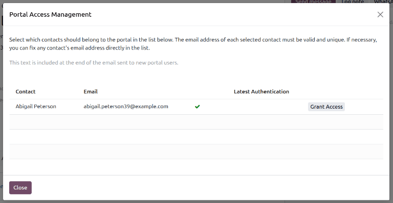
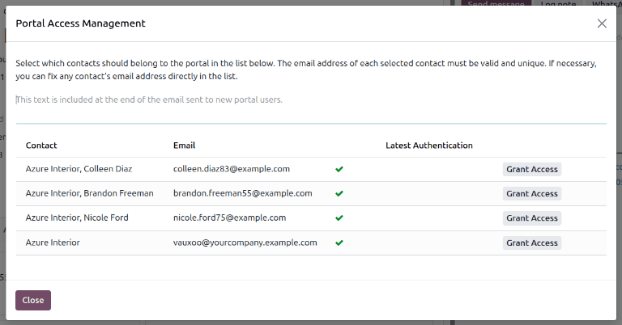
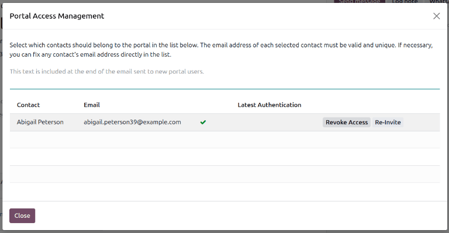

======================
Granting portal access
======================

For the customers and vendors of a business to begin using a user portal, they must first be granted
access by the business. The process to do this begins in the **Contacts** application.

Adding portal access to a contact
=================================

From the main Odoo dashboard, open the :guilabel:`Contacts` application. If the contact to be
granted access is not yet in the database, create an entry for them by clicking the :guilabel:`New`
button and entering their details. Otherwise, choose an existing contact, then click on the
:icon:`fa-gear` :guilabel:`(Actions)` drop-down menu and select :guilabel:`Grant portal access`.

.. image:: portal_access/grant-portal-access.png
   :alt: Use the Contacts application to give portal access to users.

This brings up the :guilabel:`Portal Access Management` window, which has three fields:

- :guilabel:`Contact`: This field is automatically populated with the name on the contact.
- :guilabel:`Email`: This field shows the contact's email address used to log into the portal.
- :guilabel:`Latest Authentication`: The last time the user accessed the portal appears on this
  line. If the user has never accessed the portal, it is blank.

To grant portal access, first enter the email address the contact will use to log into the portal.
This may have been automatically entered by the system if an existing contact is being granted
access. Then click the :guilabel:`Grant Access` button to finish.

.. note::
   When portal access is granted to a Company, all contacts affiliated with that company will be
   granted portal access. Indiviual contacts can be removed as needed.

Granting accesss to multiple users at once
------------------------------------------

To grant portal access to multiple users from a single company at once, navigate to the contact
listing for that company, then click :menuselection:`Action --> Grant portal access` to view a list
of the company's related contacts. Click :guilabel:`Grant Access` for each contact that needs portal
access. An email is sent to the specified email address, indicating that the contact is now a portal
user for that Odoo database.

Revoking portal access
----------------------

Some situations may require revoking an individual's portal access, such as when they retire or
leave a company. Portal access can be revoked from a contact at any time by navigating to a contact,
clicking :menuselection:`Action --> Grant portal access`, and then clicking :guilabel:`Revoke
Access`.

