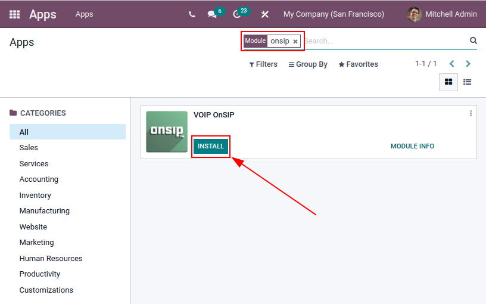
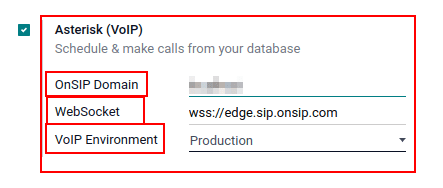
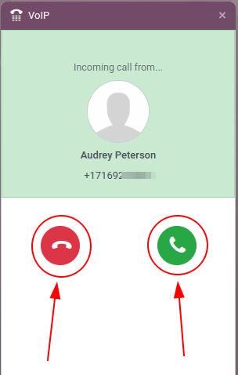

====================================
Use VoIP services in Odoo with OnSIP
====================================

Introduction
============

Odoo *VoIP* can be set up to work together with `OnSIP <https://www.onsip.com/>`_. OnSIP is a VoIP
provider. An account is needed with OnSIP in order to use this service.

Before setting up an account with OnSIP, make sure the company's home area, and the areas that will
be called, are covered by OnSIP services.

After opening an OnSIP account, follow the configuration procedure below to configure it on an Odoo
database.

Configuration
=============

To configure the Odoo database to connect to OnSIP services, first navigate to the
:menuselection:`Apps application` from the main Odoo dashboard. Then, remove the default `Apps`
filter from the :guilabel:`Search...` bar, and search for `VoIP OnSIP`.

Next, install the :guilabel:`VOIP OnSIP` module.

Odoo VoIP setting
-----------------

After installing the *VOIP OnSIP* module, go to the :menuselection:`Settings app`, scroll down to
the :guilabel:`Integrations` section, and locate the :guilabel:`Asterisk (VoIP)` fields. Then,
proceed to fill in those three fields with the following information:

- :guilabel:`OnSIP Domain`: the domain that was assigned when creating an account on `OnSIP
  <https://www.onsip.com/>`_.
- :guilabel:`WebSocket`: `wss://edge.sip.onsip.com`
- :guilabel:`VoIP Environment`: :guilabel:`Production`

.. tip::
   To access the OnSIP domain, navigate to `OnSIP <https://www.onsip.com/>`_ and log in. Then, click
   the :guilabel:`Administrators` link in the top-right of the page.

   Next, in the left menu, click :guilabel:`Users`, and then select any user. By default, the
   selected user opens on the :guilabel:`User Info` tab.

   Click on the :guilabel:`Phone Settings` tab to reveal OnSIP configuration credentials (first
   column).

   .. image:: onsip/domain-setting.png
      :align: center
      :alt: Domain setting revealed (highlighted) on administrative panel of OnSIP management
            console.

Odoo user setting
-----------------

Next, the user needs to be set up in Odoo. Every user associated with an OnSIP user **must** also be
configured in the Odoo user's settings/preferences.

To do that, navigate to :menuselection:`Settings app --> Manage Users --> Select the User`.

On the user form, click :guilabel:`Edit` to configure the user's OnSIP account. Then, click the
:guilabel:`Preferences` tab, and scroll to the :guilabel:`VoIP Configuration` section.

In this section, fill in the fields with OnSIP credentials.

Fill in the following fields with the associated credentials listed below:

- :guilabel:`SIP Login` / :guilabel:`Browser's Extension` = OnSIP :guilabel:`Username`
- :guilabel:`OnSIP authorization User` = OnSIP :guilabel:`Auth Username`
- :guilabel:`Handset Extension` = OnSIP :guilabel:`Ext.` (extension without the `x`)
- :guilabel:`SIP Password` = OnSIP :guilabel:`SIP Password`

.. image:: onsip/onsip-creds.png
   :align: center
   :alt: OnSIP user credentials with username, auth username, SIP password, and extension
         highlighted.

.. tip::
   The OnSIP extension can be found in the *User* banner line above the tabs.

When these steps are complete, click :guilabel:`Save` on the user form in Odoo to save the
configurations.

Once saved, Odoo users can make phone calls by clicking the :guilabel:`📞 (phone)` icon in the
top-right corner of Odoo.

.. seealso::
   Additional setup and troubleshooting steps can be found on `OnSIP's knowledge base
   <https://support.onsip.com/hc/en-us>`_.

Incoming calls
--------------

The Odoo database also receives incoming calls that produce pop-up windows in Odoo. When those call
pop-up windows appear, click the green :guilabel:`📞 (phone)` icon to answer the call.

To ignore the call, click the red :guilabel:`📞 (phone)` icon.

.. seealso::
   :doc:`voip_widget`

Troubleshooting
---------------

Missing parameters
~~~~~~~~~~~~~~~~~~

If a *Missing Parameters* message appears in the Odoo widget, make sure to refresh the Odoo browser
window (or tab), and try again.

.. image:: onsip/onsip04.png
   :align: center
   :alt: Missing parameter message in the Odoo VoIP widget.

Incorrect number
~~~~~~~~~~~~~~~~

If an *Incorrect Number* message appears in the Odoo widget, make sure to use the international
format for the number. This means leading with the :guilabel:`+ (plus)` sign, followed by the
international country code.

A country code is a locator code that allows access to the desired country's phone system. The
country code is dialed first, prior to the target number. Each country in the world has its own
specific country code.

For example, `+16505555555` (where `+1` is the international prefix for the United States).

.. image:: onsip/onsip05.png
   :align: center
   :alt: Incorrect number message populated in the Odoo VoIP widget.

.. seealso::
   For a list of comprehensive country codes, visit: `https://countrycode.org
   <https://countrycode.org>`_.

OnSIP on mobile phone
=====================

In order to make and receive phone calls when the user is not in front of Odoo on their computer, a
softphone app on a mobile phone can be used in parallel with Odoo *VoIP*.

This is useful for convenient, on-the-go calls, and to make sure incoming calls are heard. Any SIP
softphone will work.

.. seealso::
   - :doc:`devices_integrations`
   - `OnSIP App Download <https://www.onsip.com/app/download>`_
