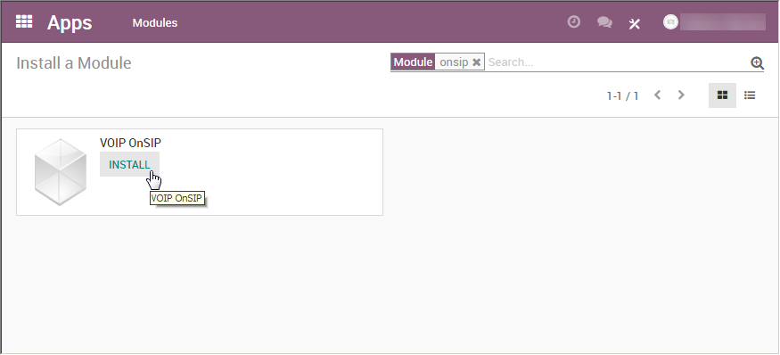

====================================
Use VoIP services in Odoo with OnSIP
====================================

Introduction
============

Odoo VoIP can be set up to work together with OnSIP (www.onsip.com). In that case, the installation
and setup of an Asterisk server is not necessary as the whole infrastructure is hosted and managed
by OnSIP.

You will need to open an account with OnSIP to use this service. Before doing so, make sure that
your area and the areas you wish to call are covered by the service. After opening an OnSIP account,
follow the configuration procedure below.

Configuration
=============

Go to Apps and install the module **VoIP OnSIP**.

Go to Settings/General Settings. In the section Integrations/Asterisk (VoIP), fill in the 3 fields:

- **OnSIP Domain** is the domain you chose when creating an account on www.onsip.com. If you don't
  know it, log in to https://admin.onsip.com/ and you will see it in the top right corner of the
  screen.
- **WebSocket** should contain wss://edge.sip.onsip.com
- **Mode** should be Production

.. image:: onsip/onsip02.png
   :align: center

Go to **Settings/Users**. In the form view of each VoIP user, in the Preferences tab, fill in the
section **PBX Configuration**:

- **SIP Login / Browser's Extension**: the OnSIP 'Username'
- **OnSIP authorization User**: the OnSIP 'Auth Username'
- **SIP Password**: the OnSIP 'SIP Password'
- **Handset Extension**: the OnSIP 'Extension'

You can find all this information by logging in at https://admin.onsip.com/users, then select the
user you want to configure and refer to the fields as pictured below.

.. image:: onsip/onsip03.png
   :align: center

You can now make phone calls by clicking the phone icon in the top right corner of Odoo (make sure
you are logged in as a user properly configured in Odoo and in OnSIP).

.. note::
   If you see a *Missing Parameters* message in the Odoo softphone, make sure to refresh your Odoo
   window and try again.

   .. image:: onsip/onsip04.png
      :align: center

.. note::
   If you see an *Incorrect Number* message in the Odoo softphone, make sure to use the
   international format, leading with the plus (+) sign followed by the international country code.
   E.g.: `+16506913277` (where `+1` is the international prefix for the United States).

   .. image:: onsip/onsip05.png
      :align: center

You can now also receive phone calls. Your number is the one provided by OnSIP. Odoo will ring and
display a notification.

.. image:: onsip/onsip06.png
   :align: center

OnSIP on Your Cell Phone
========================

In order to make and receive phone calls when you are not in front of your computer, you can use a
softphone app on your cell phone in parallel of Odoo VoIP. This is useful for on-the-go calls, but
also to make sure to hear incoming calls, or simply for convenience. Any SIP softphone will work.

On Android and iOS, OnSIP has been successfully tested with `Grandstream Wave
<https://play.google.com/store/apps/details?id=com.grandstream.ucm>`_. When creating an account,
select OnSIP in the list of carriers. You will then have to configure it as follows:

- **Account name**: OnSIP
- **SIP Server**: the OnSIP 'Domain'
- **SIP User ID**: the OnSIP 'Username'
- **SIP Authentication ID**: the OnSIP 'Auth Username'
- **Password**: the OnSIP 'SIP Password'

Aside from initiating calls from Grandstream Wave on your phone, you can also initiate calls by
clicking phone numbers in your browser on your PC. This will make Grandstream Wave ring and route
the call via your phone to the other party. This approach is useful to avoid wasting time dialing
phone numbers. In order to do so, you will need the Chrome extension `OnSIP Call Assistant
<https://chrome.google.com/webstore/detail/onsip-call-assistant/pceelmncccldedfkcgjkpemakjbapnpg>`_.

.. warning::
   The downside of using a softphone on your cell phone is that your calls will not be logged in
   Odoo, as the softphone acts as an independent, separate app.
