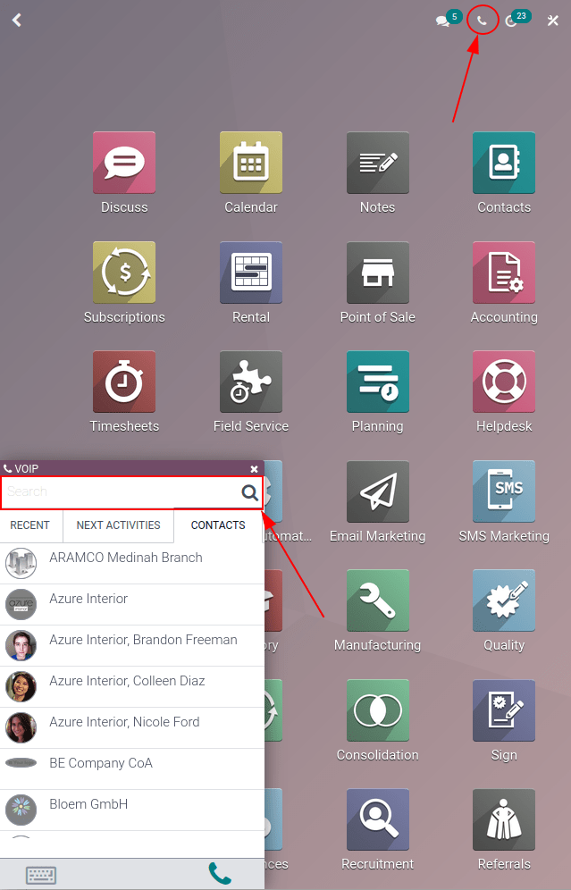
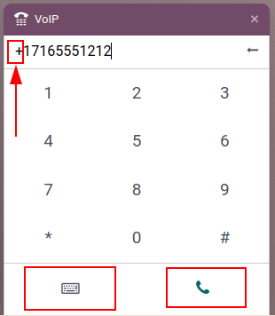
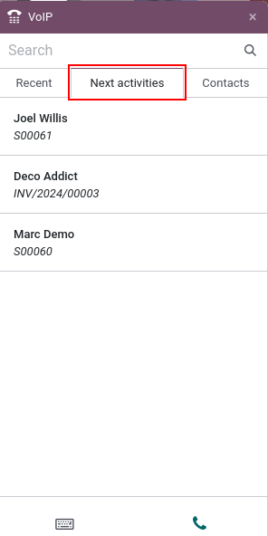

==========================================
Make, receive, transfer, and forward calls
==========================================

Calling prospective clients, customers, or colleagues is an essential part of any business. A
company also needs to be available when customers call, in order to build trust and make
connections.

This document covers how to make, receive, transfer, and forward calls with Odoo *VoIP*.

Make calls
==========

Starting on the Odoo dashboard, a call can be made by opening the phone widget in the the
upper-right corner, which is represented by a :guilabel:`☎️ (phone)` icon.

Then, a user can click on the :guilabel:`Contacts` tab, and click into any contact in the database
to make a call.

Additionally, one can also use the :guilabel:`Search bar` in the :guilabel:`VOIP` pop-up window to
find any desired contact.

To manually make a call, click the :guilabel:`⌨️ (keyboard)` icon, and proceed to manually key in
the desired number. Do not forget to lead with the :guilabel:`+ (plus)` icon, followed by the
international country code.

.. example::
   For the United States of America, the country code and :guilabel:`+ (plus)` icon, would look like
   this: `+1`. If one were to dial Belgium, the number would be prefixed by `+32`, and for Great
   Britain it would be `+44`.

After entering the full number, with the required :guilabel:`+ (plus)` icon prefix and country code,
click the green :guilabel:`📞 (phone)` icon to start the call. When finished, click the red
:guilabel:`📞 (phone)` icon to end the call.

Receive calls
=============

An incoming call automatically opens the *VoIP* widget, when a user is using the Odoo database.
Should the database be open in another tab, a sound plays (the sound **must** be activated on the
device).

Once back to the tab, the calling screen of the *VoIP* phone widget appears.

Click the green :guilabel:`📞 (phone)` icon to pick up the call, or the red :guilabel:`📞 (phone)`
icon to reject the call.

.. image:: transfer_forward/incoming-call.png
   :align: center
   :alt: Incoming call on the VoIP widget, with the call answer and call reject buttons highlighted.

Add to call queue
=================

All the contacts and customers that need to be called can be seen in one place with the Odoo *VoIP*
phone widget, under the :guilabel:`Next activities` tab.

To add a call to the :guilabel:`Next activities` tab, click the green :guilabel:`📞 (phone)` icon,
while in kanban view of the *CRM* application.

To remove them from the call queue, hover over the opportunity that has a call scheduled, and click
the red :guilabel:`📞 (phone)` icon that appears with the :guilabel:`- (minus)` icon.

When navigating back to the *VoIP* phone widget, **only** the calls that are scheduled immediately
for that day appear in the queue under the :guilabel:`Next Activities` tab of the *VoIP* pop-up
widget.

.. image:: transfer_forward/add-call-queue.png
   :align: center
   :alt: Adding a call to the next activities tab in the VoIP phone widget.

The :guilabel:`Next Activities` tab of the *VoIP* phone widget is integrated with the following Odoo
apps: *CRM*, *Project*, and *Helpdesk*.

A call can be added in the chatter of records within those applications.

To manually add a call, via the chatter, click :guilabel:`Activities` (next to the :guilabel:`🕗
(clock)` icon). Under :guilabel:`Activity Type`, select :guilabel:`Call` from the drop-down menu
that appears.

Next, set a :guilabel:`Due Date`, and add a :guilabel:`Summary`.

Lastly, change the :guilabel:`Assigned to` field to the person that should make the call. Whomever
is set in this last field (:guilabel:`Assigned to`) has this call show up in their :guilabel:`Next
Activities` call queue in the Odoo *VoIP* phone widget.

.. important::
   Only calls for the immediate day (today's date) appear in the :guilabel:`Next Activities` tab of
   the *VoIP* phone widget for that specific user.

If specified, click :guilabel:`Save` or :guilabel:`Open Calendar` to complete the scheduling of the
call.

Transfer calls
==============

A call can be transferred from one user to another in the Odoo *VoIP* phone widget. However, this
can **only** occur after speaking to the caller first. Without picking up the call in the Odoo
*VoIP* phone widget, the only way to transfer a call is automatically though the provider
console/portal.

.. seealso::
   For more information on transfers, visit :ref:`voip/axivox/forwardings_tab`.

To transfer a call within the Odoo *VoIP* phone widget, first, answer the call using the green
:guilabel:`📞 (phone)` icon.

Once the incoming call is answered, click the :guilabel:`↔ (left-right arrow)` icon. Then, enter the
extension of the user the call should be forwarded to. Finally, click :guilabel:`Transfer` to route
the call to that phone number.

.. tip::
   To find the extension for a user, consult the :abbr:`VoIP (Voice over Internet Protocol)`
   administrator, or, if the user has *Settings* access rights to *Administration*, navigate to
   :menuselection:`Settings App --> Manage Users --> Select the user --> Preferences --> VOIP -->
   VoIP username / Extension number`.

   For more information on access rights, visit: :doc:`../users/access_rights`.

.. image:: transfer_forward/transfer.png
   :align: center
   :alt: Transferring a call within the phone widget, with the transfer buttons highlighted.

Forward calls
=============

To forward a call within the Odoo *VoIP* phone widget, first, answer the call using the green
:guilabel:`📞 (phone)` icon. Once the incoming call is answered, click the :guilabel:`↔ (left-right
arrow)` icon.

Then, enter the full phone number of the user the call should be forwarded to. Finally, click
:guilabel:`Transfer` to route the call to that phone number.

.. seealso::
   For more information on forwarding, visit :ref:`voip/axivox/forwardings_tab`.
