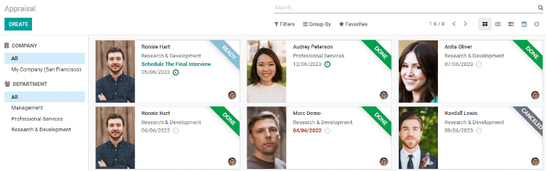
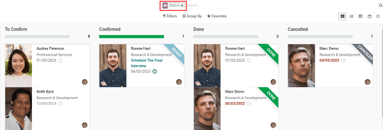
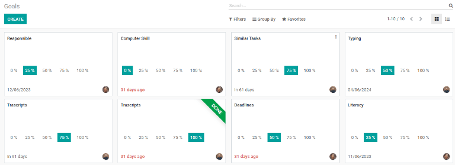
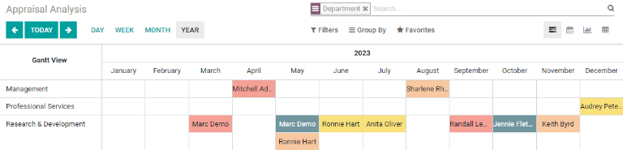
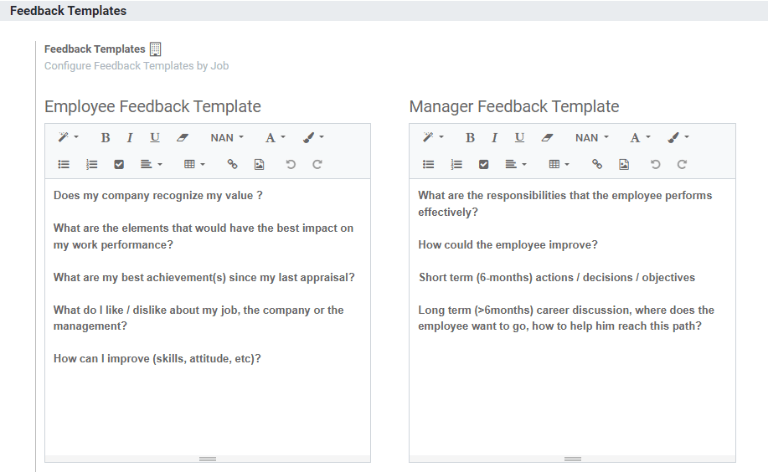
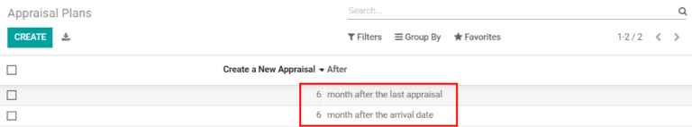
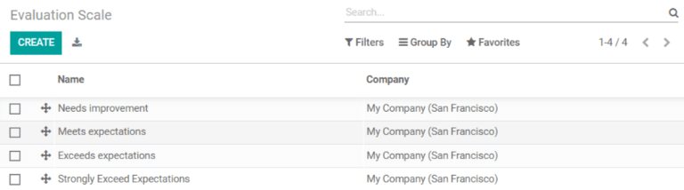

==============================
Getting started with Appraisal
==============================

Employee goals can be set, appraisals performed, and reports run, all through the three main
sections of the :guilabel:`Appraisal` application. Integration with the :guilabel:`Employees`
application means all employees in the company automatically appear in the :guilabel:`Appraisals`
application and are available for appraisals.

Appraisal
=========

The main :guilabel:`Appraisal` view displays all the employees in a kanban view. A banner indicating
the state of their appraisal, either :guilabel:`Ready`, :guilabel:`Done`, or :guilabel:`Canceled`,
appears on each card, if applicable.

If the kanban view is grouped by :guilabel:`Status`, the columns that appear are
:guilabel:`To Confirm`, :guilabel:`Confirmed`, :guilabel:`Done`, and :guilabel:`Canceled`. Drag and
move an employee card to a different stage to change the status of the appraisal. Employees can be
filtered by selecting specific companies or departments on the left side navigation.

Goals
=====

Each employee's individual goals are organized in the :guilabel:`Goals` section. The default view
displays all the goal cards individually. :guilabel:`Goals` can be grouped by name or deadline to
better visualize them. Each card shows the name of the goal, the progress the employee has made, the
deadline for the goal, the employee's photo, and a :guilabel:`Done` banner when the goal has been
achieved. Every employee requires their own card for each individual goal, so it is common to see
multiple cards for the same goal, assigned to different employees.

Reporting
=========

The :guilabel:`Reporting` tab displays the :guilabel:`Appraisal Analysis` report for the company.
Appraisals are grouped by department and can be displayed by the :guilabel:`Day`, :guilabel:`Week`,
:guilabel:`Month`, or :guilabel:`Year`.

The color of each employee's appraisal indicates the status:

.. list-table::
   :header-rows: 1
   :stub-columns: 1

   * - Color
     - Status
   * - Grey
     - Not Started
   * - Orange
     - Sent
   * - Yellow
     - Done
   * - Red
     - Cancelled

Configuration
=============

Settings
--------

Go to :menuselection:`Appraisal --> Configuration --> Settings`, and turn on automatic appraisals by
checking the :guilabel:`Appraisal Plans` box. Click on the :guilabel:`Appraisal Plans` internal link
to view the :guilabel:`Appraisal Plans` section.

Checking the :guilabel:`360 Feedback` box will send out pre-configured surveys. This integrates with
the :guilabel:`Surveys` application, so :guilabel:`Surveys` must be installed in order to use this
option. Select a :guilabel:`Default Template`, and edit it with the :guilabel:`External Link`
button. Edit the form in the pop-up, and then click :guilabel:`Save`.

Email feedback templates can be modified in the :guilabel:`Feedback Templates` section. Use the
text editor to edit the email. Default templates are for employees and managers.

Click the :guilabel:`Jobs Configuration` internal link to pull up a list view of all the
:guilabel:`Job Positions` within the company. Add a new position by clicking :guilabel:`Create`,
then enter the :guilabel:`Job Position` and add a description in the :guilabel:`Job Description`
tab. Click on the :guilabel:`Recruitment` tab and enter all the other information for the position.
The :guilabel:`Appraisals` tab will be filled in with the emails configured in the
:guilabel:`Feedback Template` section of the :guilabel:`Settings` page. Click :guilabel:`Save` when
done.

Employees
---------

Click :menuselection:`Appraisal --> Configuration --> Employees` to view all the employees in the
company. This is identical to the main view in the :guilabel:`Employees` application. Any changes
made here will be reflected on any application that uses the employees list.

Appraisal Plans
---------------

Click :menuselection:`Appraisal --> Configuration --> Appraisal Plans` to view the current appraisal
schedule. This same list appears by clicking :menuselection:`Appraisal --> Configuration -->
Settings` and clicking the :guilabel:`Appraisal Plans` internal link beneath
:guilabel:`Appraisal Plans`. Here, view how often appraisals are automatically created. The default
appraisals are set to be created 6 months after an employee is hired, and 6 months after the
previous appraisal is completed.

Click the :guilabel:`Create` button to make a new automatic appraisal. Enter how many months should
pass before the new appraisal, and select whether or not the appraisal happens after the employee is
hired or after the previous appraisal. Click the :guilabel:`Export All` button to export the list to
a spreadsheet.

Evaluation Scale
----------------

See the available options for an evaluation in this list. Click :guilabel:`Create` to add a new
scale, enter the text to appear on the evaluation, and select the company the specific line applies
to. To delete a line, check the box next to it and click :menuselection:`Actions --> Delete`. Click
and drag the entries to change the order in which they appear on the appraisal.

