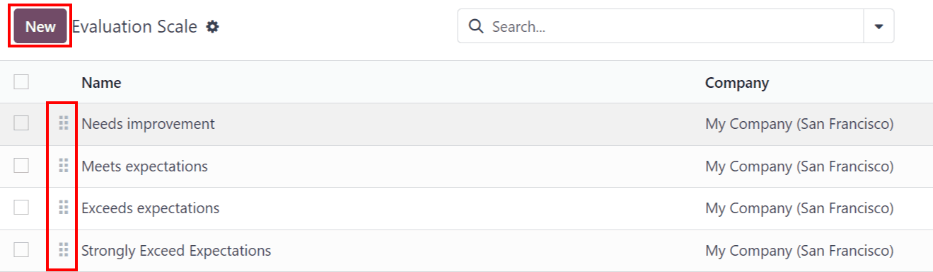
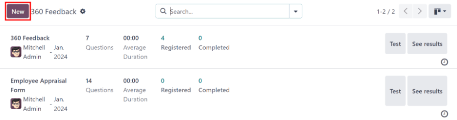

:show-content:

==========
Appraisals
==========

In Odoo, the *Appraisals* application can be used to evaluate employee performance on a recurring
basis. Managers can evaluate the performance of their employees, and also allow employees to do a
self-assessment of their own. Appraisals are customizable, and can be set for any kind of schedule
desired.

Appraisals give employees valuable feedback, including actionable goals to work toward, and
measurable skills to improve upon. Additionally, appraisals may form the basis for raises,
promotions, and other benefits.

Regular appraisals are good for both the employees and the company, since they can accurately
measure performance based on company goals, and show employees where they need to improve.

Configuration
=============

The :guilabel:`Configuration` menu in the *Appraisals* application is where the settings can be
configured, feedback templates can be edited, frequencies can be set, evaluation scales can be
managed, data for 360 feedback can be stored, and goal tags can be viewed/created.

Settings
--------

To access the *Settings* menu, navigate to :menuselection:`Appraisals application --> Configuration
--> Settings`.

Feedback templates
~~~~~~~~~~~~~~~~~~

Feedback templates are form outlines used during an employee appraisal. Any edits made to a template
are, ultimately, reflected in the appraisals sent to employees.

There are two default templates pre-configured in Odoo *Appraisals*: one for employee feedback, and
one for manager feedback. Each contains several sections, along with questions, and brief
explanations for how to respond to the questions.

The :guilabel:`Employee Feedback Template` has the following sections: :guilabel:`My work`,
:guilabel:`My future`, and :guilabel:`My feelings`.

The :guilabel:`Manager Feedback Template` has the following sections: :guilabel:`Feedback`,
:guilabel:`Evaluation`, and :guilabel:`Improvements`.

Any desired changes to the default feedback templates can be made by making changes directly in each
template.

Appraisals
~~~~~~~~~~

The :guilabel:`Appraisals` section of the settings menu determines the frequency that appraisals are
performed, and if it is possible to request additional feedback.

.. image:: appraisals/appraisals-setting.png
   :align: center
   :alt: The appraisals sections with the timeline filled in and 360 feedback enabled.

.. _appraisals/appraisal-plan:

Appraisals plans
****************

By default, appraisals are pre-configured to be automatically created six months after an employee
is hired, with a second appraisal exactly six months after that.

Once those two initial appraisals have been completed in the employee's first year, following
appraisals are only created once a year (every twelve months).

To modify this schedule, change the number of months in the blank fields under the
:guilabel:`Appraisals Plans` section.

.. important::
   If the :guilabel:`Appraisals Plans` section is modified, **all** empty :guilabel:`Next Appraisal
   Dates` are modified for **all** employees.

360 feedback
************

The :guilabel:`360 Feedback` option can be enabled to allow managers to request feedback from other
employees using a different survey form, at any time, independent of the appraisal schedule.

Typically, managers ask for feedback from other people who work with an employee they manage. This
includes the employee's various managers, peers, and direct reports.

To view the :guilabel:`360 Feedback` survey, click the :guilabel:`→ Internal link` icon at the end
of the :guilabel:`Default Template` field. The :guilabel:`360 Feedback` survey loads, and any
desired changes to the survey can be made.

For more information on how to edit a survey, refer to the :doc:`../marketing/surveys/create`
document.

.. important::
   The :guilabel:`360 Feedback` form is a pre-configured survey within the *Surveys* application. In
   order to use the :guilabel:`360 Feedback` option, including the ability to edit the survey, the
   *Surveys* application **must** be installed.

Evaluation scale
----------------

On each employee appraisal form, final rating options appear by default. To view and edit these
options, navigate to :menuselection:`Appraisals application --> Configuration --> Evaluation Scale`.
This presents the ratings in a list view.

The pre-configured ratings are :guilabel:`Needs Improvement`, :guilabel:`Meets Expectations`,
:guilabel:`Exceeds Expectations`, and :guilabel:`Strongly Exceeds Expectations`. To add another
rating, click the :guilabel:`New` button.

When the :guilabel:`New` button is clicked on the :guilabel:`Evaluation Scale` page, a blank line
appears at the bottom of the list. Enter the name of the rating in the field.

To rearrange the order of the ratings, click the :guilabel:`(six small gray boxes)` icon to the left
of a rating, and drag the rating to the desired position on the list.

360 feedback
------------

The :guilabel:`360 Feedback` section displays information for all the surveys currently configured
in the *Appraisals* application. To view the surveys, and their statistics, navigate to
:menuselection:`Appraisals application --> Configuration --> 360 Feedback`.

Each appraisal (or survey) is presented in its own line on the :guilabel:`360 Feedback` page, along
with various information related to that particular appraisal.

Each appraisal includes the following information:

- :guilabel:`Survey Name`: the name of the specific survey.
- :guilabel:`Responsible`: the employee responsible for the survey, including the month and year
  they were given that designation.
- :guilabel:`Questions`: the number of questions in that particular survey.
- :guilabel:`Average Duration`: the average time a user spends completing the survey.
- :guilabel:`Registered`: the number of people who have been sent the survey.
- :guilabel:`Completed`: the number of people who have completed the survey.

Each appraisal also has two buttons at the end of each line: a :guilabel:`Test` button and a
:guilabel:`See Results` button.

To see what an appraisal looks like for the end user (i.e. an employee), click the :guilabel:`Test`
button, and the appraisal loads in a new browser tab. The entire appraisal loads, and can be clicked
through without having to enter any answers.

To exit, close the tab. Or, click :guilabel:`This is a Test Survey. → Edit Survey` at the top of the
page to be taken to the detail form for that particular survey.

To view the results from everyone who completed an appraisal, click the :guilabel:`See Results`
button. This presents all the answers for the survey in a new tab. Each question provides
information on how many people responded to a question, and how many people skipped it. All answers
for each question are visible.

To exit, close the tab. Or, click :guilabel:`→ Edit Survey` at the top of the page to be taken to
the detail form for that particular survey.

In addition to viewing the responses from past appraisals and surveys, new surveys can also be
created from the :guilabel:`360 Feedback` page. Simply click the :guilabel:`New` button in the
top-left of the page to create a new survey.

For more information on how to create a survey, refer to the :doc:`../marketing/surveys/create`
document.

.. note::
   In previous versions of Odoo, this section was referred to as :guilabel:`Surveys`.

.. seealso::
   - :doc:`appraisals/new_appraisals`
   - :doc:`appraisals/goals`
   - :doc:`appraisals/reporting`

.. toctree::
   :titlesonly:

   appraisals/new_appraisals
   appraisals/goals
   appraisals/reporting
