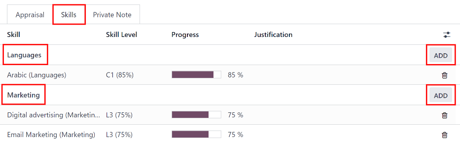
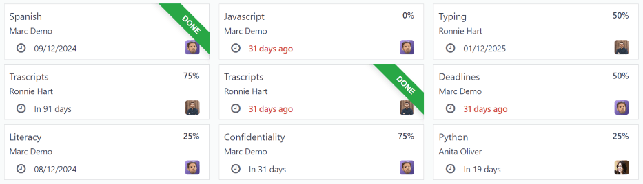
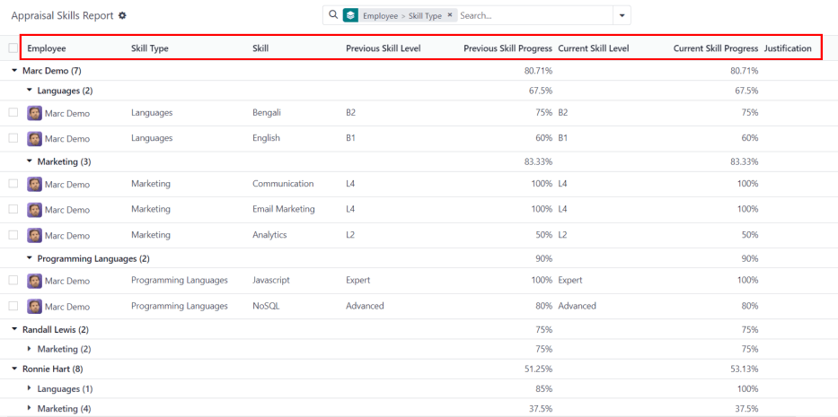

==========
Appraisals
==========

In Odoo, the *Appraisals* application can be used to evaluate employee performance on a recurring
basis. Managers can evaluate the performance of their employees, and also allow employees to do a
self-assessment of their own. Appraisals are customizable, and can be set for any kind of schedule
desired.

Appraisals give employees valuable feedback, including actionable goals to work toward, and
measurable skills to improve upon. Additionally, appraisals may form the basis for raises,
promotions, and other benefits.

Regular appraisals are good for both the employees and the company, since they can accurately
measure performance based on company goals, and show employees where they need to improve.

Configuration
=============

The :guilabel:`Configuration` menu in the *Appraisals* application is where the settings can be
configured, feedback templates can be edited, frequencies can be set, evaluation scales can be
managed, data for 360 feedback can be stored, and goal tags can be viewed/created.

Settings
--------

To access the *Settings* menu, navigate to :menuselection:`Appraisals application --> Configuration
--> Settings`.

Feedback templates
~~~~~~~~~~~~~~~~~~

Feedback templates are form outlines used during an employee appraisal. Any edits made to a template
are, ultimately, reflected in the appraisals sent to employees.

There are two default templates pre-configured in Odoo *Appraisals*: one for employee feedback, and
one for manager feedback. Each contains several sections, along with questions, and brief
explanations for how to respond to the questions.

The :guilabel:`Employee Feedback Template` has the following sections: :guilabel:`My work`,
:guilabel:`My future`, and :guilabel:`My feelings`.

The :guilabel:`Manager Feedback Template` has the following sections: :guilabel:`Feedback`,
:guilabel:`Evaluation`, and :guilabel:`Improvements`.

Any desired changes to the default feedback templates can be made by making changes directly in each
template.

Appraisals
~~~~~~~~~~

The :guilabel:`Appraisals` section of the settings menu determines the frequency that appraisals are
performed, and if it is possible to request additional feedback.

.. image:: appraisals/appraisals-setting.png
   :align: center
   :alt: The appraisals sections with the timeline filled in and 360 feedback enabled.

.. _appraisals/appraisal-plan:

Appraisals plans
****************

By default, appraisals are pre-configured to be automatically created six months after an employee
is hired, with a second appraisal exactly six months after that.

Once those two initial appraisals have been completed in the employee's first year, following
appraisals are only created once a year (every twelve months).

To modify this schedule, change the number of months in the blank fields under the
:guilabel:`Appraisals Plans` section.

.. important::
   If the :guilabel:`Appraisals Plans` section is modified, **all** empty :guilabel:`Next Appraisal
   Dates` are modified for **all** employees.

360 feedback
************

The :guilabel:`360 Feedback` option can be enabled to allow managers to request feedback from other
employees using a different survey form, at any time, independent of the appraisal schedule.

Typically, managers ask for feedback from other people who work with an employee they manage. This
includes the employee's various managers, peers, and direct reports.

To view the :guilabel:`360 Feedback` survey, click the :guilabel:`→ Internal link` icon at the end
of the :guilabel:`Default Template` field. The :guilabel:`360 Feedback` survey loads, and any
desired changes to the survey can be made.

For more information on how to edit a survey, refer to the :doc:`../marketing/surveys/create`
document.

.. important::
   The :guilabel:`360 Feedback` form is a pre-configured survey within the *Surveys* application. In
   order to use the :guilabel:`360 Feedback` option, including the ability to edit the survey, the
   *Surveys* application **must** be installed.

Evaluation scale
----------------

On each employee appraisal form, final rating options appear by default. To view and edit these
options, navigate to :menuselection:`Appraisals application --> Configuration --> Evaluation Scale`.
This presents the ratings in a list view.

The pre-configured ratings are :guilabel:`Needs Improvement`, :guilabel:`Meets Expectations`,
:guilabel:`Exceeds Expectations`, and :guilabel:`Strongly Exceeds Expectations`. To add another
rating, click the :guilabel:`New` button.

When the :guilabel:`New` button is clicked on the :guilabel:`Evaluation Scale` page, a blank line
appears at the bottom of the list. Enter the name of the rating in the field.

To rearrange the order of the ratings, click the :guilabel:`(six small gray boxes)` icon to the left
of a rating, and drag the rating to the desired position on the list.

.. image:: appraisals/evaluation-scale.png
   :align: center
   :alt: The evaluation scale, with the new button and click and drag icons highlighted.

360 feedback
------------

The :guilabel:`360 Feedback` section displays information for all the surveys currently configured
in the *Appraisals* application. To view the surveys, and their statistics, navigate to
:menuselection:`Appraisals application --> Configuration --> 360 Feedback`.

.. image:: appraisals/survey-list.png
   :align: center
   :alt: A list view of all available surveys in the Appraisals application.

Each appraisal (or survey) is presented in its own line on the :guilabel:`360 Feedback` page, along
with various information related to that particular appraisal.

Each appraisal includes the following information:

- :guilabel:`Survey Name`: the name of the specific survey.
- :guilabel:`Responsible`: the employee responsible for the survey, including the month and year
  they were given that designation.
- :guilabel:`Questions`: the number of questions in that particular survey.
- :guilabel:`Average Duration`: the average time a user spends completing the survey.
- :guilabel:`Registered`: the number of people who have been sent the survey.
- :guilabel:`Completed`: the number of people who have completed the survey.

Each appraisal also has two buttons at the end of each line: a :guilabel:`Test` button and a
:guilabel:`See Results` button.

To see what an appraisal looks like for the end user (i.e. an employee), click the :guilabel:`Test`
button, and the appraisal loads in a new browser tab. The entire appraisal loads, and can be clicked
through without having to enter any answers.

To exit, close the tab. Or, click :guilabel:`This is a Test Survey. → Edit Survey` at the top of the
page to be taken to the detail form for that particular survey.

To view the results from everyone who completed an appraisal, click the :guilabel:`See Results`
button. This presents all the answers for the survey in a new tab. Each question provides
information on how many people responded to a question, and how many people skipped it. All answers
for each question are visible.

To exit, close the tab. Or, click :guilabel:`→ Edit Survey` at the top of the page to be taken to
the detail form for that particular survey.

In addition to viewing the responses from past appraisals and surveys, new surveys can also be
created from the :guilabel:`360 Feedback` page. Simply click the :guilabel:`New` button in the
top-left of the page to create a new survey.

For more information on how to create a survey, refer to the :doc:`../marketing/surveys/create`
document.

.. note::
   In previous versions of Odoo, this section was referred to as :guilabel:`Surveys`.

Tags
----

An additional feature of the *Appraisals* application is the ability to set :ref:`goals
<appraisals/goals>` for employees. On each goal form, there is a field to add tags. The available
tags are pulled from a list that is configured from the settings.

To view a list of all existing goal tags, and to create new tags, go to the :guilabel:`Goal Tags`
page, by navigating to :menuselection:`Appraisals application --> Configuration --> Tags`.

All currently configured tags are presented in a list view.

The *Appraisals* application does **not** have any pre-configured tags, so all tags need to be added
from this list, or directly from the goal form.

To create a new tag from the :guilabel:`Goal Tags` page, click the :guilabel:`New` button, and a
blank line appears.

Enter the name of the tag on the line. Then, press the enter key to save the tag, and create a new
blank line. Repeat this for all tags that need to be added.

The list of tags is automatically arranged in alphabetical order.

Appraisals
==========

Navigate to the main *Appraisals* dashboard by opening the :guilabel:`Appraisals` application. The
:guilabel:`Appraisals` dashboard is the default view.

To view the dashboard at any point in the application, navigate to :menuselection:`Appraisals
application --> Appraisals`.

All appraisals are displayed on the dashboard in a Kanban view, by default, with a list of groupings
on the left side of the dashboard, including :guilabel:`Company`, :guilabel:`Department`, and
:guilabel:`Status`.

Click any grouping option to view appraisals for **only** the chosen selection.

.. note::
   Only groupings with multiple selections appear in the list. For example, if a database only has
   one company, the :guilabel:`Company` grouping does **not** appear, since there is no other
   company to select.

Each appraisal card displays the following information:

- :guilabel:`Name`: the employee's name.
- :guilabel:`Department`: the department the employee is associated with.
- :guilabel:`Company`: the company the employee works for. This only appears in a multi-company
  database.
- :guilabel:`Date`: the date the appraisal was requested, or is scheduled for in the future.
- :guilabel:`Activities`: any activities that are scheduled for the appraisal, such as
  :guilabel:`Meetings` or :guilabel:`Phone Calls.` If no activities are scheduled, an activity can
  be scheduled from the :guilabel:`🕘 (clock)` icon, located in the bottom-left corner of an
  appraisal card.
- :guilabel:`Manager`: the employee's manager, indicated by the profile icon in the bottom-right
  corner of an appraisal card.
- :guilabel:`Status banner`: the status of the appraisal. A banner appears if an appraisal is
  marked as either :guilabel:`Canceled` or :guilabel:`Done`. If no banner is present, that means the
  appraisal has not happened, or has not been scheduled yet.

To view the details of any appraisal, click on the card to open the appraisal form.

.. image:: appraisals/dashboard.png
   :align: center
   :alt: The Appraisals dashboard with each appraisal in its own box.

New appraisal
-------------

To create a new appraisal, click the :guilabel:`New` button at the top of the :guilabel:`Appraisals`
dashboard to load a blank appraisal form. Then, enter the following information on the form:

- :guilabel:`Name`: enter the employee's name.
- :guilabel:`Manager`: select the employee's manager from the drop-down menu. The manager is
  responsible for completing the :guilabel:`Manager's Feedback` section of the appraisal. This field
  auto-populates after the employee is selected, if they have a manager set on their employee
  profile.
- :guilabel:`Appraisal Date`: the current date is automatically entered in this field. This field is
  automatically updated once the appraisal is completed or canceled, with the corresponding date of
  completion or cancellation.
- :guilabel:`Department`: select the employee's department from the drop-down menu. This field
  auto-populates after the employee is selected, if they have a department set on their employee
  profile.
- :guilabel:`Company`: select the employee's company from the drop-down menu. This field
  auto-populates after the employee is selected, if they have a company set on their employee
  profile.

.. note::
   The only required fields for the appraisal form are the employee's :guilabel:`Name`, the
   :guilabel:`Manager`, and the :guilabel:`Company`.

Once the form is complete, click the :guilabel:`Confirm` button to confirm the appraisal request.

Once confirmed, the employee receives an email stating that an appraisal was requested, and is then
prompted to schedule an appraisal date.

The status changes to :guilabel:`Confirmed`, and the :guilabel:`Employee's Feedback` section of the
:guilabel:`Appraisal` tab is grayed out. The information in that section only appears after the
self-assessment is published by the employee. The :guilabel:`Final Rating` field also appears once
the appraisal request is confirmed.

If there are any existing appraisals for the employee, an :guilabel:`Appraisal` smart button appears
at the top of the page, listing the total number of appraisals there are for the employee.

Ask for feedback
~~~~~~~~~~~~~~~~

As part of the appraisal process, the manager can request feedback on an employee from anyone in the
company. Feedback is usually requested from co-workers and other people who interact with, or work
with, the employee. This is to get a more well-rounded view of the employee, and aid in the
manager's overall assessment.

To request feedback, the appraisal **must** be confirmed. Once confirmed, an :guilabel:`Ask
Feedback` button appears at the top of the form.

When the :guilabel:`Ask Feedback` button is clicked, an :guilabel:`Ask Feedback` email pop-up form
appears, using the :guilabel:`Appraisal: Ask Feedback` email template, which sends the
:guilabel:`360 Feedback` survey.

Enter the employees being asked to complete the survey in the :guilabel:`Recipients` field. Multiple
employees may be selected.

The email template has dynamic placeholders to personalize the message. Add any additional text to
the email, if desired.

If required, an :guilabel:`Answer Deadline` can be added, as well.

If any attachments are needed, click the :guilabel:`Attachments` button, and a file explorer window
appears. Navigate to the file(s), select them, then click :guilabel:`Open`.

When the email is ready to send, click :guilabel:`Send.`

.. image:: appraisals/ask-feedback.png
   :align: center
   :alt: The email pop-up when requesting feedback from other employees.

Appraisal form
~~~~~~~~~~~~~~

Once an appraisal is confirmed, the next steps are for the employee to fill out the self-assessment,
after which the manager completes their assessment.

.. _appraisals/employee-feedback:

Employee's feedback
*******************

To complete their portion of feedback, employees should navigate to the main
:menuselection:`Appraisals application` dashboard, where the only entries visible are appraisals for
the employee, themselves, and/or anyone they manage and have to provide manager feedback for.

Click on the appraisal to open the appraisal form. Enter responses in the :guilabel:`Employee's
Feedback` section, under the :guilabel:`Appraisal` tab.

When completed, click the :guilabel:`Not Visible to Manager` toggle (the default setting once an
appraisal is confirmed). When clicked, the toggle changes to :guilabel:`Visible to Manager`.

.. image:: appraisals/employee-feedback.png
   :align: center
   :alt: The feedback section for the employee with the toggle button highlighted.

.. _appraisals/manager-feedback:

Manager's feedback
******************

After the employee has completed the :guilabel:`Employee's Feedback` section, under the
:guilabel:`Appraisal` tab, it is time for the manager to fill out the :guilabel:`Manager's Feedback`
section.

The manager enters their responses in the fields in the :ref:`same manner as the employee
<appraisals/employee-feedback>`.

When the feedback section is completed, click the :guilabel:`Not Visible to Employee` toggle (the
default setting once an appraisal is confirmed). When clicked, the toggle changes to
:guilabel:`Visible to Employee`.

.. image:: appraisals/manager-feedback.png
   :align: center
   :alt: The feedback section for both employees and managers. The toggle buttons are highlighted.

Skills tab
~~~~~~~~~~

Part of an appraisal is evaluating an employee's skills, and tracking their progress over time. The
:guilabel:`Skills` tab of the appraisal form auto-populates with the skills from the :doc:`employee
form <../hr/employees/new_employee>`, once an appraisal is confirmed.

Each skill is grouped with like skills, and the :guilabel:`Skill Level`, :guilabel:`Progress`, and
:guilabel:`Justification` are displayed for each skill.

Update any skills, or add any new skills to the :guilabel:`Skills` tab.

If a skill level has increased, a reason for the improved rating can be entered into the
:guilabel:`Justification` field, such as `took a fluency language test` or `received Javascript
certification`.

Refer to the :ref:`Create a new employee <employees/skills>` document for detailed instructions on
adding or updating a skill.

After an appraisal is completed, and the skills have been updated, the next time an appraisal is
confirmed, the updated skills populate the :guilabel:`Skills` tab.

Private note tab
~~~~~~~~~~~~~~~~

If managers want to leave notes that are only visible to other managers, they can be entered in the
:guilabel:`Private Note` tab. The employee being evaluated does **not** have access to this tab, and
the tab does **not** appear on their appraisal.

Schedule a meeting
------------------

Once both portions of an appraisal are completed (the :ref:`employee <appraisals/employee-feedback>`
and :ref:`manager <appraisals/manager-feedback>` feedback sections), it is time for the employee and
manager to meet and discuss the appraisal.

A meeting can be scheduled in one of two ways: either from the *Appraisals* application dashboard,
or from an individual appraisal card.

To schedule an appraisal from the dashboard of the *Appraisals* application, first navigate to
:menuselection:`Appraisals application --> Appraisals`.

Click the :guilabel:`🕘 (clock)` icon, beneath the appraisal date on the desired appraisal card, and
a :guilabel:`Schedule Activity` pop-up window appears. Then, click :guilabel:`+ Schedule an
activity` to create a blank activity form.

Select :guilabel:`Meeting` for the :guilabel:`Activity Type` from the drop-down menu. Doing so
causes the form to change, so only the :guilabel:`Activity Type` and :guilabel:`Summary` fields
appear.

If scheduling an activity other than a meeting, such as a :guilabel:`Call` or a :guilabel:`To-Do`,
the fields that appear on the :guilabel:`Schedule Activity` pop-up form change, accordingly.

.. note::
   The :guilabel:`🕘 (clock)` icon may appear as a number of different icons, depending on what, if
   any, scheduled activities are in place, and the color represents their corresponding due dates.

   If no activities are scheduled, that is represented by a gray :guilabel:`🕘 (clock)` icon.

   However, if a specific activity is scheduled, the icon may appear as a :guilabel:`📞 (phone)`
   icon for a phone call, a :guilabel:`👥 (group of people)` icon for a meeting, and so on.

   The color of the icon indicates the status; a green icon means an activity is scheduled in the
   future, and a red icon means the activity is past due.

   For more details on activities, refer to the :doc:`../essentials/activities` document.

   .. image:: appraisals/activity-icons.png
      :align: center
      :alt: The appraisal cards with the various activity icons highlighted.

Enter a brief description in the :guilabel:`Summary` field of the :guilabel:`Schedule Activity`
pop-up window, such as `Annual Appraisal for (Employee)`.

Next, click the :guilabel:`Open Calendar` button. From the calendar page that appears, navigate to,
and double-click on, the desired date and time for the meeting.

Doing so opens a :guilabel:`New Event` pop-up form. From this pop-up form, make any desired
modifications, such as designating a :guilabel:`Start` time, or giving a :guilabel:`Name` to the
meeting.

Add the appraisee in the :guilabel:`Attendees` section, and include anyone else who should be in the
meeting, if necessary.

To make the meeting a video call, instead of an in-person meeting, click :guilabel:`+ Odoo meeting`,
and a :guilabel:`Videocall URL` link appears in the field.

Once all the desired changes are complete, click :guilabel:`Save & Close`.

The meeting now appears on the calendar, and the invited parties are informed, via email.

.. image:: appraisals/meeting.png
   :align: center
   :alt: The meeting form with all information entered for Ronnie Hart's annual appraisal.

The other way to schedule a meeting is from the individual appraisal form. To do this, navigate to
the :menuselection:`Appraisal application` dashboard, then click on an appraisal card.

Next, click on the :guilabel:`Meeting` smart button, and the calendar loads. Follow the same
directions above to create the meeting.

.. note::
   If no meetings are scheduled, the :guilabel:`Meeting` smart button says :guilabel:`No Meeting`.

.. _appraisals/goals:

Goals
=====

The ability to set goals for employees to work toward is an important feature of Odoo *Appraisals*.
Goals are typically set during an appraisal, so the employee knows what they need to work toward
before their next appraisal.

To view all goals, navigate to :menuselection:`Appraisals application --> Goals`. This presents all
the goals for every employee, in a default Kanban view.

Each goal card contains the following information:

- :guilabel:`Skill`: the name of the goal.
- :guilabel:`Name`: the employee the goal is assigned to.
- :guilabel:`Deadline`: the due date for the goal.
- :guilabel:`Progress`: the percentage of competency set for the goal.
- :guilabel:`Employee`: the profile icon of the employee the goal is assigned to.

If a goal is completed, a :guilabel:`Done` banner appears in the top-right corner of the goal card.

.. note::
   Every individual goal requires its own entry for each employee. If employees have the same goal,
   a goal card for each employee appears on the list. For example, if both Bob and Sara have the
   same goal of `Typing`, two cards appear in the Kanban view: one `Typing` goal for Bob, and
   another `Typing` goal for Sara.

New goal
--------

To create a new goal, navigate to :menuselection:`Appraisals application --> Goals`, and click
:guilabel:`New` to open a blank goal form.

Enter the information on the card. The information requested is all the same information that
appears on the :ref:`goal card <appraisals/goals>` in the Kanban view, with the addition of a
:guilabel:`Tags` field and a :guilabel:`Description` tab.

The current user populates the :guilabel:`Employee` field by default, and the :guilabel:`Manager`
field populates with the manager set on the employee profile.

Make any necessary changes to the form, and add any notes that might be useful to clarify the goal
in the :guilabel:`Description` tab.

.. image:: appraisals/new-goal.png
   :align: center
   :alt: A goal form filled out for a Python skill, set to 50% proficiency.

Completed goals
---------------

When a goal has been met, it is important to update the record. A goal can be marked as `Done` in
one of two ways: from the main :guilabel:`Goals` dashboard, or from the individual goal card.

To mark a goal as `Done` from the main :guilabel:`Goals` dashboard, click on the :guilabel:`⋮ (three
dots)` icon in the top-right of a goal card.

.. important::
   The :guilabel:`⋮ (three dots)` icon **only** appears when the mouse hovers over the corner of a
   goal card.

Then, click :guilabel:`Mark as Done` from the resulting drop-down menu. A green :guilabel:`Done`
banner appears in the top-right corner of the goal card.

To mark a goal as `Done` from the goal card itself, click on a goal card to open that goal's form.
Then, click the :guilabel:`Mark as Done` button in the top-left of the form. When clicked, a green
:guilabel:`Done` banner appears in the top-right corner of the goal form.

Reporting
=========

The *Appraisals* application tracks two metrics across two different reports: an :ref:`appraisal
analysis <appraisals/analysis>`, and a :ref:`skills evolution <appraisals/skills-report>`.

.. _appraisals/analysis:

Appraisal analysis
------------------

To access the *Appraisal Analysis* report, navigate to :menuselection:`Appraisals application -->
Reporting --> Appraisal Analysis`. This displays a report of all the appraisals in the database,
highlighted in different colors to represent their status.

Appraisals in yellow are completed, appraisals in orange are in-progress (the appraisal is
confirmed, but not completed), and appraisals in gray are scheduled (according to the
:ref:`appraisals/appraisal-plan`), but have not been confirmed yet.

The report displays the whole current year, by default, grouped by department.

To change the calendar view presented, change the date settings in the top-left of the report. The
options to display are :guilabel:`Day`, :guilabel:`Week`, :guilabel:`Month`, and :guilabel:`Year`.
Use the arrows to move forward or backward in time.

At any point, click the :guilabel:`Today` button to present the calendar to include today's date in
the view.

The report can have other filters and groupings set in the :guilabel:`Search...` bar at the top.

.. image:: appraisals/analysis.png
   :align: center
   :alt: A report showing all the appraisals for the Appraisal Analysis report.

.. _appraisals/skills-report:

Skills evolution
----------------

To access the *Skills Evolution* report, navigate to :menuselection:`Appraisals application -->
Reporting --> Skills Evolution`. This displays a report of all skills, grouped by employee.

All the lines of the report are collapsed, by default. To view the details of a line, click on a
line to expand the data.

Each skill has the following information listed:

- :guilabel:`Employee`: name of the employee.
- :guilabel:`Skill Type`: the category the skill falls under.
- :guilabel:`Skill`: the specific, individual skill.
- :guilabel:`Previous Skill Level`: the level the employee had previously achieved for the skill.
- :guilabel:`Previous Skill Progress`: the previous percentage of competency achieved for the skill
  (based on the :guilabel:`Skill Level`).
- :guilabel:`Current Skill Level`: the current level the employee has achieved for the skill.
- :guilabel:`Current Skill Progress`: the current percentage of competency achieved for the skill.
- :guilabel:`Justification`: any notes entered on the skill explaining the progress.

