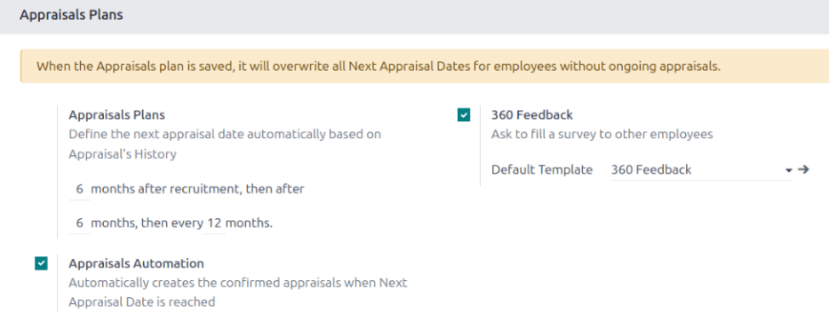

:show-content:

==========
Appraisals
==========

In Odoo, the **Appraisals** application is used to evaluate employee performance on a recurring
basis. Managers evaluate the performance of their employees, and also allow employees to do a
self-assessment of their own. Appraisals are customizable, and can be set for any kind of schedule
desired.

Appraisals give employees valuable feedback, including actionable goals to work toward, and
measurable skills to improve upon. Additionally, appraisals may form the basis for raises,
promotions, and other benefits.

Regular appraisals are good for both the employees and the company, since they can accurately
measure performance based on company goals, and show employees where they need to improve.

The :guilabel:`Configuration` menu in the **Appraisals** application is where settings are
configured, appraisal templates are selected and edited, frequencies are set, evaluation scales are
managed, data for 360 feedback is stored, skills are managed, and goal tags are viewed and created.

Settings
========

To access the *Settings* menu, navigate to :menuselection:`Appraisals app --> Configuration -->
Settings`.

Appraisal templates
-------------------

Appraisal templates are form outlines used during an employee appraisal. Any edits made to a
template are, ultimately, reflected in the appraisals sent to employees.

One default appraisal template, titled :guilabel:`Default Template`, comes preconfigured in Odoo
**Appraisals**, and is selected. To view the appraisal template details, click the
:icon:`oi-arrow-right` :guilabel:`(Internal link)` icon at the end of the :guilabel:`Default
Template` line, or navigate to the :ref:`Appraisal Templates <appraisals/appraisal-templates>`
dashboard.

.. _appraisals/appraisal-plan:

Appraisals Plans
----------------

The :guilabel:`Appraisals` section of the settings menu determines the frequency that appraisals are
performed, if appraisals are automatically scheduled and confirmed, and if it is possible to request
additional feedback.

By default, appraisals are preconfigured to be automatically created six months after an employee is
hired, with a second appraisal exactly six months after that.

Once those two initial appraisals have been completed in the employee's first year, following
appraisals are only created once a year (every twelve months).

To modify this schedule, change the number of months in the blank fields under the
:guilabel:`Appraisals Plans` section.

.. important::
   If the :guilabel:`Appraisals Plans` section is modified, **all** empty :guilabel:`Next Appraisal
   Dates` are modified for **all** employees.

The :guilabel:`360 Feedback` option can be enabled to allow managers to request feedback from other
employees using a different survey form, at any time, independent of the appraisal schedule.

Typically, managers ask for feedback from other people who work with an employee they manage. This
includes the employee's various managers, peers, and direct reports.

To view the :guilabel:`360 Feedback` survey, click the :icon:`oi-arrow-right` :guilabel:`(Internal
link)` icon at the end of the :guilabel:`Default Template` field. The :guilabel:`360 Feedback`
survey loads, and any desired changes to the survey can be made.

For more information on how to edit a survey, refer to the :doc:`../marketing/surveys/create`
document.

.. important::
   The :guilabel:`360 Feedback` form is a preconfigured survey within the *Surveys* application. In
   order to use the :guilabel:`360 Feedback` option, including the ability to edit the survey, the
   *Surveys* application **must** be installed.

.. _appraisals/appraisal-templates:

Appraisal templates
===================

To view all available appraisal templates, navigate to :menuselection:`Appraisals app -->
Configuration --> Appraisal Templates`.

A :guilabel:`Default Template` appears in the list, which comes preconfigured in Odoo. Click the
template to view the template details. The :guilabel:`Default Template` consists of two parts, one
for employee feedback, and one for manager feedback. Each part contains several sections, along with
questions, and brief explanations for how to respond to the questions.

The :guilabel:`Employee Feedback` part of the template has the following sections: :guilabel:`My
work`, :guilabel:`My future`, and :guilabel:`My feelings`.

The :guilabel:`Manager Feedback Template` part of the template has the following sections:
:guilabel:`Feedback`, :guilabel:`Evaluation`, and :guilabel:`Improvements`.

Any desired changes to the default feedback template can be made by making changes directly on the
form.

Evaluation scale
================

After an appraisal is completed, a final rating must be given to the employee. This rating helps the
employee know how they are performing in their role.

On each employee appraisal form, six final rating options appear by default. To view and edit these
options, navigate to :menuselection:`Appraisals app --> Configuration --> Evaluation Scale`. This
presents the ratings in a list view.

The preconfigured ratings are :guilabel:`Needs Improvement`, :guilabel:`Meets Expectations`,
:guilabel:`Exceeds Expectations`, :guilabel:`Strongly Exceeds Expectations`, and :guilabel:`Good`.
To add another rating, click the :guilabel:`New` button, a blank line appears at the bottom of the
list. Enter the name of the rating in the field.

360 feedback
============

The :guilabel:`360 Feedback` section displays information for all the surveys available in the
**Appraisals** application. To view the surveys, and their statistics, navigate to
:menuselection:`Appraisals application --> Configuration --> 360 Feedback`.

.. image:: appraisals/survey-list.png
   :alt: A list view of all available surveys in the Appraisals application.

Each appraisal (or survey) is presented in its own line on the :guilabel:`360 Feedback` page, along
with various information related to that particular appraisal.

Each appraisal includes the following information:

- :guilabel:`Survey Name`: the name of the specific survey.
- :guilabel:`Responsible`: the employee responsible for the survey, including the month and year
  they were given that designation.
- :guilabel:`Questions`: the number of questions in that particular survey.
- :guilabel:`Average Duration`: the average time a user spends completing the survey.
- :guilabel:`Registered`: the number of people who have been sent the survey.
- :guilabel:`Completed`: the number of people who have completed the survey.

Each appraisal also has two buttons at the end of each line: a :guilabel:`Test` button and a
:guilabel:`See Results` button.

To see what an appraisal looks like for the end user (i.e. an employee), click the :guilabel:`Test`
button, and the appraisal loads in a new browser tab. The entire appraisal loads, and can be clicked
through without having to enter any answers. To exit, close the tab.

To view the results from everyone who completed an appraisal, click the :guilabel:`See Results`
button. This presents all the answers for the survey in a new tab. Each question provides
information on how many people responded to a question, and how many people skipped it. All answers
for each question are visible. To exit, close the tab.

In addition to viewing the responses from past appraisals and surveys, new surveys can also be
created from the :guilabel:`360 Feedback` page. Click the :guilabel:`New` button in the top-left of
the page to create a new survey.

For more information on how to create a survey, refer to the :doc:`../marketing/surveys/create`
document.

Skills Type
===========

A full list of employee skills can be viewed and modified from the **Appraisals** app, by navigating
to :menuselection:`Appraislas app --> Configuration --> Skills Type`. This present a list of all the
currently configured employee skills.

This is identical to the skills listed in the employees app. Skills and skill types can be added or
modified from this dashboard, or from the :ref:`Employees app <employees/skill-types>`.

Tags
====

Odoo **Appraisals** uses tags to organize employee :doc:`goals <appraisals/goals>`. To view the
currently configured tags, navigate to :menuselection:`Appraislas app --> Configuration --> Tags`,
and the :guilabel:`Goal Tags` dashboard loads.

To add a new tag, click the :guilabel:`New` button in the upper-left corner. Enter the tag in the
blank line that appears at the bottom of the list.

.. seealso::
   - :doc:`appraisals/new_appraisals`
   - :doc:`appraisals/goals`
   - :doc:`appraisals/appraisal_analysis`
   - :doc:`appraisals/skills_evolution`

.. toctree::
   :titlesonly:

   appraisals/new_appraisals
   appraisals/goals
   appraisals/appraisal_analysis
   appraisals/skills_evolution
