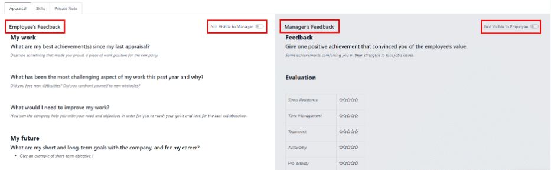

==========
Appraisals
==========

Odoo's *Appraisals* application is where employees are evaluated on a regular basis. Managers
evaluate the performance of their employees, and employees can do a self-assessment. Appraisals are
customizable and can be set for any kind of schedule.

Appraisals give employees valuable feedback including goals to work towards and skills to improve
upon. Appraisals may form the basis for raises, promotions, and other benefits. Regular appraisals
are good for both the employees and the company, by letting employees know how they are performing,
and how they can improve.

Configuration
=============

The configuration menu is where the appraisal feedback template is edited, the frequency is set,
the evaluation scale is managed, and where the data for the 360 feedback is stored.

Settings
--------

To access the :guilabel:`Settings` menu, navigate to :menuselection:`Appraisals application -->
Configuration --> Settings`.

Feedback templates
~~~~~~~~~~~~~~~~~~

Feedback templates provide the outline of the form used during an employee appraisal. Any edits made
to this template are reflected in the appraisals sent to employees.

There are two default templates pre-configured for both employee feedback and manager feedback, each
with several sections containing questions and brief explanations on how to respond to the
questions. The :guilabel:`Employee Feedback Template` has the following sections: :guilabel:`My
work`, :guilabel:`My future`, and :guilabel:`My feelings`. The :guilabel:`Manager Feedback Template`
has the following sections: :guilabel:`Feedback`, :guilabel:`Evaluation`, and
:guilabel:`Improvements`.

Make any desired changes to the feedback templates by making changes directly in each template.

Appraisals
~~~~~~~~~~

The :guilabel:`Appraisal` section of the settings menu deals with the frequency that appraisals are
performed, and if other feedback is available to request.

.. image:: appraisals/appraisals-setting.png
   :align: center
   :alt: The appraisals sections with the timeline filled in and 360 feedback enabled.

.. _appraisals/appraisal-plan:

Appraisals plans
****************

Appraisals are pre-configured to be automatically generated six months after an employee is hired,
then another appraisal six months after that. After those initial two appraisals that first year,
appraisals are conducted once a year (every twelve months).

To modify the schedule, change the number of months in the blank fields under the
:guilabel:`Appraisal Plans` section.

.. important::
   If the :guilabel:`Appraisals Plans` section is modified, all empty :guilabel:`Next Appraisal
   Dates` are modified for all employees.

360 feedback
************

Enable the :guilabel:`360 Feedback` option to allow managers to request feedback from other
employees using a different survey form, at any time, independent of the appraisal schedule.
Typically, managers ask for feedback from other people who work with an employee they manage. This
includes the employee's various manager, peers, and direct reports.

To view the :guilabel:`360 Degree Feedback` survey, click the :guilabel:`→ Internal link` icon after
the :guilabel:`Default Template` field. The :guilabel:`360 Feedback` survey loads. Make any desired
changes to the survey here. For more information on how to edit a survey, refer to the
:doc:`../marketing/surveys/create` document.

.. note::
   The 360 Feedback form is a pre-configured survey within the *Surveys* application. In order to
   use the :guilabel:`360 Feedback` option, including the ability to edit the survey, the *Surveys*
   application must be installed.

Evaluation scale
----------------

To view the default final rating options that appear on the employee appraisal form, navigate to
:menuselection:`Appraisals application --> Configuration --> Evaluation Scale`. This presents the
ratings in a list view. The pre-configured ratings are :guilabel:`Needs Improvement`,
:guilabel:`Meets Expectations`, :guilabel:`Exceeds Expectations`, and :guilabel:`Strongly Exceeds
Expectations`. To add another rating, click the :guilabel:`New` button and a blank line appears at
the bottom of the list. Enter the name of the rating in the field. To rearrange the order of the
ratings, click on the six small gray boxes to the left of a rating, and drag the rating to the
desired position.

.. image:: appraisals/evaluation-scale.png
   :align: center
   :alt: The evaluation scale, with the new button and click and drag icons highlighted.

360 feedback
------------

The :guilabel:`360 Feedback` section displays information for all the currently configured surveys
for the *Appraisals* application that can be used within the application. To view the surveys and
their statistics, navigate to :menuselection:`Appraisals application --> Configuration --> 360
Feedback`.

Each appraisal (or survey) is presented in its own line, with various information presented. Each
survey includes the following information:

- :guilabel:`Survey Name`: the name for the specific survey.
- :guilabel:`Responsible Person`: the employee responsible for the survey, including the month and
  year they were set as the responsible person.
- :guilabel:`Questions`: the number of questions in the particular survey.
- :guilabel:`Average Duration`: the average time that a user spends completing the survey.
- :guilabel:`Registered`: the amount of people who have been sent the survey.
- :guilabel:`Completed`: the amount of people who have completed the survey.

Each appraisal also has two buttons at the end of each line, a :guilabel:`Test` button and a
:guilabel:`See Results` button. To see what an appraisal looks like to the end user, click the
:guilabel:`Test` button and the appraisal loads in a new tab. The entire appraisal loads and can be
clicked through without having to enter any answers. To exit, close the tab. To view the results
from everyone who completed an appraisal, click the :guilabel:`See Results` button. This presents
all the answers for the survey in a new tab. Each question provides information on how many people
responded to a question, and how many people skipped it. All answers for each questions are visible.
To exit, close the tab.

.. image:: appraisals/survey-list.png
   :align: center
   :alt: A list view of all available surveys in the Appraisals application.

A new survey can be created from this form. Click the :guilabel:`New` button at the top to create a
new survey. For more information on how to create a survey, refer to the
:doc:`../marketing/surveys/create` document.

.. note::
   In previous version of Odoo, this section was referred to as :guilabel:`Surveys`.

Tags
----

One aspect of the *Appraisals* application is the ability to set :ref:`goals <appraisals/goals>`
for employees. On the goal forms, there is a field to add tags. The available tags are pulled from a
list that is configured from the configuration settings. To view a list of all the current goal
tags, and to create new tags, navigate to :menuselection:`Appraisals application --> Configuration
--> Tags`.

All currently configured tags are presented in a list view. The *Appraisals* application does not
have any pre-configured tags, so all tags need to be added either from this list, or directly from
the goal form.

To create a new tag, click the :guilabel:`New` button, and a blank line appears. Enter the name of
the tag on the line. Press the enter key to save the tag and create a new blank line. Repeat this
for all tags to be added. The list of tags is automatically arranged in alphabetical order.

Appraisals
==========

Navigate to the main appraisals dashboard by opening the *Appraisals* application. The appraisals
dashboard is the default view. To view the dashboard at any point in the application, navigate to
:menuselection:`Appraisals application --> Appraisals`.

All appraisals are displayed on the dashboard in a kanban view. A list of groupings appears on the
left side of the dashboard. Click any grouping option to view appraisals for only that selection.
The groupings that appear are :guilabel:`Company`, :guilabel:`Department`, and :guilabel:`Status`.

.. note::
   Only groupings with multiple selections appear in the list. For example, if a database only has
   one company, the :guilabel:`Companies` grouping does not appear since there is no other company
   to select.

Each card displays the following information about the appraisal:

- :guilabel:`Name`: the employee's name.
- :guilabel:`Department`: the department the employee is part of.
- :guilabel:`Company`: the company the employee works for.
- :guilabel:`Date`: the date the appraisal was requested or is scheduled for in the future.
- :guilabel:`Activities`: any activities that are scheduled for the appraisal, such as
  :guilabel:`Meetings` or :guilabel:`Phone Calls.` If no activities are scheduled, an activity can
  be scheduled from the icon.
- :guilabel:`Manager`: the employee's manager.
- :guilabel:`Stats banner`: the status of the appraisal. A banner appears if an appraisal is
  :guilabel:`Cancelled` or if it is :guilabel:`Done`.

To view the details of any appraisal, click on the card to open the appraisal form.

.. image:: appraisals/dashboard.png
   :align: center
   :alt: The Appraisals dashboard with each appraisal in its own box.

New appraisal
-------------

To request an appraisal, click the :guilabel:`New` button at the top of the dashboard and a blank
appraisal form loads. Enter the following information on the form:

- :guilabel:`Name`: enter the employee's name.
- :guilabel:`Manager`: select the employee's manager from the drop-down menu. The manager is
  responsible for completing the :guilabel:`Manager's Feedback` section of the appraisal. This field
  auto-populates after the employee is selected, if they have a manager set on their employee
  profile.
- :guilabel:`Appraisal Date`: the current date is automatically entered in this field. This field is
  automatically updated once the appraisal is completed or cancelled, with the corresponding date of
  completion or cancellation.
- :guilabel:`Department`: select the employee's department from the drop-down menu. This field
  auto-populates after the employee is selected, if they have a department set on their employee
  profile.
- :guilabel:`Company`: select the employee's company from the drop-down menu.This field
  auto-populates after the employee is selected, if they have a company set on their employee
  profile.

.. note::
   The only required fields for the appraisal form are the employee's :guilabel:`Name`, the
   :guilabel:`Manager`, and the :guilabel:`Company`.

Once the form is complete, click the :guilabel:`Confirm` button to confirm the appraisal request.
The employee receives an email stating that an appraisal was requested, and asks to schedule an
appraisal date. The status changes to :guilabel:`Confirmed`, and the :guilabel:`Employee's Feedback`
section of the :guilabel:`Appraisal` tab is greyed out. The information in that section only appears
after the self-assessment is published by the employee. The :guilabel:`Final Rating` field also
appears once the appraisal request is confirmed.

If there are any existing appraisals for the employee, an :guilabel:`Appraisal` smart button appears
at the top, listing the total number of appraisals there are for the employee.

Ask for feedback
~~~~~~~~~~~~~~~~

As part of the appraisal process, the manager can request feedback on an employee from anyone in the
company. Feedback is usually requested from coworkers and other people who interact with or work
with the employee. This is to get a more well-rounded view of the employee and aid in the managers
assessment.

To request feedback, click the :guilabel:`Ask Feedback` button at the top of the form. An email form
appears using the :guilabel:`Appraisal: Ask Feedback` email template, which sends the :guilabel:`360
Feedback` survey. Enter the employees being asked to complete the survey in the
:guilabel:`Recipients` field. Multiple employees may be selected. The email template has dynamic
placeholders to personalize the message. Add any additional text to the email if desired. If any
attachments are needed, click the :guilabel:`Attachments` button and a file explorer window appears.
Navigate to the file(s), select them, then click :guilabel:`Open`. When the email is ready to send,
click :guilabel:`Send.`

.. image:: appraisals/ask-feedback.png
   :align: center
   :alt: The email pop up when requesting feedback from other employees.

Appraisal form
~~~~~~~~~~~~~~

Once an appraisal is confirmed, the next steps are for the employee to fill out the self-assessment,
after which the manager completes their assessment.

.. _appraisals/employee-feedback:

Employee's feedback
*******************

Navigate to the main :menuselection:`Appraisals application` dashboard. The only entries visible on
the dashboard are appraisals for the employee themself and anyone they manage and have to provide
manager feedback for.

Click on the appraisal to open the appraisal form. Enter responses in the :guilabel:`Employee's
Feedback` section. When completed, click the :guilabel:`Not Visible to Manager` toggle (the default
setting once an appraisal in confirmed). The toggle changes to :guilabel:`Visible to Manager`.

.. _appraisals/manager-feedback:

Managers's feedback
*******************

After the employee has completed the :guilabel:`Employee's Feedback` section, it is time for the
manager to fill out the :guilabel:`Manager's Feedback` section. The manager enters the responses in
the fields in the :ref:`same manner as the employee <appraisals/employee-feedback>`. When the
feedback section is competed, click the the :guilabel:`Not Visible to Employee` toggle (the default
setting once an appraisal in confirmed). The toggle changes to :guilabel:`Visible to Employee`.

Skills tab
~~~~~~~~~~

Part of an appraisal is evaluating an employee's skills and tracking their progress over time. The
:guilabel:`Skills` tab of the appraisal auto-populates with the skills from the :doc:`employee form
<../hr/employees/new_employee>` once an appraisal is confirmed.

Each skill is grouped with like skills, and the :guilabel:`Skill Level`, :guilabel:`Progress`, and
:guilabel:`Justification` are displayed for each skill. Update any skills, or add any new skills to
the skills tab. If a skill level has increased, a reason for the improved rating can be entered into
the :guilabel:`Justification` field, such as `took a fluency language test` or `received Javascript
certification`. Refer to the :ref:`Create a new employee <employees/skills>` document for detailed
instructions on adding or updating a skill.

After an appraisal is completed and the skills have been updated, the next time an appraisal is
confirmed, the updated skills populate the skills tab.

.. image:: appraisals/skills.png
   :align: center
   :alt: The skills tab of na appraisal form, all filled out.

Private note tab
~~~~~~~~~~~~~~~~

If managers want to leave notes that are only visible to other managers, enter them in the
:guilabel:`Private Note` tab. The employee being evaluated does not have access to this tab, and the
tab does not appear on their appraisal.

Schedule a meeting
------------------

Once both portions of an appraisal are completed (the :ref:`employee
<appraisals/employee-feedback>` and :ref:`manager <appraisals/manager-feedback>` feedback sections)
it is time for the employee and manager to meet, to discuss the appraisal. A meeting can be
scheduled in one of two ways, either from the *Appraisals* application dashboard, or from an
individual appraisal card.

First, navigate to the main *Appraisals* application dashboard by going to
:menuselection:`Appraisals application --> Appraisals`. Click on the activity icon beneath the
appraisal date on the desired appraisal card and an activity summary pop-up appears. Click
:guilabel:`+ Schedule an activity` and a blank activity form appears. Select :guilabel:`Meeting` for
the :guilabel:`Activity Type` from the drop-down menu. The form changes so only the
:guilabel:`Activity Type` and :guilabel:`Summary` fields appear. If scheduling an activity other
than a meeting (such as a phone call or a to-do), the fields that appear on the schedule activity
form changes.

.. note::
   The activity icon may appear as a number of different icons, depending on what, if any, scheduled
   activities are in place, and their due dates. If no activities are scheduled, the icon is a gray
   clock. For example, the icon may appear as a phone for a phone call, a cluster of people for a
   meeting, a Gantt chart for an appraisal form to be filled out, among others. The color of the
   icon indicates the status; a green icon means an activity is scheduled in the future, and a red
   icon means the activity is past due. For more details on activities, refer to the
   :doc:`../productivity/discuss/overview/plan_activities` document

   .. image:: appraisals/activity-icons.png
      :align: center
      :alt: The appraisal cards with the various activity icons highlighted.

Enter a brief summary in the field, such as `Annual Appraisal for (Employee)`. Next, click the
:guilabel:`Open Calendar` button and the calendar loads. Navigate to and double click on the date
and time for the meeting, and a :guilabel:`New Event` form pops up. Make any modifications desired
to the form, such as the start and end times, or the name of the meeting. Add the person being
appraised in the :guilabel:`Attendees` section, and include anyone else who should be in the
meeting, if necessary. To make the meeting a video call instead of an in-person meeting, click
:guilabel:`+ Odoo meeting` and a :guilabel:`Videocall URL` link appears in the field. When done
making changes to the form, click :guilabel:`Save & Close`. The meeting now appears on the calendar,
and the invited parties are informed via email.

.. image:: appraisals/meeting.png
  :align: center
  :alt: The meeting form with all information entered for Ronnie Hart's annual appraisal.

The other way to schedule a meeting is to navigate to the individual appraisal form. Navigate to the
main *Appraisal* application dashboard, then click on an appraisal card. Next, click on the
:guilabel:`Meeting` smart button and the calendar loads. Follow the same directions above to create
the meeting.

.. note::
   If no meetings are scheduled the :guilabel:`Meeting` smart button will say :guilabel:`No
   Meeting`.

.. _appraisals/goals:

Goals
=====

An important aspect of the *Appraisals* application is the ability to set goals for employees to
work towards, and have them logged in the application. Goals are typically set during an appraisal,
so employees know what goals they need to work on before their next appraisal.

To view the various goals, navigate to :menuselection:`Appraisals Application --> Goals`. This
presents all goals for every employee in a kanban view.

Each goal card contains the following information:

- :guilabel:`Skill`: the name of the goal.
- :guilabel:`Name` the employee the goal is assigned to.
- :guilabel:`Deadline`: the due date for the goal.
- :guilabel:`Progress`: the percentage of competency set for the goal.
- :guilabel:`Employee`: the employee icon the goal is assigned to.

If a goal is completed, a :guilabel:`Done` banner appears in the top right corner of the goal card.

.. image:: appraisals/goals.png
  :align: center
  :alt: The goals kanban view, with nine goal cards.

.. note::
   Every individual goal requires its own entry for each employee. If employees have the same goal,
   a goal card for each employee must appear on the list. For example, if both Bob and Sara have the
   same goal of `Typing`, two cards appear in the kanban view, one a `Typing` goal for Bob, and
   another `Typing` goal for Sara.

New goal
--------

To create a new goal, navigate to :menuselection:`Appraisals Application --> Goals` and click
:guilabel:`New`. A blank goal form appears. Enter the information on the card. The information
requested is all the same information that appears on the :ref:`goal card <appraisals/goals>` in the
kanban view, with the addition of a :guilabel:`Tags` field and a :guilabel:`Description` tab. The
current user populates the :guilabel:`Employee` field by default, and the :guilabel:`Manager` field
populates with the manager set on the employee profile. Make any changes necessary to the form, and
add any notes that may be necessary to clarify the goal in the :guilabel:`Description` tab.

.. image:: appraisals/new-goal.png
  :align: center
  :alt: A goal form filled out for a Python skill, set to 50% proficiency.

Completed goals
---------------

When a goal has been met, it is important to update the record. A goal can be marked as done in one
of two ways, from the main goals dashboard, or from the individual goal card.

On the main goals dashboard, click on the :guilabel:`three dots` in the top right of a goal card
(this only appears when the mouse hovers over the corner). Click :guilabel:`Mark as Done` in the
drop-down menu, and a green :guilabel:`Done` banner appears in the top right corner.

The other method is in the goal card itself. Click on a goal card to opn the goal form. Click the
:guilabel:`Mark as Done` button in the top left of the form. A green :guilabel:`Done` banner appears
in the top right corner of the goal form.

Reporting
=========

The *Appraisals* application tracks two metrics in two different reports, an :ref:`appraisal
analysis <appraisals/analysis>`, and a :ref:`skills evolution <appraisals/skills-report>`.

.. _appraisals/analysis:

Appraisal analysis
------------------

To access the :guilabel:`Appraisal Analysis` report, navigate to :menuselection:`Appraisals
Application --> Reporting --> Appraisal Analysis`. This displays a report of all the appraisals in
the database, highlighted in different colors to represent their status.

Appraisals in yellow are completed, appraisals in orange are in-process (the appraisal is confirmed
but not completed), and appraisals in grey are scheduled (according to the
:ref:`appraisals/appraisal-plan`) but have not been confirmed yet. The report displays the whole
current year by default, grouped by department.

To change the calendar view presented, change the date settings in the top left of the report. The
options to display are :guilabel:`Day`, :guilabel:`Week`, :guilabel:`Month`, and :guilabel:`Year`.
Use the arrows to move forward or backwards in time. At any point, click the :guilabel:`Today`
button to present the calendar so it includes today's date in the view. The report can have other
filters and groupings set in the search bar at the top.

.. image:: appraisals/analysis.png
  :align: center
  :alt: A report showing all the appraisals for the Appraisal Analysis report.

.. _appraisals/skills-report:

Skills evolution
----------------

To access the :guilabel:`Skills Evolution` report, navigate to :menuselection:`Appraisals
Application --> Reporting --> Skills Evolution`. This displays a report of all skills, grouped by
employee.

All the lines of the report are collapsed by default. To view the details of a line, click on a line
to expand the data. Each skill has the following information listed for it:

- :guilabel:`Employee`: name of the employee.
- :guilabel:`Skill Type`: the category the skill falls under.
- :guilabel:`Skill`: the specific, individual skill.
- :guilabel:`Previous Skill Level`: the level the employee had previously achieved for the skill.
- :guilabel:`Previous Skill Progress`: the previous percentage of competency achieved for the skill
  (based on the :guilabel:`Skill Level`).
- :guilabel:`Current Skill Level`: the current level the employee has achieved for the skill.
- :guilabel:`Current Skill Progress`: the current percentage of competency achieved for the skill.
- :guilabel:`Justification`: any notes entered on the skill explaining the progress.

.. image:: appraisals/skills-report.png
  :align: center
  :alt: A report showing all the skills grouped by employee.
