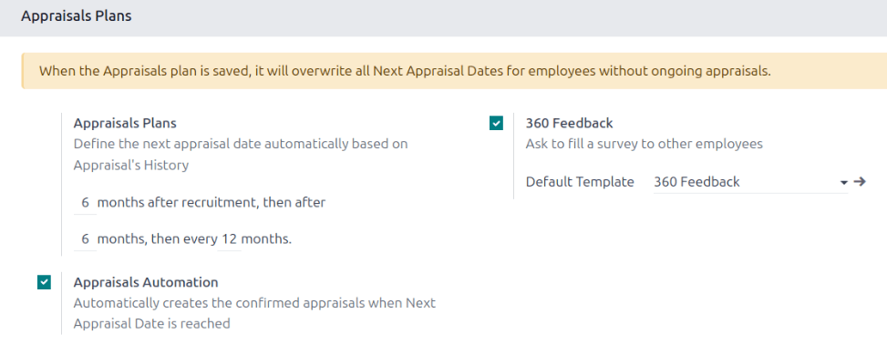
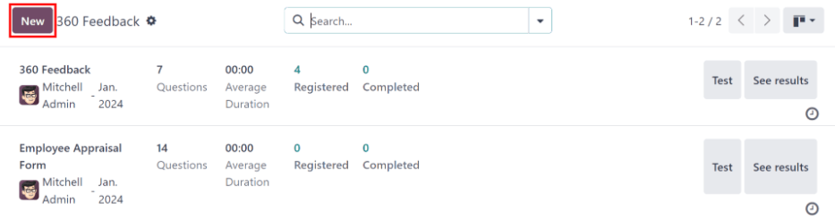

:show-content:

==========
Appraisals
==========

In Odoo, the **Appraisals** application is used to evaluate employee performance on a recurring
basis. Managers can evaluate the performance of their employees, and also allow employees to do a
self-assessment of their own. Appraisals are customizable, and can be set for any desired schedule.

Appraisals give employees valuable feedback, including actionable goals to work toward, and
measurable skills to improve upon. Additionally, appraisals may form the basis for raises,
promotions, and other benefits.

Regular appraisals are good for both the employees and the company, since they can accurately
measure performance based on company goals, and show employees where they need to improve.

The :guilabel:`Configuration` menu in the **Appraisals** application is where various settings are
configured, frequencies are set, appraisal templates are edited, evaluation scales are managed, data
for 360 feedback is stored, skills are managed, and goal tags are created.

.. important::
   When the **Appraisals** app is installed, the **Employees** app is also installed, as appraisals
   are dependant on employees, and the app cannot work without the **Employees** app.

Settings
========

To access the *Settings* menu, navigate to :menuselection:`Appraisals app --> Configuration
--> Settings`. First, using the drop-down menu, select the :guilabel:`Default Template` used for all
employee appraisals.

Feedback templates are form outlines used during an employee appraisal. One template comes
preconfigured with the **Appraisals** app, named :guilabel:`Default Template`.

.. _appraisals/appraisal-plan:

Appraisals plans
----------------

The :guilabel:`Appraisals Plans` section of the settings menu determines the frequency appraisals
are performed, whether appraisals are scheduled automatically, and if it is possible to request
additional feedback.

By default, appraisals are preconfigured to be automatically created six months after an employee is
hired, with a second appraisal exactly six months after that.

Once those two initial appraisals have been completed in the employee's first year, following
appraisals are only created once a year (every twelve months).

To modify this schedule, change the number of months in the blank fields under the
:guilabel:`Appraisals Plans` section.

To have appraisals automatically scheduled *and* confirmed according to the schedule, tick the
checkbox next to :guilabel:`Appraisals Automation`.

.. important::
   If the :guilabel:`Appraisals Plans` section is modified, **all** empty :guilabel:`Next Appraisal
   Dates` are modified for **all** employees.

Enable the :guilabel:`360 Feedback` option to allow managers to request feedback from other
employees using a different survey form, at any time, independent of the appraisal schedule.

Typically, managers ask for feedback from other people who work with an employee they manage. This
includes the employee's various managers, coworkers, and direct reports.

By default, the preconfigured :guilabel:`360 Feedback` populates the :guilabel:`Default Template`
field.

To view the :guilabel:`360 Feedback` survey, click the :icon:`oi-arrow-right` :guilabel:`(Internal
link)` icon at the end of the :guilabel:`Default Template` field. The :guilabel:`360 Feedback`
survey loads, and any desired changes to the survey are then made.

For more information on how to edit a survey, refer to the :doc:`../marketing/surveys/create`
document.

.. important::
   The :guilabel:`360 Feedback` form is a preconfigured survey within the **Surveys** application.
   In order to use the :guilabel:`360 Feedback` option, including the ability to edit the survey,
   the **Surveys** application **must** be installed.

Appraisal templates
===================

To view available appraisal templates and make any desired modifications, navigate to
:menuselection:`Appraisals app --> Configuration --> Appraisal Templates`. Only one appraisal
template comes preconfigured in Odoo's **Appraisals** app, the :guilabel:`Default Template`.

Click on the template to view the template details. The :guilabel:`Default Template` contains
several sections, along with questions, and brief explanations for how to respond to the questions.

The :guilabel:`Employee Feedback` section has the following sections: :guilabel:`My work`,
:guilabel:`My future`, and :guilabel:`My feelings`.

The :guilabel:`Manager Feedback` side has the following sections: :guilabel:`Feedback`,
:guilabel:`Evaluation`, and :guilabel:`Improvements`.

Make any desired modifications directly in the template. Any edits made to the template are,
ultimately, reflected in the appraisals sent to employees.

Evaluation scale
================

On each employee appraisal form, final rating options appear by default. To view and edit these
options, navigate to :menuselection:`Appraisals app --> Configuration --> Evaluation Scale`. This
presents the ratings in a list view.

The preconfigured ratings are :guilabel:`Needs Improvement`, :guilabel:`Meets Expectations`,
:guilabel:`Exceeds Expectations`, :guilabel:`Strongly Exceeds Expectations`, and :guilabel:`Good`.
To add another rating, click the :guilabel:`New` button, and a blank line appears at the bottom of
the list. Enter the name of the rating in the field.

.. note::
   If in a multi-company environment, a :guilabel:`Company` column also appears.

360 feedback
============

The :guilabel:`360 Feedback` section displays information for all the surveys currently configured
in the **Appraisals** application. To view the surveys, and their statistics, navigate to
:menuselection:`Appraisals app --> Configuration --> 360 Feedback`.

Each appraisal (or survey) is presented in its own line on the :guilabel:`360 Feedback` dashboard,
along with various information related to each particular appraisal.

Each appraisal includes the following information:

- :guilabel:`Survey Name`: the name of the specific survey.
- :guilabel:`Responsible`: the employee responsible for the survey, including the month and year
  they were given that designation.
- :guilabel:`Questions`: the number of questions in that particular survey.
- :guilabel:`Average Duration`: the average time a user spends completing the survey.
- :guilabel:`Registered`: the number of people who have been sent the survey.
- :guilabel:`Completed`: the number of people who have completed the survey.

Each appraisal also has two buttons at the end of each line: a :guilabel:`Test` button and a
:guilabel:`See results` button.

To see what an appraisal looks like for the end user (i.e. an employee), click the :guilabel:`Test`
button, and the appraisal loads in a new browser tab. The entire appraisal loads, and can be clicked
through without having to enter any answers. To exit, close the tab.

To view the results from everyone who completed an appraisal, click the :guilabel:`See Results`
button. This presents all the answers for the survey in a new tab. Each question provides
information on how many people responded to a question, and how many people skipped it. All answers
for each question are visible. To exit, close the tab.

In addition to viewing the responses from past appraisals and surveys, new surveys can also be
created from the :guilabel:`360 Feedback` page. Click the :guilabel:`New` button in the top-left
corner of the page to create a new survey.

For more information on how to create a survey, refer to the :doc:`../marketing/surveys/create`
document.

.. note::
   In previous versions of Odoo, this section was referred to as :guilabel:`Surveys`.

Skills type
===========

An employee's progress is reflected not only in their appraisals, but through specific :doc:`goals
<appraisals/goals>`. These goals can be reviewed independently, or concurrent with an appraisal.

Goals can be based on specific skills, or independently. To view the currently configured skills,
navigate to :menuselection:`Appraisals app --> Configuration --> Skills Type`. This list is
identical to the skills in the *8Employees** app, and can be modified either here in the
**Appraisals** app, or in the :ref:`Employees app <employees/skill-types>`.

Tags
====

Tags are used when creating an employee :doc:`goals <appraisals/goals>`, to classify goals for
reporting purposes. To view the preconfigured tags, navigate to :menuselection:`Appraisals app -->
Configuration --> Tags`.

The default tags are: :guilabel:`External`, :guilabel:`Hard Skills`, :guilabel:`Internal`,
:guilabel:`Programming`, :guilabel:`Soft Skills`, and :guilabel:`Training`.

To add a new tag, click the :guilabel:`New` button in the upper-left corner. Enter the new tag in
the blank field that appears at the bottom of the list.

.. seealso::
   - :doc:`appraisals/new_appraisals`
   - :doc:`appraisals/goals`
   - :doc:`appraisals/appraisal_analysis`
   - :doc:`appraisals/skills_evolution`

.. toctree::
   :titlesonly:

   appraisals/new_appraisals
   appraisals/goals
   appraisals/appraisal_analysis
   appraisals/skills_evolution
