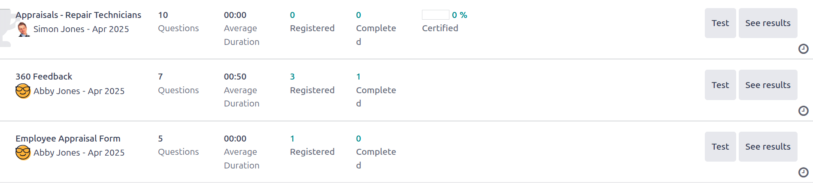
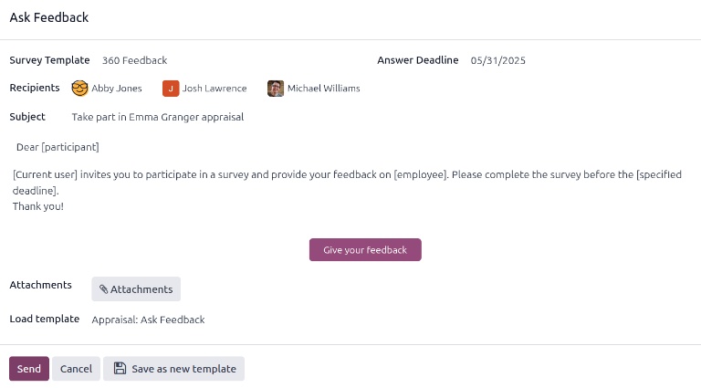

============
360 Feedback
============

Odoo's **Appraisals** app lets managers gather feedback on their direct reports from anyone in the
company. Input from colleagues gives managers a fuller view of each employee's strengths, growth
areas, and collaboration skills.

.. _appraisals/360-dashboard:

360 feedback dashboard
======================

The :guilabel:`360 Feedback` section displays information for all the surveys configured for the
**Appraisals** app. To view the surveys and their statistics, navigate to :menuselection:`Appraisals
app --> Configuration --> 360 Feedback`.

Each appraisal, or survey, is presented on its own line on the :guilabel:`360 Feedback` dashboard,
along with various information related to that particular appraisal.

Each appraisal includes the following information:

- :guilabel:`Survey Name`: the name of the specific survey.
- :guilabel:`Responsible`: the employee responsible for the survey, including the month and year
  they were given that designation.
- :guilabel:`Questions`: the number of questions in that particular survey.
- :guilabel:`Average Duration`: the average time a user spends completing the survey.
- :guilabel:`Registered`: the number of people who have been sent the survey.
- :guilabel:`Completed`: the number of people who have completed the survey.
- :guilabel:`Certified`: if the survey is for a certification, the percentage of users who have
  passed the certification.

Each appraisal row offers two actions:

- :guilabel:`Test`: Opens the appraisal in a new tab to preview the questions without submitting
  answers. Close the tab to return to the list, or click :icon:`oi-arrow-right` :guilabel:`Go to
  Survey`/:guilabel:`Go to Appraisal` for the full form.
- :guilabel:`See Results`: :ref:`View response analytics <appraisals/360-view-results>`.

.. _appraisals/360-request-feedback:

Request feedback
================

To request feedback from a colleague, navigate to the **Appraisals** app, and click on the appraisal
card to open it.

Click the :guilabel:`Ask Feedback` button, and an :guilabel:`Ask Feedback` email pop-up window
appears, using the :guilabel:`Appraisal: Ask Feedback` email template.

First, using the drop-down menu, select the employees being asked to provide feedback in the
:guilabel:`Recipients` field. Multiple employees may be selected. Next, make any desired changes to
the default message, and attach any relevant documents.

The :guilabel:`Answer Deadline` date is automatically set to the day after the :guilabel:`Appraisal
Date` on the appraisal form. Using the calendar selector, modify the date, if desired.

Click :guilabel:`Send`, and the feedback requests are sent to the specified employees.

.. _appraisals/360-view-results:

View results
============

To view the results from everyone who has completed a survey, click the :guilabel:`See Results`
button at the end of the corresponding survey line in the :ref:`360 Feedback dashboard
<appraisals/360-dashboard>`. This presents all the answers for the survey in a new tab. Each
question provides information on how many people responded to a question, and how many people
skipped it. All answers for each question are visible.

To save a PDF version of the survey results, click the :icon:`fa-print` :guilabel:`(Print)` icon at
the top of the page. To exit, close the tab.

In addition to viewing the responses from past appraisals and surveys, new surveys can also be
created from the :guilabel:`360 Feedback` page. Click the :guilabel:`New` button in the top-left of
the page to create a new survey.

For more information on how to create a survey, refer to the :doc:`../../marketing/surveys/create`
document.
