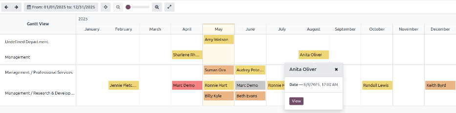
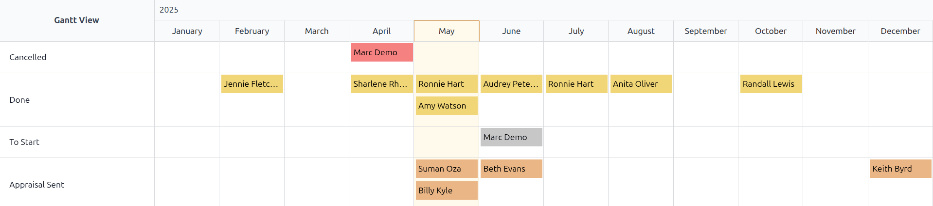
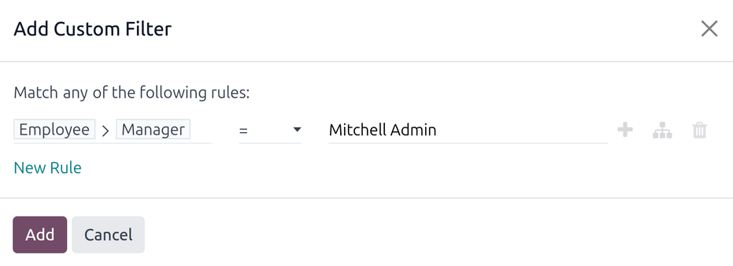
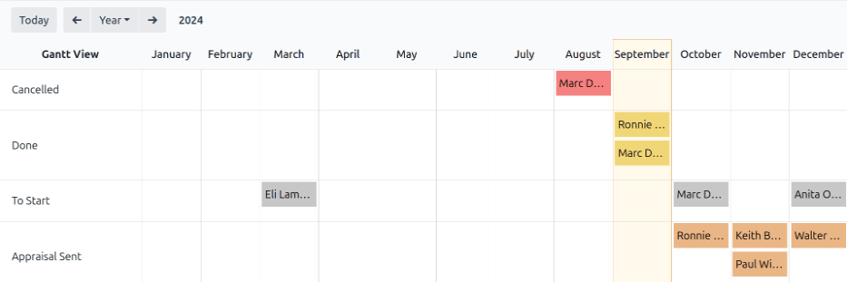

==================
Appraisal analysis
==================

The **Appraisals** app has the ability to report on all the appraisals in the system, including
past, present, and future appraisals, and their respective statuses. This report helps managers
track scheduled appraisals, and identify any overdue or unconfirmed ones.

To access the *Appraisal Analysis* report, navigate to :menuselection:`Appraisals app --> Reporting
--> Appraisal Analysis`.

On the :guilabel:`Appraisal Analysis` page, a report loads, displaying all the appraisals in the
database. Each entry is highlighted in a different color to represent their status:

+-----------+----------------------------+------------------------------------------------+
| Color     | Status                     | Meaning                                        |
+===========+============================+================================================+
| Yellow    |:guilabel:`Done`            | The appraisal was completed.                   |
+-----------+----------------------------+------------------------------------------------+
| Orange    |:guilabel:`Appraisal Sent`  |The appraisal was confirmed, but not completed. |
+-----------+----------------------------+------------------------------------------------+
| Red       |:guilabel:`Cancelled`       |The appraisal was cancelled.                    |
+-----------+----------------------------+------------------------------------------------+
| Gray      |:guilabel:`To Start`        | The appraisal was scheduled, but not confirmed.|
+-----------+----------------------------+------------------------------------------------+

.. note::
   Appraisals are scheduled automatically (appear in gray), according to their respective
   :ref:`appraisals/appraisal-plan`.

The report displays the current year, in a default Gantt view, grouped by department, with the
current month highlighted.

To change the period of time that is presented, adjust the date settings in the top-left corner of
the report by clicking the default :guilabel:`Year` to reveal a drop-down menu of options. The
options to display are :guilabel:`Day`, :guilabel:`Week`, :guilabel:`Month`, and :guilabel:`Year`.
Use the adjacent arrows to move forward or backward in time.

At any point, click the :guilabel:`Today` button to have the Gantt view include today's date in the
view.

To view the details of any appraisal, click on any appraisal. A pop-over window appears, displaying
the due date for the appraisal. To view more details, click the :guilabel:`View` button, and further
details appear in a pop-up window.

The report can have other :ref:`filters <search/filters>` and :ref:`groupings <search/group>` set in
the search bar at the top.

.. _appraisals/group-status:

Group by status
===============

When a company has a large number of employees, the default :guilabel:`Appraisal Analysis` report
may display too much information to view easily. In this scenario, viewing the data by status can be
beneficial.

First, remove the default :icon:`oi-group` :guilabel:`Department` grouping from the search bar.
Next, click the :icon:`fa-caret-down` :guilabel:`(down arrow)` icon in the far-right of the search
bar. Click :guilabel:`Status` in the :icon:`oi-group` :guilabel:`Group By` column. Click away from
the drop-down menu to close it.

All the appraisals are now organized by status, in the following order: :guilabel:`Cancelled`,
:guilabel:`Done`, :guilabel:`To Start`, and :guilabel:`Appraisal Sent`.

This view makes it easy to see which appraisals need to be completed, and when, as well as which
appraisals still need to be confirmed.

Use case: view only the user's appraisals
=========================================

When viewing the :guilabel:`Appraisal Analysis` report, it can save time to only view the appraisals
the signed-in user is responsible for, and hide the rest.

To only view this data, click the :icon:`fa-caret-down` :guilabel:`(down arrow)` icon in the
far-right of the search bar, revealing a drop-down menu.

.. note::
   It is not necessary to remove the default :icon:`oi-group` :guilabel:`Department` grouping. If it
   remains active, the results are grouped by department. If it is removed, the results appear in a
   list, alphabetically.

Click :guilabel:`Add Custom Filter` at the bottom of the :icon:`fa-filter` :guilabel:`Filters`
column, and a :guilabel:`Add Custom Filter` pop-up window appears.

Click into the first field, and a pop-over appears with a variety of options. Click the
:icon:`fa-chevron-right` :guilabel:`(right arrow)` icon after the word :guilabel:`Employee`, then
scroll down and click on :guilabel:`Manager`. Next, set the middle field to :guilabel:`=`
:guilabel:`(equal)`. Last, click the third field and select the desired user from the list. When all
the fields are set, click :guilabel:`Add`.

Now, the only appraisals that appear are the appraisals that the selected user is responsible for,
instead of viewing *all* the appraisals.

This report can also be :ref:`grouped by status <appraisals/group-status>`.

.. seealso::
   - :doc:`Odoo essentials reporting <../../essentials/reporting>`
   - :doc:`../../essentials/search`
