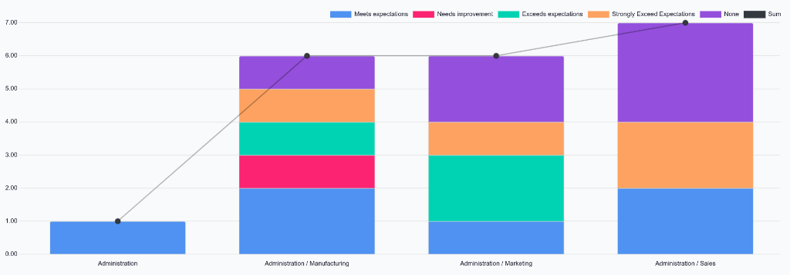

==================
Appraisal analysis
==================

The **Appraisals** app has the ability to report on all the appraisals in the system, including
past, present, and future appraisals, and their respective final ratings.

This report helps managers determine how employees are doing overall. If the majority of appraisals
have a status of *Needs improvement*, it may indicate that employees need more training to
successfully perform their jobs. If the majority of appraisals have a status of *Strongly Exceed
Expectations*, it may indicate that employees are not challenged enough, and may benefit from
promotions or increased levels of responsibility.

To view the *Appraisal Analysis* report, navigate to :menuselection:`Appraisals app --> Reporting
--> Appraisal Analysis`. On the *Appraisal Analysis* page, a report loads displaying all the
appraisals in the database for the past 365 days, in a default stacked bar chart. Appraisals are
grouped first by :guilabel:`Department` then :guilabel:`Final Rating`.

The displayed ratings correspond to the configured *Evaluation Scale* options. Each rating is
color-coded on the report. The default options for the *Evaluation Scale* are as follows:

- :guilabel:`Meets expectations`: Blue
- :guilabel:`Needs improvement`: Red
- :guilabel:`Exceeds expectations`: Green
- :guilabel:`Strongly Exceed Expectations`: Orange

.. note::
   If modifications are made to the *Evaluation Scale*, the colors and options may appear different.

Roll over any column's segment to view the number of appraisals with the respective final rating. To
view the specific appraisals within a segment, click on it. A list displaying each employee's
:guilabel:`Name`, :guilabel:`Department`, :guilabel:`Appraisal Date`, and :guilabel:`Status` for
every appraisal appears. Return to the *Appraisal Analysis* report by clicking the breadcrumb menu.

The default report includes appraisals that have been scheduled but not completed (appraisals with a
status of *Confirmed* or *To Confirm*). To **only** view completed appraisals, click into the search
bar, then click :guilabel:`Done` in the :icon:`fa-filter` :guilabel:`Filters` column. The report
reloads, displaying only completed appraisals with a final rating.

To view only appraisals for the signed-in user's team, click into the search bar and click
:guilabel:`My Team` in the :icon:`fa-filter` :guilabel:`Filters` column. This report only displays
the employees the user manages. This allows the user to better understand their team's performance
by showing how many employees are performing either above or below expectations.

.. tip::
   To hide a metric from the report, click its label above the chart. Hidden metrics are indicated
   by a strikethrough on the label. Click the label again to make the metric visible.

