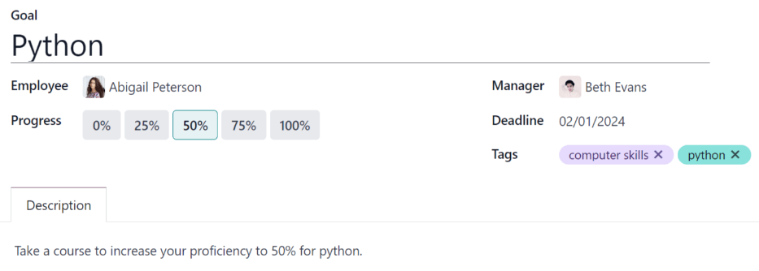

=====
Goals
=====

The Odoo *Appraisals* application allows managers to set goals for their employees. That way,
employees know what to work toward before their next review.

To view all goals, navigate to :menuselection:`Appraisals app --> Goals`. This presents all the
goals for every employee, in a default Kanban view.

.. _appraisals/goal-card:

Each goal card contains the following information:

- :guilabel:`Goal`: the name of the goal.
- :guilabel:`Employee`: the employee the goal is assigned to.
- :icon:`fa-clock-o` :guilabel:`(clock)` icon: displays the corresponding :doc:`activity icon
  <../../essentials/activities>` for the record. If no activities are scheduled, the default icon is
  the :icon:`fa-clock-o` :guilabel:`(clock)`. If any activities have been scheduled, the icon
  represents the activity scheduled soonest.
- :guilabel:`Deadline`: the due date for the goal.
- :guilabel:`Progress`: the percentage of competency set for the goal. The options are
  :guilabel:`0%`, :guilabel:`25%`, :guilabel:`50%`, :guilabel:`75%`, or :guilabel:`100%`.
- :guilabel:`Employee Icon`: the profile icon of the employee the goal is assigned to.

If a goal is completed, a :guilabel:`Done` banner appears in the top-right corner of the goal card.

.. image:: goals/goals.png
   :align: center
   :alt: The goals Kanban view, with nine goal cards.

.. note::
   Every individual goal requires its own record for each employee. If multiple employees have the
   same goal, a goal card for each employee appears on the list.

   For example, if Bob and Sara have the same goal of `Typing`, two cards appear in the Kanban view:
   one `Typing` goal for Bob, and another `Typing` goal for Sara.

New goal
========

To create a new goal, navigate to :menuselection:`Appraisals app --> Goals`, and click
:guilabel:`New` top-left corner to open a blank goal form.

Input the :guilabel:`Goal`, :guilabel:`Employee`, :guilabel:`Progress`, and :guilabel:`Deadline`,
information on the goal card, as discussed in the :ref:`goal card <appraisals/goal-card>` section of
this document.

The information requested is all the same information that appears on the goal card in the Kanban
view, with the addition of a :guilabel:`Tags` field and a :guilabel:`Description` tab.

.. tip::
   The *Appraisals* application does **not** have any pre-configured tags, so all tags need to be
   added. To add a tag, enter the name of the tag on the line, then click :guilabel:`Create
   "(tag)"`. Repeat this for all tags that need to be added.

The current user populates the :guilabel:`Employee` field, by default, and the :guilabel:`Manager`
field populates with the manager set on the employee profile.

Make any necessary changes to the form, and add any notes that might be useful to clarify the goal
in the :guilabel:`Description` tab.

Completed goals
===============

When a goal has been met, it is important to update the record. A goal can be marked as `Done` in
one of two ways: from the main :guilabel:`Goals` dashboard, or from the individual goal card.

To mark a goal as `Done` from the main :guilabel:`Goals` dashboard, click on the
:icon:`fa-ellipsis-v` :guilabel:`(vertical ellipsis)` icon in the top-right of a goal card.

.. note::
   The :icon:`fa-ellipsis-v` :guilabel:`(vertical ellipsis)` icon **only** appears when the mouse
   hovers over the top-right corner of a goal card.

Then, click :guilabel:`Mark as Done` from the resulting drop-down menu. A green :guilabel:`Done`
banner appears in the top-right corner of the goal card.

To mark a goal as `Done` from the goal card itself, click on a goal card to open that goal's form.
Then, click the :guilabel:`Mark as Done` button in the top-left of the form. When clicked, a green
:guilabel:`Done` banner appears in the top-right corner of the goal form.
