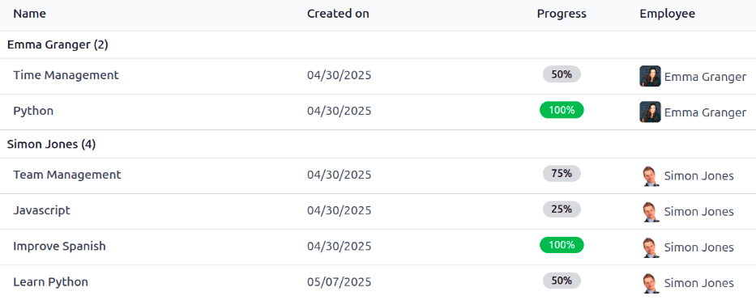

=====
Goals
=====

The Odoo **Appraisals** application allows managers to set (and track) clear goals for their
employees. Continuous progress towards goals give employees a concrete target between reviews, and
give managers reliable insights when evaluating performance.

View goals
==========

To view all goals, navigate to :menuselection:`Appraisals app --> Goals`. This presents all the
goals for every employee, in a default list view, grouped by :guilabel:`Employee`.

Click on an employee to expand the listed goals. Each goal displays the following information:

- :guilabel:`Name`: The name of the goal.
- :guilabel:`Created on`: The date the goal was made.
- :guilabel:`Progress`: The percentage of progress the employee has achieved.
- :guilabel:`Employee`: The employee assigned to the goal.

.. note::
   Only employees with goals assigned to them appear in the list.

.. _appraisals/goal-card:

Create goals
============

To create new goals, navigate to :menuselection:`Appraisals app --> Goals`, and click
:guilabel:`New` in the top-left corner to open a blank goal form. Add the following information on
the form:

- :guilabel:`Goal`: Type in a brief name for the goal in this field.
- :guilabel:`Employee`: Using the drop-down menu, select the employee being assigned the goal. Once
  this field is populated, the employee's manager populates the :guilabel:`Manager` field.
- :guilabel:`Progress`: Click the current percentage of competency for the goal. The options are
  :guilabel:`0%`, :guilabel:`25%`, :guilabel:`50%`, :guilabel:`75%`, or :guilabel:`100%`.
- :guilabel:`Manager`: Using the drop-down menu, select the employee's manager (if not already
  selected).
- :guilabel:`Deadline`: Using the calendar selector, enter the due date for the goal.
- :guilabel:`Tags`: Using the drop-down menu, add any relevant :ref:`tags <appraisals/add-tags>` to
  the goal.
- :guilabel:`Description` tab: Enter any details regarding the goal in this tab.

.. tip::
   Some goals can be broken down into steps, which may be input as a checklist. A checklist is a
   tool the employee may use to mark their progress.

.. image:: goals/new-goal.png
   :alt: A completed goal created for learning Python.

.. _appraisals/add-tags:

Tags
----

Adding tags to goals can help when viewing the goals report, to see how many goals with specific
tags are assigned to employees.

To view all the current tags, and add new ones, navigate to :menuselection:`Appraisals app -->
Configuration --> Tags`. All tags appear in a list view. The default tags are: :guilabel:`External`,
:guilabel:`Hard Skills`, :guilabel:`Internal`, :guilabel:`Programming`, :guilabel:`Soft Skills`, and
:guilabel:`Training`.

To add a new tag, click the :guilabel:`New` button in the upper-left corner, and a new line appears
at the bottom of the list. Enter the tag, then press return or click away from the field.

Update goals
============

During employee appraisals, goals are reviewed to see how much progress the employee has made. When
an employee has achieved the next level of progress, the goal must be updated accordingly.

To update a goal's progress percentage, navigate to :menuselection:`Appraisals app --> Goals`.
Expand the employee whose goals are being evaluated, and click on an individual goal to open the
goal record.

Click the new :guilabel:`Progress` box to set the new progress level. It is recommended to add notes
in the :guilabel:`Description` tab, as the employee progresses with the goal. The notes should
include dates the progress changed, and any supporting information regarding the change.

.. note::
   Goal progress can be updated at any time by the employee's manager, not only during an appraisal.

Complete goals
==============

When a goal has been met, it is important to update the record. Navigate to
:menuselection:`Appraisals app --> Goals`. Expand the employee whose goals are being evaluated, and
click on an individual goal to open the goal record.

Click the :guilabel:`Mark as Done` button in the upper-left corner. A green :guilabel:`Done` banner
appears in the top-right corner of the goal card, and the :guilabel:`Progress` changes to
:guilabel:`100%`.

.. note::
   On the :guilabel:`Goals` dashboard, completed goals are indicated with a green :guilabel:`100%`
   in the :guilabel:`Progress` column.
