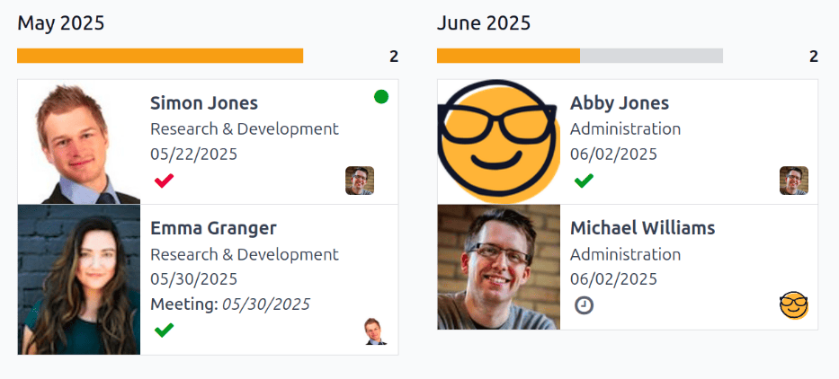
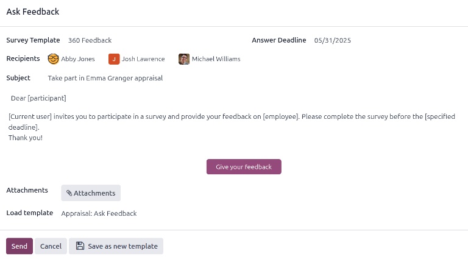
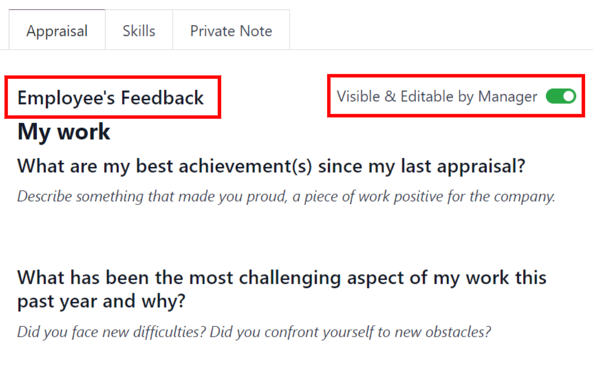
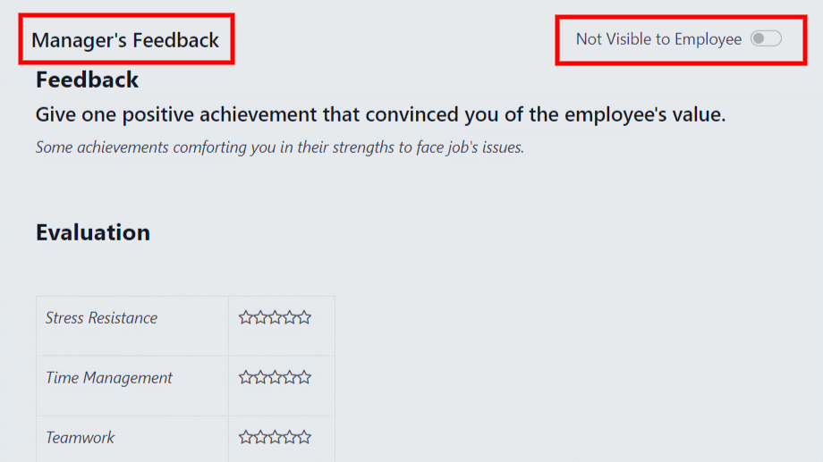
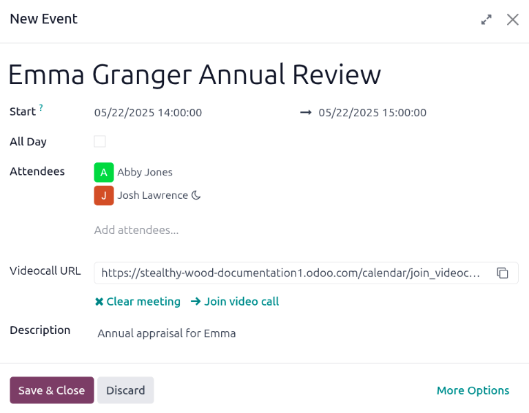

==============
New appraisals
==============

To create a new appraisal for an employee, first navigate to the main *Appraisals* dashboard by
opening the :menuselection:`Appraisals` app. The :guilabel:`Appraisals` dashboard is the default
view.

Appraisals dashboard
====================

All appraisals are displayed on the dashboard in a default Kanban view, with a list of groupings on
the left side of the dashboard, including :guilabel:`COMPANY`, :guilabel:`DEPARTMENT`, and
:guilabel:`STATUS`.

Click any grouping option to view appraisals for **only** the chosen selection.

.. note::
   Only groupings with multiple selections appear in the list. For example, if a database only has
   one company, the :guilabel:`COMPANY` grouping does **not** appear, since there is no other
   company to select.

Each appraisal card displays the following information:

- **Name**: the employee's name.
- **Department**: the department the employee is associated with.
- **Company**: the company the employee works for. This only appears in a multi-company
  database.
- **Date**: the date the appraisal was requested, or is scheduled for in the future.
- **Activities**: any :doc:`activities <../../essentials/activities>` that are scheduled for the
  appraisal, such as *Meetings* or *Phone Calls*.
- **Manager**: the employee's manager, indicated by the profile icon in the bottom-right
  corner of an appraisal card.
- **Status banner**: the status of the appraisal. A banner appears if an appraisal is marked as
  either *Canceled* or *Done*. If no banner is present, that means the appraisal has not happened,
  or has not been scheduled yet.

To view the details of any appraisal, click on the card to open the appraisal form.

Create an appraisal
===================

To create a new appraisal, click the :guilabel:`New` button in the upper-left corner of the
:guilabel:`Appraisals` dashboard. Doing so reveals a blank appraisal form. After entering a name in
the first blank field, proceed to enter the following information on the form:

- :guilabel:`Manager`: select the employee's manager from the drop-down menu. The manager is
  responsible for completing the *Manager's Feedback* section of the appraisal. This field
  auto-populates after the employee is selected, if they have a manager set on their employee
  profile.
- :guilabel:`Appraisal Date`: the current date is automatically entered in this field. This field is
  automatically updated once the appraisal is completed or cancelled, with the corresponding date of
  completion or cancellation.
- :guilabel:`Department`: select the employee's department from the drop-down menu. This field
  auto-populates after the employee is selected, if they have a department set on their employee
  profile.
- :guilabel:`Company`: select the employee's company from the drop-down menu. This field
  auto-populates after the employee is selected, if they have a company set on their employee
  profile.

.. note::
   The only required fields for the appraisal form are the employee's name, the :guilabel:`Manager`,
   and the :guilabel:`Company`.

Once the form is complete, click the :guilabel:`Confirm` button to confirm the appraisal request.

Once confirmed, the employee receives an email stating that an appraisal was requested, and is then
prompted to schedule an appraisal date.

The status changes to :guilabel:`Confirmed`, and the :guilabel:`Employee's Feedback` section of the
:guilabel:`Appraisal` tab is grayed out. The information in that section only appears after the
self-assessment is published by the employee. The :guilabel:`Final Rating` field also appears once
the appraisal request is confirmed.

If there are any existing appraisals for the employee, an :guilabel:`Appraisal` smart button appears
at the top of the page, listing the total number of appraisals there are for the employee.

Ask for feedback
----------------

As part of the appraisal process, the manager can request feedback on an employee from anyone in the
company. Feedback is usually requested from co-workers and other people who interact with, or work
with, the employee. This is to get a more well-rounded view of the employee, and aid in the
manager's overall assessment.

To request feedback, the appraisal **must** be confirmed. Once confirmed, an :guilabel:`Ask
Feedback` button appears at the top of the form.

When the :guilabel:`Ask Feedback` button is clicked, an :guilabel:`Ask Feedback` email pop-up form
appears, using the :guilabel:`Appraisal: Ask Feedback` email template, which sends the
:guilabel:`360 Feedback` survey.

Enter the employees being asked to complete the survey in the :guilabel:`Recipients` field. Multiple
employees may be selected.

The email template has dynamic placeholders to personalize the message. Add any additional text to
the email, if desired.

If required, an :guilabel:`Answer Deadline` can be added, as well.

If any attachments are needed, click the :icon:`fa-paperclip` :guilabel:`Attachments` button, and a
file explorer window appears. Navigate to the file(s), select them, then click :guilabel:`Open`.

When the email is ready to send, click :guilabel:`Send.`

Appraisal form
--------------

Once an appraisal is confirmed, the next steps require the employee to fill out the self-assessment,
after which the manager completes their assessment.

.. _appraisals/employee-feedback:

Employee's feedback
~~~~~~~~~~~~~~~~~~~

To complete their portion of feedback, employees should navigate to the main
:menuselection:`Appraisals application` dashboard, where the only entries visible are appraisals for
the employee, themselves, and/or anyone they manage and have to provide manager feedback for.

Click on the appraisal to open the appraisal form. Enter responses in the :guilabel:`Employee's
Feedback` section, under the :guilabel:`Appraisal` tab.

When completed, click the :guilabel:`Not Visible to Manager` toggle (the default setting once an
appraisal is confirmed). When clicked, the toggle changes to :guilabel:`Visible to Manager`.

.. _appraisals/manager-feedback:

Manager's feedback
~~~~~~~~~~~~~~~~~~

After the employee has completed the :guilabel:`Employee's Feedback` section, under the
:guilabel:`Appraisal` tab, it is time for the manager to fill out the :guilabel:`Manager's Feedback`
section.

The manager enters their responses in the fields in the :ref:`same manner as the employee
<appraisals/employee-feedback>`.

When the feedback section is completed, click the :guilabel:`Not Visible to Employee` toggle (the
default setting once an appraisal is confirmed). When clicked, the toggle changes to
:guilabel:`Visible to Employee`.

Skills tab
~~~~~~~~~~

Part of an appraisal is evaluating an employee's skills, and tracking their progress over time. The
:guilabel:`Skills` tab of the appraisal form auto-populates with the skills from the :ref:`employee
form <employees/skills>`, once an appraisal is confirmed.

Each skill is grouped with like skills, and the :guilabel:`Skill Level`, :guilabel:`Progress`, and
:guilabel:`Justification` are displayed for each skill.

Update any skills, or add any new skills to the :guilabel:`Skills` tab.

If a skill level has increased, a reason for the improved rating can be entered into the
:guilabel:`Justification` field, such as `took a fluency language test` or `received Javascript
certification`.

.. seealso::
   Refer to the :ref:`Create a new employee <employees/skills>` document for detailed instructions
   on adding or updating a skill.

After an appraisal is completed, and the skills have been updated, the next time an appraisal is
confirmed, the updated skills populate the :guilabel:`Skills` tab.

.. image:: new_appraisals/skills.png
   :align: center
   :alt: The skills tab of an appraisal form, all filled out.

.. note::
   The :guilabel:`Skills` tab can be modified **after** the employee and their manager have met and
   discussed the employee's appraisal.

   This is a common situation as the manager may not have all the necessary information to properly
   assess and update the employee's skills before meeting.

Private Note tab
~~~~~~~~~~~~~~~~

If managers want to leave notes that are only visible to other managers, they can be entered in the
:guilabel:`Private Note` tab. This can be done before or after meeting with the employee to discuss
the appraisal.

The employee being evaluated does **not** have access to this tab, and the tab does **not** appear
on their appraisal.

Schedule a meeting
------------------

Once both portions of an appraisal are completed (the :ref:`employee <appraisals/employee-feedback>`
and :ref:`manager <appraisals/manager-feedback>` feedback sections), it is time for the employee and
manager to meet and discuss the appraisal.

A meeting can be scheduled in one of two ways: either from the *Appraisals* application dashboard,
or from an individual appraisal card.

To schedule an appraisal from the dashboard of the *Appraisals* application, first navigate to
:menuselection:`Appraisals app --> Appraisals`.

Click the :icon:`fa-clock-o` :guilabel:`(clock)` icon, beneath the appraisal date on the desired
appraisal card, and a pop-up window appears. Then, click :icon:`fa-plus` :guilabel:`Schedule an
activity` to create an activity from a :guilabel:`Schedule Activity` pop-up form that appears.

Select :guilabel:`Meeting` for the :guilabel:`Activity Type` from the drop-down menu. Doing so
causes the form to change, so only the :guilabel:`Activity Type` and :guilabel:`Summary` fields
appear.

Enter a brief description in the :guilabel:`Summary` field of the :guilabel:`Schedule Activity`
pop-up form, such as `Annual Appraisal for (Employee)`.

Next, click the :guilabel:`Open Calendar` button. From the calendar page that appears, navigate to,
and double-click on, the desired date and time for the meeting.

Doing so opens a :guilabel:`New Event` pop-up form. From this pop-up form, make any desired
modifications, such as designating a :guilabel:`Start` time, or modifying the default
:guilabel:`Title` to the meeting.

Add the appraisee in the :guilabel:`Attendees` section, and include anyone else who should also be
in the meeting, if necessary.

To make the meeting a video call, instead of an in-person meeting, click :icon:`fa-plus`
:guilabel:`Odoo meeting`, and a :guilabel:`Videocall URL` link appears in the field.

Once all the desired changes are complete, click :guilabel:`Save & Close`.

The meeting now appears on the calendar, and the invited parties are informed, via email.

The other way to schedule a meeting is from the individual appraisal form. To do this, navigate to
the :menuselection:`Appraisal app` dashboard, then click on an appraisal card.

Next, click on the :icon:`fa-calendar` :guilabel:`Meeting` smart button, and the calendar loads.
Follow the same directions above to create the meeting.

For more detailed information on how to schedule activities, refer to the :doc:`activities
<../../essentials/activities>` documentation.

.. note::
   If no meetings are scheduled, the :guilabel:`Meeting` smart button reads :guilabel:`No Meeting`.

Complete an appraisal
=====================

After the appraisal is complete, and both the manager and employee have met to discuss the
appraisal, the appraisal can be marked as *Done*. When completed, click the :guilabel:`Mark as Done`
button on the appraisal form, located in the top-left corner.

Once the appraisal is marked as *Done*, the :guilabel:`Mark as Done` button disappears, and a
:guilabel:`Reopen` button appears.

.. tip::
   Modifications are **not** possible once the appraisal is marked as done.

   To make any changes to an appraisal that is marked as *Done*, click the :guilabel:`Reopen`
   button.

   Then, click the :guilabel:`Confirm` button that appears, and make any modifications needed. Once
   all modifications are complete, click the the :guilabel:`Mark as Done` button again.

.. seealso::
   - :doc:`../appraisals/goals`
   - :doc:`../appraisals/reporting`
