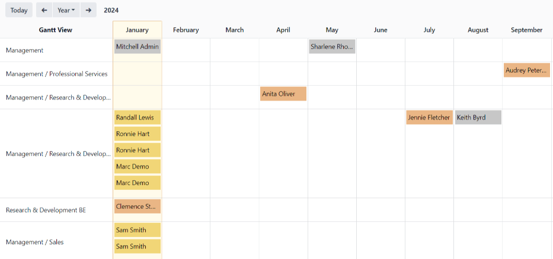
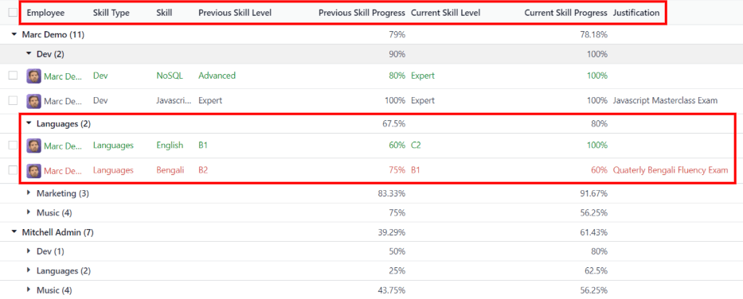

=========
Reporting
=========

In Odoo's *Appraisals* app, two metrics are tracked as appraisals are completed: an :ref:`appraisal
analysis <appraisals/analysis-report>`, and a :ref:`skills evolution <appraisals/skills-report>`.

.. _appraisals/analysis-report:

Appraisal analysis
------------------

To access the *Appraisal Analysis* report, navigate to :menuselection:`Appraisals app --> Reporting
--> Appraisal Analysis`.

On the :guilabel:`Appraisal Analysis` page, there is a report of all the appraisals in the database,
highlighted in different colors to represent their status.

Appraisals in yellow are *Done*, appraisals in orange are in progress (the *Appraisal Sent*, but not
completed), appraisals in red have been *Cancelled*, and appraisals in gray are scheduled *To Start*
(according to the :ref:`appraisals/appraisal-plan`), but have not been confirmed yet.

The report displays the current year, in a default Gantt view, and is grouped by department.

To change the period of time that is presented by default, adjust the date settings in the top-left
of the report. The options to display are :guilabel:`Day`, :guilabel:`Week`, :guilabel:`Month`, and
:guilabel:`Year`. Use the arrows to move forward or backward in time.

At any point, click the :guilabel:`Today` button to have the Gantt view include today's date in the
view.

The report can have other :ref:`filters <search/filters>` and :ref:`groupings <search/group>` set in
the :guilabel:`Search...` bar at the top.

.. example::
   Appraisals that have been cancelled appear in red on the :guilabel:`Appraisal Analysis` report,
   but there is no preconfigured filter to show only cancelled appraisals.

   To view only cancelled appraisals, click the :icon:`fa-caret-down` :guilabel:`(caret down)` icon
   in the :guilabel:`Search...` bar.

   Next, click :guilabel:`Add Custom Filter` in the :guilabel:`Filters` section, and a
   :guilabel:`Add Custom Filter` pop up window loads.

   Using the drop-down menu, select :guilabel:`Status` for the first drop-down, then select
   :guilabel:`Cancelled` for the third drop-down field. Click the :guilabel:`Add` button, and only
   appraisals that have been cancelled appear.

   .. image:: reporting/custom-filter.png
      :align: center
      :alt: The Custom Filter pop-up with the parameters set to only show cancelled appraisals.

.. _appraisals/skills-report:

Skills evolution
----------------

To access the *Skills Evolution* report, navigate to :menuselection:`Appraisals app --> Reporting
--> Skills Evolution`. The :guilabel:`Appraisal Skills Report` page displays a report of all skills,
grouped by employee.

Skill levels are **only** updated after an appraisal is marked as done. Any skill level changes from
any ongoing appraisals that have **not** been finalized are **not** included in this report.

All the lines of the report are collapsed, by default. To view the details of a line, click anywhere
on a line to expand the data.

Each skill has the following information listed:

- :guilabel:`Employee`: name of the employee.
- :guilabel:`Skill Type`: the category the skill falls under.
- :guilabel:`Skill`: the specific, individual skill.
- :guilabel:`Previous Skill Level`: the level the employee had previously achieved for the skill.
- :guilabel:`Previous Skill Progress`: the previous percentage of competency achieved for the skill
  (based on the :guilabel:`Skill Level`).
- :guilabel:`Current Skill Level`: the current level the employee has achieved for the skill.
- :guilabel:`Current Skill Progress`: the current percentage of competency achieved for the skill.
- :guilabel:`Justification`: any notes entered on the skill, explaining the progress.

The color of the skill text indicates any changes from the previous appraisal. Skill levels that
have increased since the last appraisal appear in green as an *Improvement*, skill levels that have
not changed appear in black as *No Change*, and skills that have regressed appear in red as
*Regression*.

The report can have other :ref:`filters <search/filters>` and :ref:`groupings <search/group>` set in
the :guilabel:`Search...` bar at the top.

.. example::
   Since the :guilabel:`Appraisal Skills Report` organizes all skills by employee, it can be
   difficult to find employees with a specific skill at a specific level. To find these employees,
   a custom filter must be used.

   To view only employees with an :guilabel:`Expert` level of the :guilabel:`Javascript` skill,
   first remove any active filters in the :guilabel:`Search...` bar.

   Next, click the :icon:`fa-caret-down` :guilabel:`(caret down)` icon in the :guilabel:`Search...`
   bar, then click :guilabel:`Add Custom Filter` in the :guilabel:`Filters` section to load an
   :guilabel:`Add Custom Filter` pop up window.

   Using the drop-down menu, select :guilabel:`Skill` for the first drop-down, then select
   :guilabel:`Javascript` for the third drop-down field.

   Next, click the :guilabel:`New Rule` button, and another line appears. In this second line,
   select :guilabel:`Current Skill Level` for the first drop-down, then select :guilabel:`Expert`
   for the third drop-down field.

   After the :guilabel:`New Rule` button is clicked, the word :guilabel:`any` in the sentence
   :guilabel:`Match any of the following rules:` changes from plain text into a drop-down menu.
   Click the :icon:`fa-caret-down` :guilabel:`(caret down)` icon after the word :guilabel:`any`, and
   select :guilabel:`all`.

   Finally, click the :guilabel:`Add` button, and only employees that have an :guilabel:`Expert`
   level for the skill :guilabel:`Javascript` appear.

   .. image:: reporting/javascript.png
      :align: center
      :alt: The Custom Filter pop-up with the parameters set to only show employees with expert
            level for the skill javascript.

.. seealso::
   - :doc:`Odoo essentials reporting <../../essentials/reporting>`
   - :doc:`../../essentials/search`
