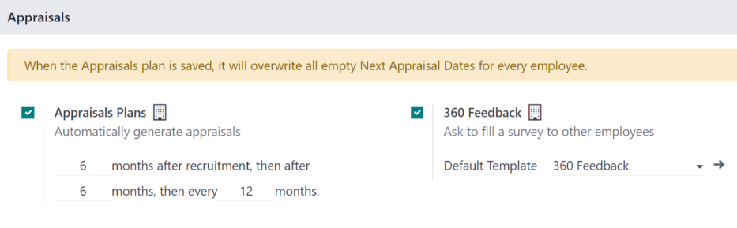
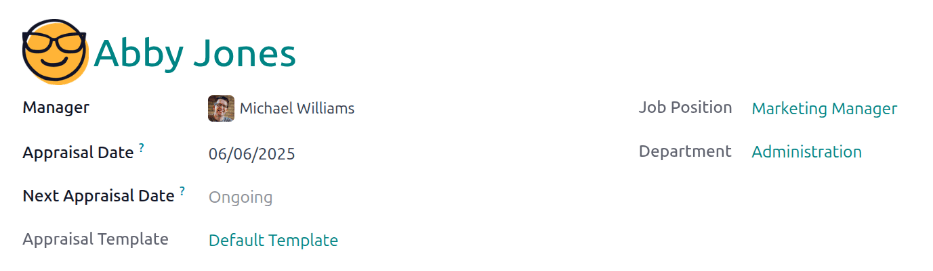

===================
Schedule appraisals
===================

Odoo's **Appraisals** app helps managers run recurring performance reviews. Each review can include
a self-assessment and can follow any schedule the company sets.

Regular appraisals turn day-to-day work into clear goals and measurable skill targets. They also
supply the objective evidence HR needs for raises or promotions, and keep individual performance
aligned with company KPIs.

Reviews can be :ref:`scheduled automatically <appraisals/auto>` through an :ref:`appraisal plan
<appraisals/appraisal-plan>` that triggers evaluations at set intervals, or :ref:`created manually
<appraisals/manual>` whenever needed—such as before a promotion or department transfer.

.. _appraisals/auto:

Automatic scheduling
====================

To ensure no appraisal is missed, enable automatic scheduling by going to :menuselection:`Appraisals
app --> Configuration --> Settings`.

The :guilabel:`Appraisals Plan` settings determines the frequency that appraisals are scheduled.

.. _appraisals/appraisal-plan:

Appraisals plans
----------------

By default, appraisals are preconfigured to be automatically created six months after an employee is
hired, with a second appraisal exactly six months after that.

Once those two initial appraisals have been completed in the employee's first year, following
appraisals are only created once a year (every twelve months).

To modify this schedule, change the number of months in the blank fields under the
:guilabel:`Appraisals Plans` section.

.. important::
   Changing the :guilabel:`Appraisals Plans` field updates **every** employee record whose
   :guilabel:`Next Appraisal Dates` is empty.

Appraisals automation
---------------------

Tick the checkbox next to :guilabel:`Appraisals Automation` to have Odoo automatically schedule
*and* confirm appraisals.

Appraisals are scheduled according to the :ref:`appraisal plan <appraisals/appraisal-plan>`.

.. _appraisals/manual:

Manually schedule an appraisal
==============================

Managers can schedule an appraisal at any time, outside the regular cycle.

For example, if an employee is promoted, or transfers to a new role or a new department, an
appraisal is scheduled to assess performance in the current role.

To create a new appraisal, open the :menuselection:`Appraisals` app, and click the :guilabel:`New`
button in the upper-left corner. This opens a blank :guilabel:`Appraisals` form.

First, using the drop-down menu, select the employee being evaluated, in the first field on the
form. Once an employee is selected, the employee's :guilabel:`Manager`, :guilabel:`Job Position`,
and :guilabel:`Department` fields are populated according to the information on the employee record.

The current date populates the :guilabel:`Appraisal Date` field, which is the date the appraisal is
scheduled to be completed. Using the calendar selector, adjust the date, if desired. This field is
typically updated when the manager submits their final rating at the end of the appraisal process.

If there is an :ref:`appraisal plan <appraisals/appraisal-plan>` configured, the :guilabel:`Next
Appraisal Date` field displays :guilabel:`Ongoing`. This indicates that the following appraisal will
be scheduled according to the appraisal schedule. Once the appraisal is marked as complete, the
:guilabel:`Next Appraisal Date` is updated with the date of the next appraisal.

Last, select the desired :guilabel:`Appraisal Template`. The :guilabel:`Default Template` populates
this field, by default, and is created when the **Appraisals** app is installed. Using the drop-down
menu, select a different template, if desired.

Once the information in the top-half of the :guilabel:`Appraisals` form is complete, click the
:guilabel:`Confirm` button in the upper-left corner, and the appraisal is scheduled, and the
employee is notified.

Once the appraisal is confirmed, both the employee and manager can start to fill out the appraisal.

