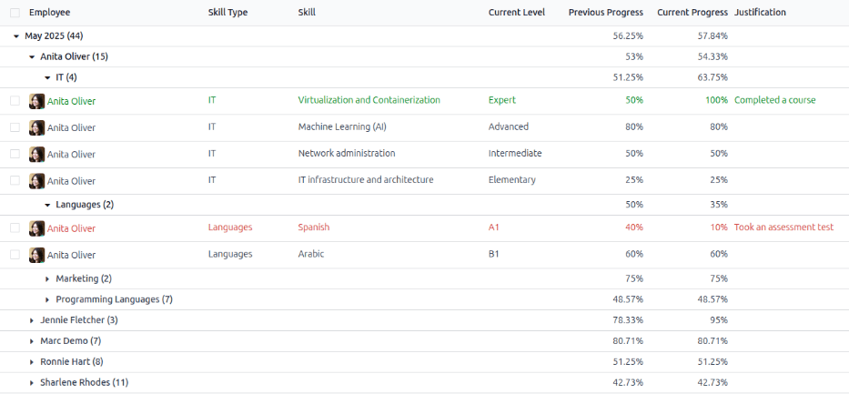
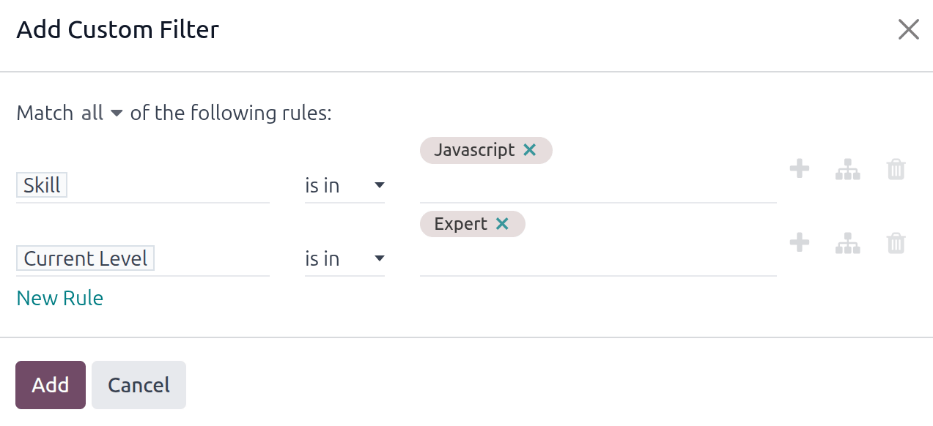
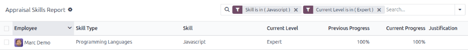

================
Skills evolution
================

In Odoo's **Appraisals** app, it is possible to view employee's skills as they progress over time in
the :ref:`Skills Evolution <appraisals/identify-skills-evolution>` report, also known as the
*Appraisal Skills Report*.

Managers can use this to see who is achieving their various skill goals set on their appraisals, who
is meeting their skill deadlines, who has the highest performance in terms of skill development, and
more.

The *Skills Evolution* report also provides the ability to :ref:`search for employees with specific
skills <appraisals/identify-skills>` at certain levels, which can be helpful for scenarios where
specific skills are required.

.. _appraisals/identify-skills-evolution:

Skills evolution report
=======================

To access this *Skills Evolution* report, navigate to :menuselection:`Appraisals app --> Reporting
--> Skills Evolution`.

Doing so reveals the :guilabel:`Appraisal Skills Report` page, which displays a report of all
skills, grouped by employee, in alphabetical order, by default.

.. note::
   Skill levels are **only** updated after an appraisal is marked as done. Any skill level changes
   from ongoing appraisals that have **not** been finalized are **not** included in this report.

All the :guilabel:`Employee` lines are expanded, with all the various skill types nested below. Each
individual skill type is collapsed, by default. To view the individual skills contained within a
skill type, click anywhere on the skill type line to expand the data.

Each skill has the following information listed:

- :guilabel:`Employee`: the name of the employee.
- :guilabel:`Skill Type`: the category the skill falls under.
- :guilabel:`Skill`: the specific, individual skill.
- :guilabel:`Previous Skill Level`: the level the employee had previously achieved for the skill.
- :guilabel:`Previous Skill Progress`: the previous percentage of competency achieved for the skill
  (based on the :guilabel:`Skill Level`).
- :guilabel:`Current Skill Level`: the current level the employee has achieved for the skill.
- :guilabel:`Current Skill Progress`: the current percentage of competency achieved for the skill.
- :guilabel:`Justification`: any notes entered on the skill, explaining the progress.

The color of the skill text indicates any changes from the previous appraisal. Skill levels that
have increased since the last appraisal appear in green, as an *Improvement*. Skill levels that have
**not** changed appear in black, as *No Change*. Skills that have regressed appear in red, as
*Regression*.

This report can be modified to find specific information by adjusting the :ref:`filters
<search/filters>` and :ref:`groupings <search/group>` set in the search bar at the top.

.. _appraisals/identify-skills:

Use case: Identify employees with specific skills
=================================================

Since the :guilabel:`Appraisal Skills Report` organizes all skills by employee, it can be difficult
to find employees with a specific skill at a specific level. To find these employees, a custom
filter must be used.

In this example, the report is modified to show employees with an expert level of Javascript
knowledge. To view only those employees, first remove all active filters in the search bar.

Next, click the :icon:`fa-caret-down` :guilabel:`(down arrow)` icon in the search bar, then click
:guilabel:`Add Custom Filter` beneath the :icon:`fa-filters` :guilabel:`Filters` column to load an
:guilabel:`Add Custom Filter` pop-up window.

Using the drop-down menu in the first field, select :guilabel:`Skill`. Then, keep the second field
as-is, and select :guilabel:`Javascript` from the third drop-down menu in the third field.

Next, click :guilabel:`New Rule`, and another line appears. In this second line, select
:guilabel:`Current Skill Level` for the first drop-down field, leave the second field as-is, then
select :guilabel:`Expert` for the third drop-down field.

After the :guilabel:`New Rule` button is clicked, the word :guilabel:`"any"` in the sentence
:guilabel:`Match any of the following rules:`, changes from plain text into a drop-down menu. Click
the :icon:`fa-caret-down` :guilabel:`(down arrow)` icon after the word :guilabel:`any`, and select
:guilabel:`all`.

Finally, click the :guilabel:`Add` button.

Now, only employees that have an :guilabel:`Expert` level for the skill :guilabel:`Javascript`
appear. In this example, only :guilabel:`Marc Demo` meets these criteria.

Use case: Assess highest improvement
====================================

Another way to modify the :guilabel:`Appraisal Skills Report` is to identify the employee who has
the highest amount of improved skills over a specific period of time.

To view this information, first remove the default filter in the search bar. Next, click the
:icon:`fa-caret-down` :guilabel:`(down arrow)` icon in the search bar, then click
:guilabel:`Improvement` beneath the :icon:`fa-filter` :guilabel:`Filters` column. Enabling this
filter only presents skills that have improved.

It is possible to view the skills that have improved over a period of time, such as a specific
quarter, or month. With the search bar drop-down menu still expanded, click :guilabel:`Add Custom
Filter` at the bottom of the :icon:`fa-filter` :guilabel:`Filters` column, and an :guilabel:`Add
Custom Filter` pop-up window appears.

Select :guilabel:`Create Date` for the first drop-down field, then select :guilabel:`is between` for
the second drop-down field. Once :guilabel:`is between` is selected, a second field appears after
the last field. Using the calendar selector, select the date range to apply the filter to. Once all
the fields are properly formatted, click :guilabel:`Add`.

The custom filter presents only the skills that have improved during the specified time period,
organized by employee.

.. example::
   To determine the employee with the most amount of improved skills for the third quarter, remove
   the default filter in the search bar of the :guilabel:`Appraisal Skills Report`. Next, activate
   the :guilabel:`Improvement` filter, then click :guilabel:`Add Custom Filter` at the bottom of the
   :icon:`fa-filter` :guilabel:`Filters` column.

   In the resulting :guilabel:`Add Custom Filter` pop-up window, select :guilabel:`Create Date` for
   the first drop-down field, then select :guilabel:`is between` for the second drop-down field. Two
   date fields appear after :guilabel:`is between` is selected.

   Using the calendar selector, set the first date to :guilabel:`07/01/2024` and the second date to
   :guilabel:`09/30/2024`, then click :guilabel:`Add`.

   These filters present only the skills that have improved during the third quarter (between July
   1st and September 30th, 2024), organized by employee.

   .. image:: skills_evolution/custom-filter.png
      :alt: The Custom Filter pop-up with the parameters set.

To view the number of employees and skills in further detail, click the :icon:`oi-view-pivot`
:guilabel:`(Pivot)` icon in the top-right corner to view the data in a pivot table. This presents a
pivot table with the employees populating the rows, and the only visible column represents the total
number of improved skills.

To expand more rows or columns to view which skill types had the most overall improvement, click
:icon:`fa-plus-square` :guilabel:`Total` above the :guilabel:`Count` column, then click
:guilabel:`Skill Type` from the resulting drop-down menu. This organizes the total improved skills
by their respective skill type.

.. example::
   In this example, it is determined that :guilabel:`Charles Reginald` had the largest improvement
   in the third quarter, with six improved skills. Additionally, they also had the most skill
   improvements for both :guilabel:`Languages` (three) and :guilabel:`Programming Languages` (two).

  .. image:: skills_evolution/largest-improvement.png
     :alt: The pivot table showing the skill improvements for the third quarter.

.. seealso::
   - :doc:`Odoo essentials reporting <../../essentials/reporting>`
   - :doc:`../../essentials/search`
