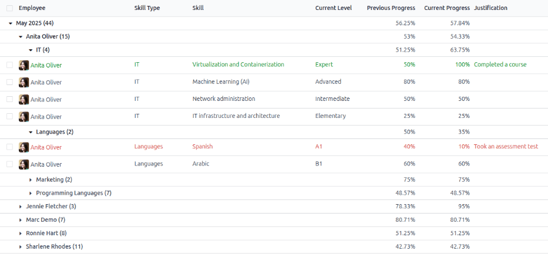
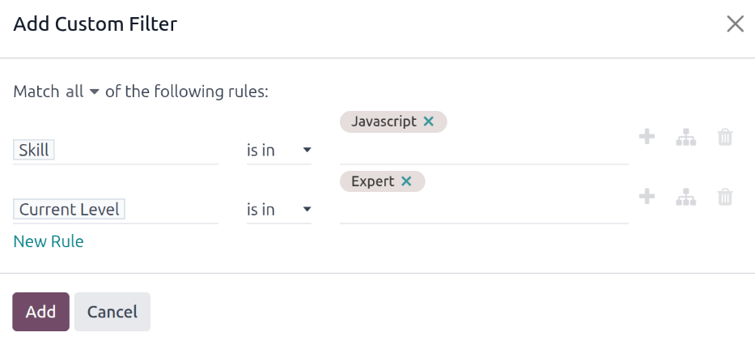
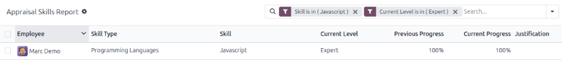

================
Skills evolution
================

In Odoo's **Appraisals** app, it is possible to view employee's skills as they progress over time in
the :ref:`Skills Evolution <appraisals/identify-skills-evolution>` report, also known as the
*Appraisal Skills Report*.

Managers can use this to see who is achieving their various skill goals set on their appraisals, who
is meeting their skill deadlines, who has the highest performance in terms of skill development, and
more.

The *Skills Evolution* report also provides the ability to :ref:`search for employees with specific
skills <appraisals/identify-skills>` at certain levels, which can be helpful for scenarios where
specific skills are required.

.. _appraisals/identify-skills-evolution:

Skills evolution report
=======================

To access this *Skills Evolution* report, navigate to :menuselection:`Appraisals app --> Reporting
--> Skills Evolution`.

Doing so reveals the *Appraisal Skills Report* page. All skills are grouped first by the month the
skill was initially achieved, then by employee, and lastly by skill type.

.. important::
   The *Appraisals Skills Report* **only** displays skills for employees with at least one
   completed appraisal. Skills for employees whose appraisals have a status of *Draft* or *Ongoing*
   are not included.

   When an employee completes their first appraisal, all their skills appear on the report. Once
   subsequent appraisals are marked as *Done*, any skill changes from the previous appraisal appear
   on the report.

   Any skill level changes from ongoing appraisals that have **not** been finalized are **not**
   included in this report.

To view the specific details for an employee's skill, expand the :guilabel:`Date`, then the
:guilabel:`Employee`, then the :guilabel:`Skill Type`. This displays a list of all the employee's
skills within that skill type. Each skill displays the following information:

- :guilabel:`Employee`: The name of the employee.
- :guilabel:`Skill Type`: The category the skill falls under.
- :guilabel:`Skill`: The specific, individual skill.
- :guilabel:`Current Level`: The current level the employee has achieved for the skill.
- :guilabel:`Previous Progress`: The previous percentage of competency achieved for the skill.
- :guilabel:`Current Progress`: The current percentage of competency achieved for the skill.
- :guilabel:`Justification`: Any notes entered on the skill, explaining the progress.

The color of the skill text indicates any changes from the previous appraisal. Skill levels that
have increased since the last appraisal appear in green, skill levels that have **not** changed
appear in black, and skills that have regressed appear in red.

This report can be modified to find specific information by adjusting the :ref:`filters
<search/filters>` and :ref:`groupings <search/group>` set in the search bar at the top.

.. _appraisals/identify-skills:

Use case: Identify employees with specific skills
=================================================

Since the *Appraisal Skills Report* organizes all skills by month, then employee, it can be
difficult to find employees with a specific skill at a specific level. To find these employees, a
custom filter must be used.

In this example, the report is modified to show employees with an expert level of Javascript
knowledge. To view only those employees, first remove all active filters in the search bar.

Next, click the :icon:`fa-caret-down` :guilabel:`(Toggle Search Panel)` icon in the search bar, then
click :guilabel:`Custom Filter...` beneath the :icon:`fa-filters` :guilabel:`Filters` column to
load a *Custom Filter* pop-up window.

Using the drop-down menu in the first field, select :guilabel:`Skill`. Then, keep the second field
as-is :guilabel:`(is equal to)`, and select :guilabel:`Javascript` for the third field.

Next, click :guilabel:`New Rule`, and another line appears. In this second line, select
:guilabel:`Current Level` for the first drop-down field, leave the second field as-is :guilabel:`(is
equal to)`, then select :guilabel:`Expert` for the third drop-down field.

After the second rule is added, navigate to the text at the top of the pop-up window that shows
:guilabel:`Match any` :icon:`fa-caret-down` :guilabel:`of the following rules`. Click the drop-down
menu for :guilabel:`any` to change it to :guilabel:`all`.

Finally, click the :guilabel:`Search` button.

Now, only employees that have an :guilabel:`Expert` level for the skill :guilabel:`Javascript`
appear. In this example, only :guilabel:`Marc Demo` meets these criteria.

Use case: Assess highest improvement
====================================

Another way to modify the *Appraisal Skills Report* is to identify the employee who has the highest
amount of improved skills over a specific period of time.

To view this information, first remove the default filter in the search bar. Next, click the
:icon:`fa-caret-down` :guilabel:`(Toggle Search Panel)` icon in the search bar, then click
:guilabel:`Improvement` beneath the :icon:`fa-filter` :guilabel:`Filters` column. Enabling this
filter only presents skills that have improved.

It is possible to view the skills that have improved over a period of time, such as a specific
quarter, or month. With the search bar drop-down menu still expanded, click :guilabel:`Custom
Filter...` at the bottom of the :icon:`fa-filter` :guilabel:`Filters` column, and a *Custom Filter*
pop-up window appears.

Select :guilabel:`Create Date` for the first drop-down field, then select :guilabel:`after` for the
second drop-down field. Once :guilabel:`after` is selected, the current date populates the last
field. Modify the date so it is one day before the date range.

Next, click :guilabel:`New Rule`, and a second line appears with identical information. In this
second rule, click on the middle drop-down menu, and select :guilabel:`Before`. Modify the last
field so the date is one day after the desired time period.

Once all the fields are properly formatted, click :guilabel:`Search`.

The custom filter presents all skills that have been improved, organized by employee, in a default
list view.

.. example::
   To determine the employee with the most amount of improved skills for the second quarter, remove
   the default filter in the search bar of the *Appraisal Skills Report*. Next, activate the
   :guilabel:`Improvement` filter, then click :guilabel:`Custom Filter...` at the bottom of the
   :icon:`fa-filter` :guilabel:`Filters` column.

   In the resulting *Custom Filter* pop-up window, select :guilabel:`Create Date` for the first
   drop-down field, then select :guilabel:`after` for the second drop-down field. Using the calendar
   selector, set the date to :guilabel:`03/30/2026`. Click :guilabel:`New Rule`, and select
   :guilabel:`before` in the middle fiel. Using the calendar selector, set the last field to
   :guilabel:`07/01/2026`, then click :guilabel:`Search`.

   .. image:: skills_evolution/custom-filter.png
      :alt: The Custom Filter pop-up with the parameters set.

To view the number of employees and skills in further detail, click the :icon:`oi-view-pivot`
:guilabel:`(Pivot)` icon in the top-right corner to view the data in a pivot table. This presents a
pivot table with the employees populating the rows, and the only visible column represents the total
number of improved skills.

To expand the columns to view which skill types had the most overall improvement, click
:icon:`fa-plus-square` :guilabel:`Total` above the :guilabel:`Count` column, then click
:guilabel:`Custom Group` :icon:`fa-caret-down`, then click :guilabel:`Skill` from the resulting
drop-down menu. This expands all the improved skills, organized by individual skill.

.. example::
   In this example, :guilabel:`Audrey Peterson` improved the most in the third quarter, with five
   improved skills.

  .. image:: skills_evolution/largest-improvement.png
     :alt: The pivot table showing the skill improvements for the third quarter.

.. seealso::
   - :doc:`Odoo essentials reporting <../../essentials/reporting>`
   - :doc:`../../essentials/search`
