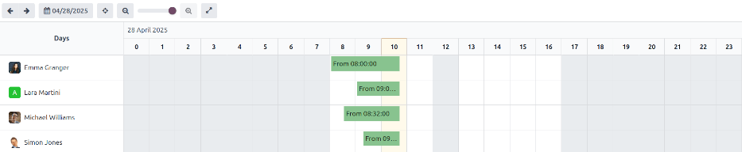
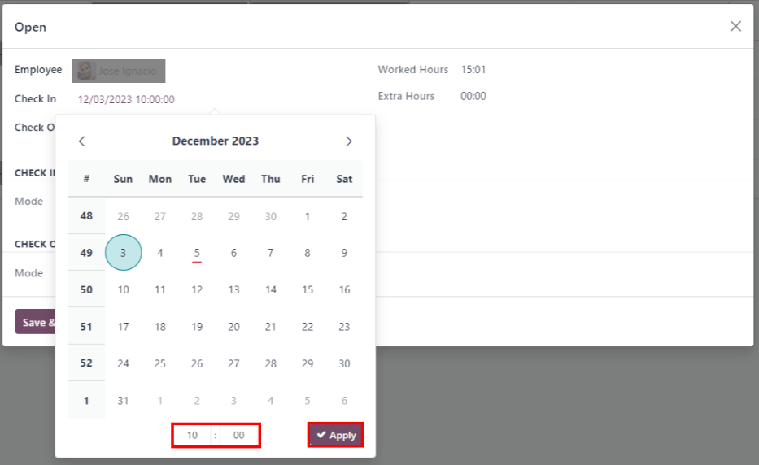

:show-content:

===========
Attendances
===========

.. toctree::
   :titlesonly:

   attendances/hardware

Odoo's *Attendances* application functions as a time clock. Employees are able to check in and out
of work using a dedicated device in kiosk mode, while users are also able to check in and out of
work directly from the database. Managers can quickly see who is available at any given time, and
create reports to see everyone's hours, and gain insights on which employees are working overtime,
or checking out of work earlier than expected.

.. _attendances/access-rights:

Access Rights
=============

It is important to understand how the different access rights affect what users can access in the
*Attendances* application.

Every user in the database is always able to access their own information on the dashboard, and can
check in and out directly from the database. Access to all the other features is determined by
access rights.

To see what access rights a user has, navigate to the :menuselection:`Settings application --> Users
& Companies: Users`, and click on an individual user. The :guilabel:`Access Rights` tab is visible
by default. Scroll down to the :guilabel:`Human Resources` section to see the setting. For the
:guilabel:`Attendances` field, the options are either to leave the field blank, or select
:guilabel:`Administrator`.

If the :guilabel:`Administrator` option is selected, the user has full access to the entire
*Attendances* application, with no restrictions. They can view all employee attendance records,
enter kiosk mode from the application, access all reporting metrics, and make modifications to the
settings.

If left blank, the user can only view their own information on the *Attendances* application
dashboard, and can view their own personal attendance records under the reporting feature. Everyone
else's attendance records will be hidden from view on the report. There is no access to either the
kiosk mode or the configuration menu.

.. _attendances/approvers:

Approvers
---------

The only other scenario where different information may be accessible in the *Attendances*
application is for approvers. If a user does *not* have administrative rights for the *Attendances*
application, but they are set as an employee's approver for the *Attendances* application, that user
will be able to view the attendance records for that specific employee, as well as make
modifications to that employee's attendance records (when necessary). This applies to all employee's
the user is listed as the *Attendances* application approver. Approvers are typically managers,
though this is not necessary.

To see who the attendance approver is for an employee, navigate to the :menuselection:`Employees
application` and click on the specific employee. Click on the :guilabel:`Work Information` tab, and
scroll to the :guilabel:`Approvers` section, and check the :guilabel:`Attendance` field. The person
selected will be able to view that employees' attendance records, both on the *Attendances*
application dashboard as well as in the attendance reports, and make modifications to their
records.

Configuration
=============

There are very few configurations needed in the *Attendances* application. Determining how employees
check in and out, defining how the kiosks function, and determining how extra hours are computed are
all set in the Configuration menu. Navigate to the :menuselection:`Attendances application-->
Configuration` to access the configuration menu.

Modes
-----

.. _attendances/kiosk-mode:

- :guilabel:`Kiosk Mode`: using the drop-down menu, select how an employee checks in when using a
  kiosk. Options are :guilabel:`Barcode/RFID`, :guilabel:`Barcode/RFID and Manual Selection`, or
  :guilabel:`Manual Selection`.

  .. important::
     The *Barcode* application **does not** need to be installed in order to use one of the
     Barcode/RFID settings.

- :guilabel:`Attendances from Backend`: activate this selection to allow users to check in and out
  directly from the Odoo database. If this is not activated, users must use a kiosk to check in and
  out of work.

.. _attendances/kiosk-settings:

Kiosk Settings
--------------

This section only needs to be configured if employees use kiosks for checking in and out. If kiosks
are *not* being used, modifying any of these fields will **not** adversely affect the functionality
of the Attendances application.

- :guilabel:`Barcode Source`: this setting appears if either of the two Barcode/RFID selections were
  configured for the :ref:`Kiosk Mode <attendances/kiosk-mode>` setting. Select how barcodes are
  scanned at the kiosk, either with a dedicated barcode :guilabel:`Scanner`, or the device's
  :guilabel:`Front Camera`, or :guilabel:`Back Camera`.
- :guilabel:`Employee PIN Identification`: activate this option if employees should use a unique PIN
  to check in. PINs are configured on each individual employee record. Refer to the
  :doc:`../hr/employees/new_employee` documentation for more information on setting up PINs.
- :guilabel:`Display Time`: set the duration (in seconds) the check in and check out confirmation
  screen remains on the kiosk before going back to the main check in screen.
- :guilabel:`Attendance Kiosk Url`: Odoo generates a unique web address (URL) in order to use a
  device as a kiosk without having to sign in to the Odoo database. When setting up a kiosk device,
  navigate to this unique web address in a web browser to present the Attendances application kiosk.

  .. important::
     These kiosk URLs are **not** secured with any type of access code. Anyone who has the URL can
     access the Attendances application kiosk. If the URL is compromised for any reason, such as in
     the event of a security breach, click :guilabel:`Generate a new Kiosk Mode URL`, located
     beneath the link, to generate a new URL and update the kiosk(s) accordingly.

Extra Hours
-----------

- :guilabel:`Count of Extra Hours`: enable this box to allow employees to log extra hours beyond
  their set working hours (sometimes referred to as *overtime*). Activating this selection displays
  the following settings as well. If this is not activated, no other configurations appear.

  - :guilabel:`Start From`: the current date is automatically entered in this field. If desired,
    click on this field and use the calendar selector to modify the start date that extra hours will
    be logged.
  - :guilabel:`Tolerance Time In Favor Of Company`: enter the amount of time, in minutes, that will
    *not* count towards an employee's overtime. When an employee checks out, and the extra time
    logged is below the specified minutes, the extra time will *not* be counted as overtime for the
    employee.
  - :guilabel:`Tolerance Time In Favor Of Employee`: enter the amount of time, in minutes, that an
    employee is given, that will not adversely affect their attendance if they log less time than
    their working hours. When an employee checks out, and the total time logged for the day is less
    than their specified working hours, and less than this specified grace period, they will not be
    penalized for their reduced hours.
  - :guilabel:`Display Extra Hours`: activate this box to display the extra hours logged by an
    employee when they check out with a kiosk, or when a user checks out in the database.

    .. example::
       A company sets both of the :guilabel:`Tolerance` fields to `15` minutes, and the working
       hours for the entire company is set from 9:00 AM to 5:00 PM. If an employee checks in at 9:00
       AM, and checks out at 5:14 PM, the extra 14 minutes are *not* counted towards their overtime.
       If an employee checks in at 9:05 AM, and checks out at 4:55 PM, even though they logged a
       total of 10 minutes less than their full working hours, they will not be penalized for this
       discrepancy.

Check in and out via the database
=================================

Odoo's *Attendances* application allows users who are logged into the database to check in and out,
without needing to go into the *Attendances* application, or use a kiosk. For some smaller
companies, where every employee is also a user, this feature may be useful.

A user can check in and out on the main database dashboard, as well as in any application. In the
upper right corner of the top main menu, which is always visible regardless of what application the
user is in, a :guilabel:`🔴 (red circle)` or :guilabel:`🟢 (green circle)` is visible. Click on the
colored circle to reveal the attendance widget, enabling the user to check in and/or out.

.. image:: attendances/top-menu.png
   :align: center
   :alt: Top right main menu with check in button highlighted.

Check in
--------

If the attendance widget circle is red, this indicates the user is not currently checked in. Click
the :guilabel:`🔴 (red circle)` and the attendance widget appears, displaying a green
:guilabel:`Check in ->` button.

.. image:: attendances/check-in.png
   :align: center
   :alt: Top right main menu with check in button highlighted.

If the user has not checked in and out already during the current work day, this button is the only
visible item in the widget. If the user has previously checked in and out, a :guilabel:`Total today`
field appears above the button, and the total amount of time that has been logged for the day
appears beneath that field, in an :guilabel:`XX:XX` (hours:minutes) format.

Click the :guilabel:`Check in ->` button to check in. The :guilabel:`🔴 (red circle)` in the top
menu changes to green, and the widget changes appearance as well. The widget updates to reflect that
the user has checked in, by changing the green :guilabel:`Check in ->` button to a yellow
:guilabel:`Check out ->` button.

Click anywhere on the screen to close the attendance widget.

Check out
---------

If the user is checking out for the first time, :guilabel:`Since XX:XX (AM/PM)` appears at the top
of the widget, with the time the user checked in populating the time field. Beneath that line,
:guilabel:`XX:XX` is displayed, indicating the hours and minutes that have elapsed since checking
in. As time passes, this value is updated to reflect the hours and minutes that have passed since
the user checked in.

If the user has previously checked in and out, additional fields are presented. A :guilabel:`Before
XX:XX (AM/PM)` field appears in addition to the :guilabel:`Since XX:XX (AM/PM)` field. The time
displayed in both of these fields are populated with the most recent check in time, and will match.
Beneath the :guilabel:`Before XX:XX (AM/PM)` field, the previously logged hours are displayed, in an
:guilabel:`XX:XX` (hours:minutes) format.

In addition, beneath both of these fields, a :guilabel:`Total today` field appears. This field is
the sum of both the :guilabel:`Before XX:XX (AM/PM)` and :guilabel:`Since XX:XX (AM/PM)` fields, and
is the total time that will be logged for the user, if they were to log out at that moment.

As time passes, both the :guilabel:`Since XX:XX (AM/PM)` and :guilabel:`Total today` fields are
updated live. To check out, click the yellow :guilabel:`Check out ->` button. The attendance widget
updates again, displaying the :guilabel:`Total today` field with the logged time, and the yellow
:guilabel:`Check out ->` button changes to a green :guilabel:`Check in ->` button.

.. image:: attendances/check-in-database-message.png
   :align: center
   :alt: The pop-up that appears when an employee checks in inside the database.

.. tip::
   There is no limit to the amount of times a user can check in and check out. Users are able to
   check in and out without any time elapsing (a value of 00:00). Each time an employee logs in and
   out, the information is stored and appears on the dashboard, including check ins and check outs
   with no time value.

Kiosk Mode
==========

Some companies may opt to use a dedicated device (a laptop or desktop PC, a tablet, or a mobile
phone) for employees to check in and check out from. Kiosk mode is used for these scenarios.

.. important::
   If users check in and out using either a badge or an RFID, then an accessible device in kiosk
   mode **must** be available in order to check in and check out using these two methods.

Entering kiosk mode is only available for users with specific :ref:`access rights
<attendances/access-rights>`.

There are three ways that kiosk mode can be activated:

#. Navigate to the :guilabel:`Attendances` application, and click :guilabel:`Kiosk Mode` in the top
   menu. The device then enters kiosk mode.
#. Navigate to the :menuselection:`Attendances application --> Configuration`. In the
   :guilabel:`Kiosk Settings` section, click on the link in the :guilabel:`Attendance Kiosk Url`
   field. A new tab opens in kiosk mode. It is recommended to close the database tab to keep the
   database secure.
#. Navigate to the :menuselection:`Attendances application --> Configuration`. In the
   :guilabel:`Kiosk Settings` section, click :guilabel:`Copy` next to the link beneath the
   :guilabel:`Attendance Kiosk Url` field. Paste this URL into a web browser on the kiosk device and
   navigate to it.

.. image:: attendances/kiosk-url.png
   :align: center
   :alt: The Attendances Kiosk URL field in the settings section of the Attendances application.

As a security measure, once a device is in kiosk mode, it is not possible to exit kiosk mode and go
back into the database without singing back in. To exit kiosk mode, click the back button in the web
browser. This logs the user out of the database, and returns to the main log in screen. This
prevents anyone from accessing the database, adding another layer of security.

Badge
-----

To check in or out using a badge, tap the :guilabel:`📷 (camera) Tap to scan` image in the center of
the kiosk. Then, scan the barcode on the badge using the method configured in the :ref:`kiosk
settings <attendances/kiosk-settings>` section of the configuration menu. Options are a dedicated
barcode scanning device, or the kiosk's front or back camera. Once the barcode is scanned, the
employee is checked in or out, and a :ref:`confirmation message <attendances/confirmation>` appears
with all the check in or check out information.

RFID
----

To check in or out using an RFID key fob, simply scan the fob with an RFID reader. Once scanned, the
employee is then either checked in or checked out, and a :ref:`confirmation message
<attendances/confirmation>` appears with all the check in or check out information.

Manually
--------

Users who do not have a scannable badge or an RFID fob can manually check in and out at a kiosk. Tap
the :guilabel:`Identify Manually` button on the kiosk, and a screen with all the employees that can
be checked in or out appears. This is the same view as in the *Employees* application dashboard. Tap
on the person, and they are either checked in or checked out, and a :ref:`confirmation message
<attendances/confirmation>` appears.

When a large number of employees appear in the list, making scrolling inefficient, there are two
ways to quickly find a specific person:

- :guilabel:`Search...`: tap on the :guilabel:`Search...` field and enter the person's name. As the
  name is typed in, the matching results are displayed on the screen.
- :guilabel:`Department`: to quickly filter the presented employees, tap on a department to display
  only those employees that are part of that department. The :guilabel:`Departments` are listed on
  the left side of the screen, and the number at the end of each department indicates how many
  employees are part of the department, and will be displayed when selected.

PIN
~~~

If the :guilabel:`Employee PIN Identification` option was activated in the :ref:`kiosk settings
<attendances/kiosk-settings>` section of the configuration menu, the employee is prompted to enter a
PIN when manually checking in or out.

After the employee is selected, a number pad appears with a message. When checking in,
:guilabel:`(Employee) Welcome! Please enter your PIN to check in` appears above the numbers. When
checking out, :guilabel:`(Employee) Want to check out? Please enter your PIN to check out` appears
above the numbers.

Tap in the PIN using the number pad, then tap :guilabel:`OK` when done. The employee is then checked
in or out, and a :ref:`confirmation message <attendances/confirmation>` appears.

.. image:: attendances/enter-pin.png
   :align: center
   :alt: The pop-up that appears when prompted to enter a pin.

.. _attendances/confirmation:

Confirmation message
--------------------

When an employee checks in or out, a confirmation message appears with all the check in or check out
information. When checking in, a welcome message appears, as well as the date and time of check in.
An :guilabel:`Hours Previously Today: XX:XX` field also appears, displaying any time already logged
for that employee for the day. If no time has already been logged, the value displayed is `00:00`.
Beneath the message is an :guilabel:`OK` button. To exit the screen before the preset time in the
kiosk, tap the :guilabel:`OK` button.

When checking out, the screen displays a goodbye message, with the date and time of check out, and
the total hours logged for the day. Beneath the message is a :guilabel:`Goodbye` button. To exit the
screen before the preset time, tap the :guilabel:`Goodbye` button.

.. image:: attendances/goodbye-message.png
   :align: center
   :alt: The goodbye message with all the employee's check out information.

Overview
========

When entering the *Attendances* application, the :guilabel:`Overview` dashboard is presented,
containing all the check in and check out information for the signed in user. If the user has
specific :ref:`access rights <attendances/access-rights>` and/or are :ref:`approvers
<attendances/approvers>` for specific employees, then those additional employee's check in and check
out information is also visible on the :guilabel:`Overview` dashboard.

Views
-----

To change the view from the default Gantt chart to a list view, click the :guilabel:`List` icon in
the top right of the dashboard, beneath the user's photo. To switch back to the Gantt chart, click
the :guilabel:`Gantt` button, located next to the :guilabel:`List` button.

The default view presents the current day's information. To present the information for the
:guilabel:`Week`, :guilabel:`Month`, or :guilabel:`Year`, click on the :guilabel:`Day` button to
reveal a drop-down, displaying those other options. Select the desired view, and the dashboard will
update, presenting the selected information. To change the :guilabel:`Day`, :guilabel:`Week`,
:guilabel:`Month`, or :guilabel:`Year` presented, click the left or right :guilabel:`arrow` buttons
on either side of the drop-down button. To jump back to a view containing the current day, click the
:guilabel:`Today` button. The refreshed the dashboard, presenting information containing the current
day's information.

In the :guilabel:`Day` view, the column for the current hour is highlighted in yellow. If the
:guilabel:`Week` or :guilabel:`Month` view is selected, the column for the current day is
highlighted. If the :guilabel:`Year` view is selected, the current month is highlighted.

         highlighted.

Any entries that have errors appear in red, indicating they need to be resolved by a user with the
proper :ref:`access rights <attendances/access-rights>` and/or are :ref:`approvers
<attendances/approvers>` for the employee(s) with the errors.

.. _attendances/filters-groups:

Filters and Groups
------------------

To filter the results in the dashboard or to present different groups of information, click the
drop-down button in the :guilabel:`Search` bar above the dashboard, then select one of the available
:guilabel:`Filters` or :guilabel:`Group By` options. There are several pre-configured filters and
groups to choose from, as well as an option to create custom ones.

Filters
~~~~~~~

The default filters that can be selected are:

- :guilabel:`My Attendances`: this filter only presents the user's attendance data.
- :guilabel:`My Team`: this filter presents the attendance data for the user's team.
- :guilabel:`At Work`: this filter displays the attendance data for everyone currently checked in.
- :guilabel:`Errors`: this filter displays any entries with :ref:`errors <attendances/errors>` that
  need to be resolved.
- :guilabel:`Check In`: this filter has a drop-down to further select a specific time period. Select
  the desired time period from the options presented, a specific month, quarter, or year.
- :guilabel:`Last 7 days`: this filter presents the attendance data for the last seven days.
- :guilabel:`Add Custom Filter`: create a custom filter using the pop-up that appears when this is
  selected.

Groups
~~~~~~

The default groups that can be selected are:

- :guilabel:`Check In`: this grouping presents a drop-down menu containing the following time period
  options: :guilabel:`Year`, :guilabel:`Quarter`, :guilabel:`Month`, :guilabel:`Week`, and
  :guilabel:`Day`. Selected the time period to display all the check-in information, grouped by the
  selected time period.
- :guilabel:`Employee`: this group presents the attendance data organized by employee.
- :guilabel:`Check Out`: this grouping presents a drop-down menu containing the following time
  period options: :guilabel:`Year`, :guilabel:`Quarter`, :guilabel:`Month`, :guilabel:`Week`, and
  :guilabel:`Day`. Selected the time period to display all the check-out information, grouped by the
  selected time period.
- :guilabel:`Add Custom Group`: this option displays a drop-down menu with a variety of options to
  group the attendance data by, including :guilabel:`City`, :guilabel:`Country`, :guilabel:`Mode`,
  and :guilabel:`IP Address`.

.. _attendances/errors:

Errors
------

Entries that contain an error appear on the dashboard in red. In the :guilabel:`Gantt view`, the
entry appears with a red background. If in the :guilabel:`List view`, the entry text appears in red.

An error typically occurs when an employee has checked in but has not checked out within the last
24 hours, or when an employee has a check in and check out period spanning over 16 hours.

To fix the error, the attendance entry must be modified or deleted. Click on the entry to reveal a
pop-up containing the details for that particular entry. To modify the :guilabel:`Check In` and/or
:guilabel:`Check Out` information, click on the :guilabel:`Check In` or :guilabel:`Check Out` field
and a calendar selector appears. Click on the desired date, then use the time selector beneath the
calendar to select the specific time for the entry. When the information is correct, click
:guilabel:`Apply.`

         selector is shown, and the time selector is highlighted.

When all the information on the pop-up is correct, click :guilabel:`Save & Close`. When the entry no
longer has an error, the entry appears in gray instead of red.

To delete an entry, click :guilabel:`Remove` on the pop-up instead of making modifications to the
entry.

Reporting
=========

To view attendance reports, click :guilabel:`Reporting` in the top menu. The default report displays
each employee's attendance information for the past 3 months, in a :guilabel:`Line Chart`.

The default view is a :guilabel:`Graph`. To view the data in a pivot table, click the
:guilabel:`Pivot Table` button on the top right of the report. To switch back to the graph view,
click the :guilabel:`Graph` button, located next to the :guilabel:`Pivot Table` button.

To present different information, adjust the :ref:`filters and groups <attendances/filters-groups>`
in the same way as in the :guilabel:`Overview` dashboard.

The data can be presented in either a :guilabel:`Bar Chart`, :guilabel:`Line Chart`, :guilabel:`Pie
Chart`, :guilabel:`Stacked` chart, or in :guilabel:`Descending` or :guilabel:`Ascending` order. To
change the view to any of these charts, click the corresponding button above the displayed chart.

To change the :guilabel:`Measures`, click the :guilabel:`Measures` button and select the desired
measure from the drop-down menu.

The report can also be inserted into a spreadsheet. Click the :guilabel:`Insert in Spreadsheet`
button and a pop-up appears. Select the desired spreadsheet, and click :guilabel:`Confirm`.

.. image:: attendances/reporting.png
   :align: center
   :alt: The default report view, with all the optional view buttons highlighted.
