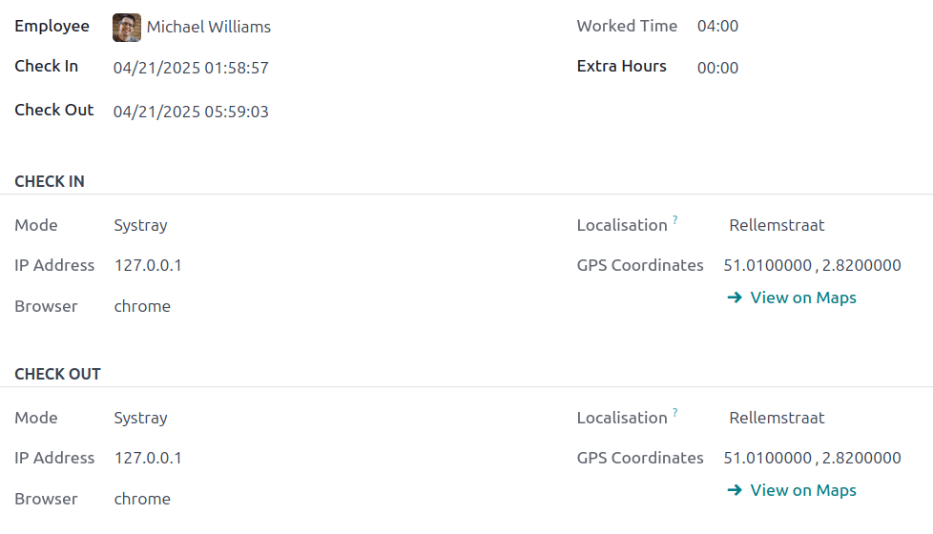

:show-content:

===========
Attendances
===========

Odoo's *Attendances* application functions as a time clock. Employees are able to check in and out
of work using a dedicated device in kiosk mode, while users are also able to check in and out of
work directly from the database. Managers can quickly see who is available at any given time, create
reports to see everyone's hours, and gain insights on which employees are working overtime, or
checking out of work earlier than expected.

.. _attendances/access-rights:

Access rights
=============

It is important to understand how the different access rights affect what options and features users
can access in the *Attendances* application.

Every user in the database is able to check in and out directly from the database, without needing
access to the *Attendances* application. Additionally, all users can access their own attendance
records from their employee form in the *Employees* app.

Access to both the *Attendances* application, and the various features within the application is
determined by access rights.

To see what access rights a user has, navigate to the :menuselection:`Settings app --> Users &
Companies: Users`, and click on an individual user. The :guilabel:`Access Rights` tab is visible by
default. Scroll down to the :guilabel:`Human Resources` section to see the setting. For the
:guilabel:`Attendances` field, the options are either to leave the field blank or select
:guilabel:`Administrator`.

If the :guilabel:`Administrator` option is selected, the user has full access to the entire
*Attendances* application, with no restrictions. They can view all employee attendance records,
enter *Kiosk mMode* from the application, access all reporting metrics, and make modifications to
the settings. If left blank, the user does **not** have access to the *Attendances* application.

.. _attendances/approvers:

Approvers
---------

The **only** other scenario where different information may be accessible in the *Attendances*
application is for approvers. If a user does *not* have administrative rights for the *Attendances*
application, but they are set as an employee's approver for the *Attendances* application, that user
is able to view the attendance records for that specific employee, as well as make modifications to
that employee's attendance records, if necessary. This applies to all employees for whom the user is
listed as the *Attendances* application approver. Approvers are typically managers, though this is
not required.

To see who the attendance approver is for an employee, navigate to the :menuselection:`Employees
application` and click on the specific employee. Click on the :guilabel:`Work Information` tab,
scroll to the :guilabel:`Approvers` section, and check the :guilabel:`Attendance` field. The person
selected is able to view that employees' attendance records, both on the *Attendances* application
dashboard as well as in the attendance reports, and make modifications to their records.

Configuration
=============

Few configurations are needed in the *Attendances* application. Determining how employees check in
and out, defining how the kiosks function, and determining how extra hours are computed are all set
in the Configuration menu. Navigate to the :menuselection:`Attendances application -->
Configuration` to access the configuration menu.

Modes
-----

- :guilabel:`Attendances from Backend`: activate this selection to allow users to check in and out
  directly from the Odoo database. If this is not activated, users must use a kiosk to check in and
  out of work.

Extra hours
-----------

This section specifies how extra time is calculated, including when extra time is counted and what
time is not logged.

- :guilabel:`Count of Extra Hours`: enable this box to allow employees to log extra hours beyond
  their set working hours (sometimes referred to as *overtime*). Activating this selection displays
  the following settings as well. If this is not activated, no other configurations appear.

  - :guilabel:`Start From`: the current date is automatically entered in this field. If desired,
    click on this field and use the calendar selector to modify the start date on which extra hours
    are logged.
  - :guilabel:`Tolerance Time In Favor Of Company`: enter the amount of time, in minutes, that is
    **not** counted towards an employee's overtime. When an employee checks out, and the extra time
    logged is below the specified minutes, the extra time is **not** counted as overtime for the
    employee.
  - :guilabel:`Tolerance Time In Favor Of Employee`: enter the amount of time, in minutes, that an
    employee is given, that does **not** adversely affect their attendance if they log less time
    than their working hours. When an employee checks out, and the total time logged for the day is
    less than their specified working hours and less than this specified grace period, they are
    **not** penalized for their reduced hours.

    .. example::
       A company sets both of the :guilabel:`Tolerance` fields to `15` minutes, and the working
       hours for the entire company are set from 9:00 AM to 5:00 PM.

       If an employee checks in at 9:00 AM, and checks out at 5:14 PM, the extra 14 minutes are
       **not** counted towards their overtime.

       If an employee checks in at 9:05 AM, and checks out at 4:55 PM, even though they logged a
       total of 10 minutes less than their full working hours, they are **not** penalized for this
       discrepancy.

  - :guilabel:`Display Extra Hours`: activate this box to display the extra hours logged by an
    employee when they check out with a kiosk, or when a user checks out in the database.

.. note::
   Employees are still able to log overtime hours even if the :guilabel:`Count of Extra Hours`
   option is not activated. The difference is that when :guilabel:`Count of Extra Hours` is
   activated, the extra hours can be :ref:`deducted from an approved time off request
   <time_off/deduct-extra-hours>`.

Overview
========

When entering the *Attendances* application, the :guilabel:`Overview` dashboard is presented,
containing all the check in and check out information for the signed in user. If the user has
specific :ref:`access rights <attendances/access-rights>` and/or are :ref:`approvers
<attendances/approvers>` for specific employees, then those additional employee's check in and check
out information is also visible on the :guilabel:`Overview` dashboard.

Views
-----

To change the view from the default Gantt chart to a list view, click the :guilabel:`List` icon in
the top right of the dashboard, beneath the user's photo. To switch back to the Gantt chart, click
the :guilabel:`Gantt` button, located next to the :guilabel:`List` button.

The default view presents the current day's information. To present the information for the
:guilabel:`Week`, :guilabel:`Month`, or :guilabel:`Year`, click on the :guilabel:`Day` button to
reveal a drop-down, displaying those other options. Select the desired view, and the dashboard
updates, presenting the selected information. To change the :guilabel:`Day`, :guilabel:`Week`,
:guilabel:`Month`, or :guilabel:`Year` presented, click the :guilabel:`← (left arrow)` or
:guilabel:`→ (right arrow)` buttons on either side of the drop-down menu. To jump back to a view
containing the current day, click the :guilabel:`Today` button. This refreshes the dashboard,
presenting information containing the current day's information.

In the :guilabel:`Day` view, the column for the current hour is highlighted in yellow. If the
:guilabel:`Week` or :guilabel:`Month` view is selected, the column for the current day is
highlighted. If the :guilabel:`Year` view is selected, the current month is highlighted.

.. image:: attendances/overview.png
   :align: center
   :alt: The overview dashboard presenting the information for the week, with the current day
         highlighted.

Any entries that have errors appear in red, indicating they need to be resolved by a user with the
proper :ref:`access rights <attendances/access-rights>` and/or are :ref:`approvers
<attendances/approvers>` for the employee(s) with the errors.

.. _attendances/filters-groups:

Filters and groups
------------------

To filter the results in the overview dashboard, or to present different groups of information,
click the :guilabel:`🔻 (triangle drop down)` button in the right side of the :guilabel:`Search` bar
above the dashboard, and select one of the available :guilabel:`Filters` or :guilabel:`Group By`
options. There are several pre-configured filters and groups to choose from, as well as an option to
create custom ones.

Filters
~~~~~~~

The default filters that can be selected are:

- :guilabel:`My Attendances`: this filter only presents the user's attendance data.
- :guilabel:`My Team`: this filter presents the attendance data for the user's team.
- :guilabel:`At Work`: this filter displays the attendance data for everyone currently checked in.
- :guilabel:`Errors`: this filter displays any entries with :ref:`errors <attendances/errors>` that
  need to be resolved.
- :guilabel:`Check In`: this filter has a drop-down to further select a specific time period. Select
  the desired time period from the options presented, a specific month, quarter, or year.
- :guilabel:`Last 7 days`: this filter presents the attendance data for the last seven days.
- :guilabel:`Add Custom Filter`: create a custom filter using the pop-up that appears when this is
  selected.

Groups
~~~~~~

The default groups that can be selected are:

- :guilabel:`Check In`: this grouping presents a drop-down menu containing the following time period
  options: :guilabel:`Year`, :guilabel:`Quarter`, :guilabel:`Month`, :guilabel:`Week`, and
  :guilabel:`Day`. Selected the time period to display all the check-in information, grouped by the
  selected time period.
- :guilabel:`Employee`: this group presents the attendance data organized by employee.
- :guilabel:`Check Out`: this grouping presents a drop-down menu containing the following time
  period options: :guilabel:`Year`, :guilabel:`Quarter`, :guilabel:`Month`, :guilabel:`Week`, and
  :guilabel:`Day`. Selected the time period to display all the check-out information, grouped by the
  selected time period.
- :guilabel:`Add Custom Group`: this option displays a drop-down menu with a variety of options to
  group the attendance data by, including :guilabel:`City`, :guilabel:`Country`, :guilabel:`Mode`,
  and :guilabel:`IP Address`.

.. _attendances/errors:

Attendance log details
----------------------

Odoo captures various time and location details when a user checks in and out. The specific details
provided are determined by the method the user checked in and out.

To view the specific check in and/or check out details for an employee, click on an individual entry
in the overview dashboard.

A detailed attendance log for the user appears in a pop-up window. To close the detailed attendance
log, click the :guilabel:`Save & Close` button in the bottom-left corner of the form.

The detailed attendance log contains the following information:

Main details
~~~~~~~~~~~~

- :guilabel:`Employee`: the name of the employee.
- :guilabel:`Check In`: the date and time the employee checked in.
- :guilabel:`Check Out`: the date and time the employee checked out. This only appears if the
  employee has checked out.
- :guilabel:`Worked Hours`: the total amount of time the employee logged for the day, in an hour and
  minute format (HH:MM). This value calculates all the checks in and check outs for the day, if the
  employee checked in and out multiple times.
- :guilabel:`Extra Hours`: any extra hours the employee logged that is beyond their expected working
  hours.

Check in/check out details
~~~~~~~~~~~~~~~~~~~~~~~~~~

The following information appears for both the :guilabel:`Check In` and :guilabel:`Check Out`
sections.

- :guilabel:`Mode`: the method with which the attendance information was gathered.
  :guilabel:`Systray` is displayed if the employee logged in and out :ref:`directly from the
  database <attendances/check-in>`, :guilabel:`Manual` is displayed if the employee logged in and
  out :ref:`using an attendance kiosk <attendances/kiosk-mode-entry>`.
- :guilabel:`IP Address`: the IP address for the computer the employee used to log in or out.
- :guilabel:`Browser`: the web browser the employee used to log in or out.
- :guilabel:`Localization`: the city and country associated with the computer's IP address.
- :guilabel:`GPS Coordinates`: the specific coordinates when the user logged in or out. To view the
  specific coordinates on a map, click the :guilabel:`→ View on Maps` button beneath the
  :guilabel:`GPS Coordinates`. This opens a map in a new browser tab, with the specific location
  pointed out.

Errors
------

Entries that contain an error appear on the overview dashboard in red. In the :guilabel:`Gantt
view`, the entry appears with a red background. If in the :guilabel:`List view`, the entry text
appears in red.

An error typically occurs when an employee has checked in but has not checked out within the last
24 hours, or when an employee has a check in and check out period spanning over 16 hours.

To fix the error, the attendance entry must be modified or deleted. Click on the entry to reveal a
pop-up containing the details for that particular entry. To modify the :guilabel:`Check In` and/or
:guilabel:`Check Out` information, click on the :guilabel:`Check In` or :guilabel:`Check Out` field
and a calendar selector appears. Click on the desired date, then use the time selector beneath the
calendar to select the specific time for the entry. When the information is correct, click
:guilabel:`Apply.`

.. image:: attendances/errors.png
   :align: center
   :alt: The pop-up that allows for modifications to an attendance entry with an error. The calendar
         selector is shown, and the time selector is highlighted.

When all the information on the pop-up is correct, click :guilabel:`Save & Close`. When the entry no
longer has an error, the entry appears in gray instead of red.

To delete an entry, click :guilabel:`Remove` on the pop-up instead of making modifications to the
entry.

Reporting
=========

To view attendance reports, click :guilabel:`Reporting` in the top menu. The default report displays
each employee's attendance information for the past 3 months, in a :guilabel:`Line Chart`.

The default view is a :guilabel:`Graph`. To view the data in a pivot table, click the
:guilabel:`Pivot Table` button on the top right of the report. To switch back to the graph view,
click the :guilabel:`Graph` button, located next to the :guilabel:`Pivot Table` button.

To present different information, adjust the :ref:`filters and groups <attendances/filters-groups>`
in the same way as in the :guilabel:`Overview` dashboard.

The data can be presented in either a :guilabel:`Bar Chart`, :guilabel:`Line Chart`, :guilabel:`Pie
Chart`, :guilabel:`Stacked` chart, or in :guilabel:`Descending` or :guilabel:`Ascending` order. To
change the view to any of these charts, click the corresponding button above the displayed chart.

To change the :guilabel:`Measures`, click the :guilabel:`Measures` button and select the desired
measure from the drop-down menu.

The report can also be inserted into a spreadsheet. Click the :guilabel:`Insert in Spreadsheet`
button and a pop-up appears. Select the desired spreadsheet, and click :guilabel:`Confirm`.

.. image:: attendances/reporting.png
   :align: center
   :alt: The default report view, with all the optional view buttons highlighted.

.. seealso::
   - :doc:`attendances/check_in_check_out`
   - :doc:`attendances/kiosks`
   - :doc:`attendances/hardware`

.. toctree::
   :titlesonly:

   attendances/check_in_check_out
   attendances/kiosks
   attendances/hardware
