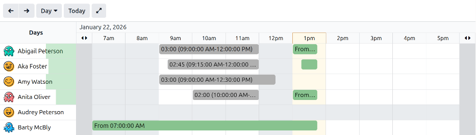
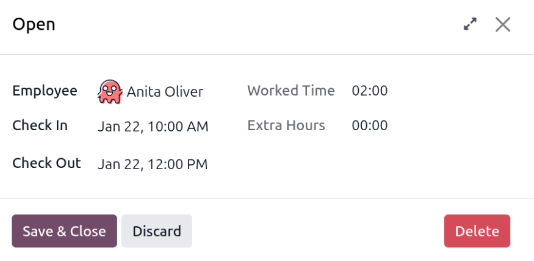
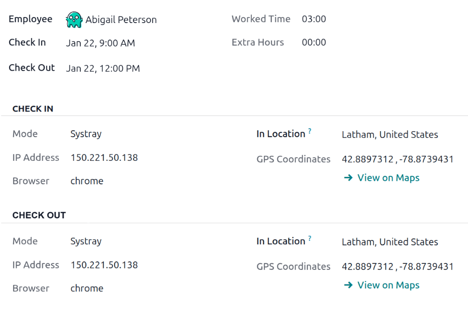

===============
Attendance logs
===============

When entering the **Attendances** application, the :guilabel:`Overview` dashboard is presented by
default, and displays all the user's attendance logs (their check in and check out information) for
the current day. If the user has the required :ref:`access rights <attendances/access-rights>` or is
an :ref:`approver <attendances/approvers>` for specific employees, those employees' attendance logs
also appear on the :guilabel:`Overview` dashboard.

The :guilabel:`Overview` dashboard displays the current day, segmented by hour, with the current
hour highlighted in yellow. The appearance of the :guilabel:`Overview` dashboard is determined by
the :ref:`working schedule <employees/schedule>` set on the employee's records. Each employee's
working hours appear in white, while all other hours appear in gray. This allows managers to
visually determine if an employee is working outside of their working hours.

Employees populate the rows, alphabetically by first name. Each attendance log displays the total
hours along with the specific check in and check out times. The log colors indicate the following
statuses:

- Gray: Completed entries where the employee has checked in and out.
- Green: Active entries where the employee checked in but has not yet checked out.
- Red: Entries with any errors (e.g. employees have double entries, or forget to check out).

         highlighted.

A color-coded bar indicates how many hours out of the total expected hours the employee has logged
for the day. Rollover the color bar to view the details for the employee's current day. Solid colors
indicate the logged hours (with both a start and end time), while pale colors indicate the employee
is signed in, but has not signed out yet. Only *completed* attendance logs (records with a check in
and check out time) appear in the summary of the logged time.

.. example::
   Abigail Peterson is scheduled to work from 9:00 AM to 12:00 PM, then take a one-hour lunch break
   from 12:00 PM to 1:00 PM, then work from 1:00 PM to 6:00 PM, for a total of eight hours.

   Abigails checks in at 9:00 AM, and checks out at 12:00 PM. She logs in again at 1:00 PM. The
   current time is 2:15 PM. The rollover information displays `3h / 8h`, indicating Abigail has
   logged three completed working hours out of a total of eight. There is a pale green line that
   extends past the summary block, indicating she checked in at 1:00 PM, but has not yet checked
   out. The length of the pale green line indicates the time worked.

   .. image:: attendance_logs/status-bar.png
      :alt: The rollover green bar indicating Abigail logged 3 hours, and is currently logged in.

The **Attendances** dashboard allows for changing the displayed time period, either :guilabel:`Day`,
:guilabel:`Week`, :guilabel:`Month`, :guilabel:`Quarter`, :guilabel:`Year`, or a custom time period.
To instantly return the dashboard to the present date, click the :guilabel:`Today` button at any
time.

.. note::
   Any attendance logs that have errors appear in red, indicating they need to be resolved by a user
   with the proper :ref:`access rights <attendances/access-rights>` or are :ref:`approvers
   <attendances/approvers>` for the employees with the errors.

.. _attendances/filters-groups:

Filters and groups
==================

Sometimes, attendance officers and managers need to view specific records, such as all automatic
checkouts, to determine which employees chronically forget to check out, or by department, to
determine which team is working the most overtime.

For these cases, use the search bar to select a :icon:`fa-filter` :guilabel:`Filters` or
:icon:`oi-group` :guilabel:`Group By`, or combine both to present the desired information.

.. seealso::
   :doc:`../../essentials/search`

High-value filters
------------------

.. list-table::
   :header-rows: 1
   :stub-columns: 1
   :widths: 40 60

   * - Filter
     - Common use case
   * - At Work
     - Verify employees still on-site before shutting down the building for the night, or to perform
       a head count.
   * - Errors
     - View all errors to correct them prior to payroll processing.
   * - Automatically Checked-Out
     - Perform an audit to determine employees who chronically forget to check-out of work.
   * - Date
     - Limit results to a specific pay-period or audit window.
   * - Active/Archived Employees
     - Switch between current staff and former employees when auditing historical data.

Insightful groupings
--------------------

.. list-table::
   :header-rows: 1
   :stub-columns: 1
   :widths: 40 60

   * - Group by
     - When it helps
   * - Employee
     - Review individual attendance logs during a 1:1 meeting.
   * - Department
     - Compare staffing levels and working hours to determine over-working and under-working teams.
   * - Manager
     - Determine where attendance follow-up questions can be directed to for an employee.
   * - Method
     - Spot trends in attendance methods to potentially resolve hardware issues.
   * - Date (Day/Week/Month)
     - Identify absenteeism spikes or seasonal patterns.

.. _attendances/errors:

Attendance log details
======================

Odoo records both the time and location for every check-in and check-out, with fields varying by the
method used. These detailed attendance logs can confirm where an employee was on any given workday.
This can be useful for companies with hybrid working schedules, who may need to perform audits to
ensure proper compliance.

To view an attendance log, click on any attendance entry on the :guilabel:`Overview` dashboard, and
the attendance log appears in a pop-up window. This log displays a summary, including the following
information:

- :guilabel:`Employee`: The name of the employee.
- :guilabel:`Check In`: The date and time the employee checked in.
- :guilabel:`Check Out`: The date and time the employee checked out. This **only** appears if the
  employee has checked out.
- :guilabel:`Worked Time`: The amount of time the employee logged for that specific entry, in an
  hour and minute format (HH:MM).
- :guilabel:`Worked Extra Hours`: The unpaid overtime hours worked beyond the expected working
  schedule for that specific entry (shows **only** when present for the employee).
- :guilabel:`Extra Hours`: The approved overtime for that specific entry (the :guilabel:`Worked
  Time` minus the approved :guilabel:`Worked Extra Hours`.

Check in/check out details
--------------------------

Additional detailed check in and check out information for the attendance log is available. Click
the :icon:`fa-expand` :guilabel:`(expand)` icon in the upper-right corner of the attendance log, and
the detailed record loads.

The following additional information appears for both the *Check In* and *Check Out* sections, which
appear in the expanded attendance log.

- :guilabel:`Mode`: The attendance submission method. The available options are:

  - :guilabel:`Systray`: The employee checked in or out :doc:`directly from the database
    <../attendances/check_in_check_out>`.
  - :guilabel:`Kiosk`: The employee checked in or out using an :ref:`attendance kiosk
    <attendances/kiosk-mode-entry>`.
  - :guilabel:`Manual`: The employee's manager or an **Attendances** app administrator
    :ref:`manually created the attendance record <attendances/create-records>`. This typically
    occurs when an employee forgets to check in or check out.

- :guilabel:`IP Address`: The device's IP address used to check in or out.
- :guilabel:`Browser`: The web browser the employee used to check in or out.
- :guilabel:`Localisation`: The city and country associated with the computer's IP address.
- :guilabel:`GPS Coordinates`: The specific coordinates when the user checked in or out. To view the
  specific coordinates on a map, click the :icon:`oi-arrow-right` :guilabel:`View on Maps` button
  beneath the :guilabel:`GPS Coordinates`. This opens a map in a new browser tab, with the specific
  location pointed out.

Attendance errors
=================

Entries that contain an error appear on the overview dashboard in red. In the :icon:`fa-tasks`
:guilabel:`(Gantt)` view, the entry appears with a red background; in the :icon:`oi-view-list`
:guilabel:`(List)` view, the entry text appears in red.

An error occurs when an employee has checked in but not checked out within 24 hours, or when a
single check-in period exceeds 16 hours.

To fix the error, the attendance entry must be modified or deleted. Click on the entry to reveal a
pop-up containing the details for that particular entry. To modify the :guilabel:`Check In` or
:guilabel:`Check Out` information, click on the :guilabel:`Check In` or :guilabel:`Check Out` field,
and a calendar selector appears. Click on the desired date, then use the time selector beneath the
calendar to select the specific time for the entry. When the information is correct, click
:guilabel:`Apply.`

When all the information on the pop-up is correct, click :guilabel:`Save & Close`. When the entry no
longer has an error, the entry appears in gray instead of red.

To delete an entry, click the red :guilabel:`Delete` button on the pop-up window instead of making
modifications to the entry.
