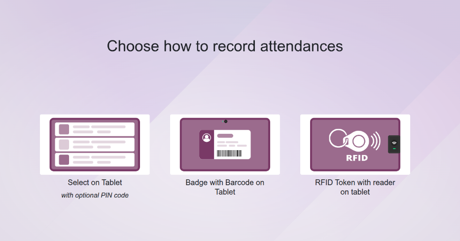
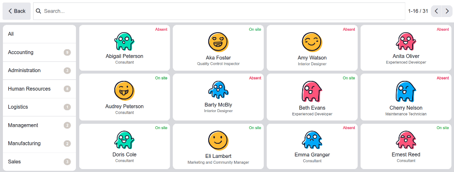
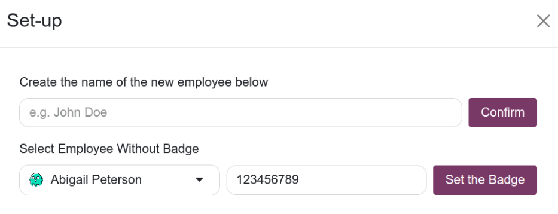

==========
Onboarding
==========

The **Attendances** application allows for various ways to check-in and check-out of work. Managers
or HR workers may need to train employees on the various methods available. Odoo's **Attendances**
application has an onboarding feature to aid with employee training.

To open the *Onboarding* screen, navigate to :menuselection:`Attendances app --> Configuration -->
Onboarding`. The screen loads an onboarding dashboard, with three options to check-in:
:ref:`manually <attendances/onboard-manual>`, with a :ref:`barcode <attendances/onboard-barcode>`,
or with an :ref:`RFID token <attendances/onboard-rfid>`.

.. note::
   This can be done on either a PC or tablet.

.. important::
   When onboarding employees using the *Onboarding* interface, any attendance logs created are
   reflected in the database. This means that employees who check-in during onboarding training are
   logged into work in the **Attendances** app.

   If managers want to use the *Onboarding* dashboard as a training *only*, they must check
   attendance records and make any necessary modifications, so all attendance records are accurate
   and reflect the correct working hours.

.. _attendances/onboard-manual:

Manual selection
================

On the *Onboarding* screen, click or tap on the image above the text :guilabel:`Select on Tablet`. A
dashboard loads with all employees listed in a default Kanban view. All Kanban cards indicate the
employee's current status with either a red :guilabel:`Absent` or a green :guilabel:`On Site` text
in the upper-right corner of the card.

Navigate to the desired employee, then click or tap their Kanban card. The employee is automatically
checked-in or checked-out depending on their status in the **Attendances** app. The screen briefly
displays a *Welcome* or *Goodbye* screen with the current date and time, along with any previously
logged attendance hours.

After the specified period of time designated in the :ref:`kiosk settings
<attendances/kiosk-settings>` has elapsed, the screen reverts to the main *Onboarding* dashboard. To
exit the screen sooner, click the :guilabel:`OK` button.

.. note::
   The list of departments on the left-side or the search bar at the top can be used to navigate to
   the desired employee.

.. _attendances/onboard-barcode:

Badge with barcode
==================

The second option available to check-in or check-out is to use an ID badge that has a barcode on it.
Click or tap on the center image above the text :guilabel:`Badge with Barcode on Tablet`, and a
dashboard loads displaying two options: :guilabel:`Scan your badge` and :guilabel:`New Set-up
(Employee/Badge)`.

If the employee has an ID badge with a barcode, click the :guilabel:`Scan your badge` button to scan
the barcode using either the device's camera or a dedicated barcode scanner. A *Barcode Scanner*
pop-up window loads and displays the area being scanned. Scan the barcode to check in or check out
of the database.

.. image:: attendance_onboarding/barcode-scan.png
   :alt: The barcode scanning dashboard from the Onboarding screen.

.. note::
   The **Barcode** app does **not** need to be installed to use the barcode option.

Create a new barcode
--------------------

If the employee does *not* have a barcode, click the :guilabel:`New Set-up (Employee/Badge)` button
to bring up the *Set-up* pop-up window. Using the drop-down menu beneath the text :guilabel:`Select
Employee Without Badge`, select the *existing* employee who does **not** have a barcode. Next, enter
the new barcode in the corresponding field.

Once completed, click the :guilabel:`Set the Badge` button. The *Set-up* pop-up window closes, and a
notification stating `Badge assigned successfully!` appears in the upper-right corner of the
*Onboarding* dashboard.

The new badge number appears in the *Badge ID* field in the *Settings* tab on the :ref:`employee's
form <employees/hr-attn-pos>`.

.. important::
   The *Set-up* pop-up window **only** creates a new barcode and stores the number on the employee's
   record. The barcode must be printed to scan it with the :guilabel:`Badge with Barcode on Tablet`
   option.

   If the employee already has a barcode on their profile, the current barcode is replaced with the
   newly entered one.

Create a new employee
---------------------

If an employee has **not** been created in the system, a new employee can be added to the database
from the *Set-up* pop-up window. Type in the employee's name in the field below :guilabel:`Create
the name of the new employee below`, then click the :guilabel:`Confirm` button.

The *Set-up* pop-up window closes, and a notification stating `Employee created successfully!`
appears in the upper-right corner of the *Onboarding* dashboard.

.. important::
   The *Set-up* pop-up window only creates a new employee record in the **Employees** app. A barcode
   must be created and printed to scan it with the :guilabel:`Badge with Barcode on Tablet` option.

.. _attendances/onboard-rfid:

RFID token
==========

The third option available to check in on the *Onboarding* dashboard is to use an RFID token. Click
the button above the text :guilabel:`RFID Token with reader on tablet` to bring up a dashboard with
two options: :guilabel:`Scan your badge`, or :guilabel:`New Set-up (Employee/Badge)`.

If the employee has an RFID token, click the :guilabel:`Scan your badge` button to scan the RFID
token using a connected RFID reader.

.. important::
   To use this feature, both RFID key fobs *and* an RFID reader **must** be purchased. Follow the
   manufacturer's directions to install the RFID reader and set up the RFID key fob.
