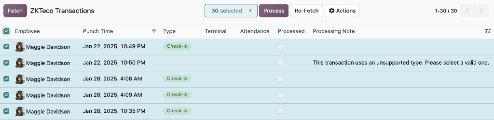

===================
BioTime integration
===================

BioTime is a third-party attendance application that, when integrated with Odoo, retrieves
attendance *punches*, or records, from a BioTime server. These are converted into attendance
records, eliminating the need to record employee check-ins and check-outs manually in the
**Attendances** app.

.. important::
   The integration is built for BioTime 8.5 and 9.0 APIs. This integration connects to the BioTime
   software, **not** to ZKTeco terminals. Device compatibility depends on BioTime itself. Check the
   official BioTime supported device list for the installed version before adding a new terminal.

Installation
============

To configure the database, a module must be installed first. Open the **Apps** application, remove
the default filter in the search bar, and search for `ZKTeco`. Install the :guilabel:`Attendances
ZKTeco BioTime` module.

Configuration
=============

To configure the BioTime integration, navigate to :menuselection:`Attendances app --> Configuration
--> Settings`. Scroll to the *ZKTeco BioTime* section and configure the following fields:

- :guilabel:`Company Name`: Enter the company name that is registered on the BioTime server. This is
  used to identify which company's data to retrieve if the server hosts more than one.
- :guilabel:`Server URL`: Enter the full URL of the ZKTeco BioTime server.
- :guilabel:`Email`: Enter the email address used to authenticate the BioTime server.
- :guilabel:`Password`: Enter the password used to authenticate the BioTime server.
- :guilabel:`Transaction Fetch Window`: Enter the number of days of punch data fetched from the
  BioTime server on each sync. Set the window of time wide enough to cover the sync interval, so no
  punches are missed if a sync runs late.
- :guilabel:`Check-out Lookback`: Enter the number of days to search backward for an open check-in
  when matching a check-out. If none is found within that window, the check-out is left unmatched.

Once the fields are filled in, click :guilabel:`Save`, then click the :guilabel:`Test Connection`
button in the *ZKTeco BioTime* section. After a successful connection, data can be fetched.

Fetch transactions
==================

The devices connected to the BioTime server are referred to as *terminals*. Each attendance record
identifies which terminal generated the transaction.

BioTime stores each punch as a single check-in or check-out record, while an **Attendances** app
record in Odoo combines both check-in and check-out information in a single record. For this reason,
punches retrieved from BioTime are first stored separately in the database before being converted
into **Attendances** app records.

To view the fetched BioTime records, navigate to :menuselection:`Attendances app --> Overview -->
ZKTeco Transactions`. Each ZKTeco Transaction record displays the following information:

- :guilabel:`Employee`: The employee linked to the transaction. This is matched using the
  :guilabel:`ZKTeco employee ID` field in the *Settings* tab of the :ref:`employee form
  <employees/new_employee/hr-attn-pos>`. If no match is found, a warning appears in the
  :guilabel:`Processing Note` field.
- :guilabel:`Punch Time`: The punch time recorded on the BioTime server, converted to the user's
  time zone.
- :guilabel:`Type`: Either `Check-In` (mapped to a value of 0) or `Check-Out` (mapped to a value of
  1) on the BioTime server. Any other value is not supported, and a warning notes that a valid type
  must be selected before processing.
- :guilabel:`Terminal`: The terminal, or device, that generated the transaction.
- :guilabel:`Attendance`: The attendance record generated once the transaction is processed. This
  field is empty until processing succeeds.
- :guilabel:`Is Processed`: Indicates whether the transaction has been converted into an attendance
  record.
- :guilabel:`Processing Note`: Displays a warning when the transaction cannot be matched or
  processed, for example when no matching employee or no valid type is found.
- :guilabel:`Zkteco Transaction`: The ID of the transaction on the BioTime server.

.. tip::
   Transactions automatically sync every 12 hours. To fetch them manually at any time, click
   :guilabel:`Fetch` from the *ZKTeco Transactions* dashboard.

Process transactions
====================

Processing the ZKTeco transactions converts them into **Attendances** app attendance records. How a
transaction is handled depends on its type.

*Check-in* transactions create a new attendance record, unless the employee already has an open
attendance record (a check-in with no matching check-out).

*Check-out* transactions are linked to the earliest open attendance record found within the
:guilabel:`Check-out Lookback` period as configured in the settings menu, using that record's
check-out time.

.. note::
   An employee **cannot** have two open attendance records at the same time.

To process a transaction, select it and click :guilabel:`Process`. If processing fails, check the
:guilabel:`Processing Note` field for the reason. Once the record is corrected, click
:guilabel:`Process` again. If the punch data itself looks wrong or incomplete, click
:guilabel:`Re-Fetch` to pull it again from the BioTime server before reprocessing. Both actions are
available for a single transaction, or in bulk from the list view.

.. example::
   In this example, a check-in transaction cannot be processed because an earlier attendance record
   is still open. The transaction on January 28 is not processed because an attendance record with a
   check-in on January 28 is already open. That record must be checked out before the employee can
   check in again.

   Once a ZKTeco Transaction is processed successfully, its associated attendance record appears in
   the transaction's Attendance field, and the attendance record's mode is set to BioTime,
   distinguishing it from attendance entered manually or through other check-in methods.

   .. image:: biotime_integration/example.png
      :alt: The BioTime check-in with an error for January 28th.

.. important::
   A processed ZKTeco Transaction **cannot** be deleted while it remains linked to an attendance
   record. Delete the attendance record first.
