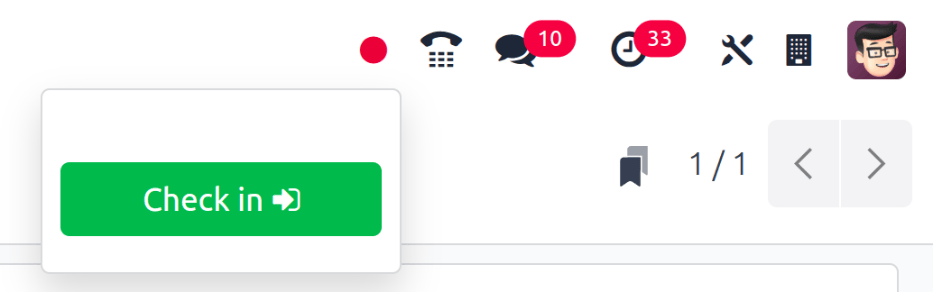
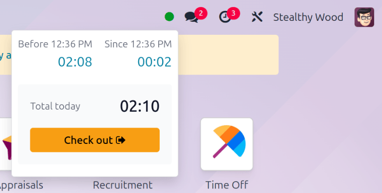

================
Check in and out
================

Odoo's *Attendances* application allows users, who are logged into the database, to check in and
out, without needing to go into the *Attendances* application, or use a kiosk. For smaller
companies, where every employee is also a user, this feature may be useful.

A user can check in and/or out on the main database Odoo dashboard, or while inside any application.
To do so, in the upper-right corner of the top main header menu, which is always visible regardless
of what application the user is in, a :guilabel:`🔴 (red circle)` or :guilabel:`🟢 (green circle)`
is visible. Click on the colored circle to reveal the attendance widget, enabling the user to check
in and/or out.

.. _attendances/check-in:

Check in
========

If the attendance widget circle is red, this indicates the user is not currently checked in. Click
the :guilabel:`🔴 (red circle)`, and the attendance widget appears, displaying a green
:guilabel:`Check in` :icon:`fa-sign-in` button.

When the user checks in from the database, the *Attendances* app logs the location details for the
user, including the IP Address and GPS coordinates.

.. important::
   For the *Attendances* app to log the location details, the user must allow their computer to
   access their location information.

If the user has not already checked in and out during the current work day, this button is the only
visible item in the widget. If the user has previously checked in and out, a :guilabel:`Total today`
field appears above the button, and the total amount of time that has been logged for the day
appears in that field, in an :guilabel:`HH:MM` (hours:minutes) format.

Click the :guilabel:`Check in` :icon:`fa-sign-in` button to check in. The :guilabel:`🔴 (red
circle)` in the top menu changes to green, and the widget changes appearance, as well. The widget
updates to reflect that the user has checked in, by changing the green :guilabel:`Check in`
:icon:`fa-sign-in` button to a yellow :guilabel:`Check out` :icon:`fa-sign-out` button.

Click anywhere on the screen to close the attendance widget.

Check out
=========

If the user is checking out for the first time, :guilabel:`Since HH:MM (AM/PM)` appears at the top
of the widget, with the time the user checked in populating the time field. Beneath that line, the
hours and minutes that have elapsed since checking in are displayed in a :guilabel:`HH:MM` format.
As time passes, this value is updated to reflect the hours and minutes that have passed since the
user checked in.

If the user has previously checked in and out, additional fields are presented. A :guilabel:`Before
HH:MM (AM/PM)` field appears, in addition to the :guilabel:`Since HH:MM (AM/PM)` field. The times
displayed in both of these fields match, and are populated with the most recent check in time.
Beneath the :guilabel:`Before HH:MM (AM/PM)` field, the previously logged time is displayed, in an
:guilabel:`HH:MM` (hours:minutes) format.

In addition, beneath both of these fields, a :guilabel:`Total today` field appears. This field is
the sum of both the :guilabel:`Before HH:MM (AM/PM)` and :guilabel:`Since HH:MM (AM/PM)` fields, and
is the total time that is logged for the user, if they were to log out at that moment.

As time passes, both the :guilabel:`Since HH:MM (AM/PM)` and :guilabel:`Total today` fields are
updated live. To check out, click the yellow :guilabel:`Check out` :icon:`fa-sign-out` button. The
attendance widget updates again, displaying the :guilabel:`Total today` field with the logged time,
while the yellow :guilabel:`Check out` :icon:`fa-sign-out` button changes to a green
:guilabel:`Check in` :icon:`fa-sign-in` button.

When the user checks out from the database, the *Attendances* app logs the location details for the
user. This information is **only** logged if the user allows their computer to access this
information.

.. tip::
   There is no limit to the amount of times a user can check in and check out. Users are able to
   check in and out without any time elapsing (a value of 00:00). Each time an employee logs in and
   out, the information is stored and appears on the main *Attendances* dashboard, including check
   ins and check outs with no time value.
