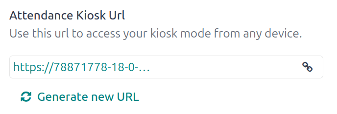
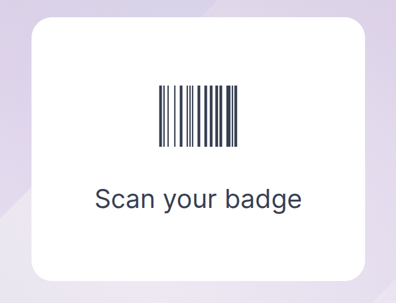
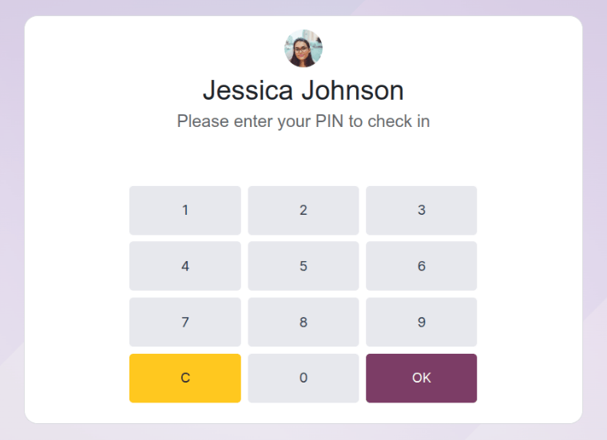
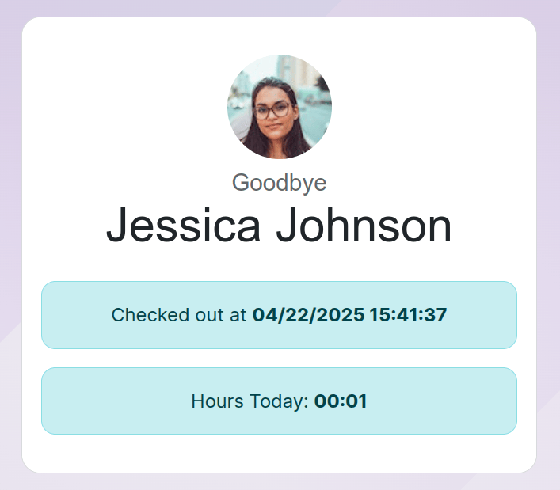

======
Kiosks
======

Odoo's *Attendances* app allows employees to check in and out of work directly from the database, or
from a kiosk.

A kiosk is a :doc:`dedicated device <hardware>` (a PC, tablet, or mobile phone) for employees to use
when they check in and out.

Kiosks are needed for employees who do **not** have access to the database.

Only employees with access to the database can check in and out from the *Attendances* app, and they
are referred to as *users*.

.. important::
   If employees :ref:`check in and out <attendances/kiosk-mode-entry>` using a badge or an RFID,
   then an :doc:`accessible device <hardware>` in :ref:`Kiosk Mode <attendances/kiosk-mode>`
   **must** be available in order to use these two methods.

Configuration
=============

There are only a few configurations needed to use kiosks in the *Attendances* application. Navigate
to :menuselection:`Attendances app --> Configuration` to access the :guilabel:`Settings` page to
configure the :ref:`attendances/kiosk-mode` and the :ref:`attendances/kiosk-settings`.

Once all desired settings have been configured, click the :guilabel:`Save` button on the
:guilabel:`Settings` page, to activate and enable them.

.. _attendances/kiosk-mode:

Kiosk Mode section
------------------

Using the drop-down menu, select how an employee checks in when using a kiosk. Options are
:guilabel:`Barcode/RFID`, :guilabel:`Barcode/RFID and Manual Selection`, or :guilabel:`Manual
Selection`.

.. note::
   The *Barcode* application **does not** need to be installed to use one of the Barcode/RFID
   settings.

.. _attendances/kiosk-settings:

Kiosk Settings section
----------------------

The various settings in the :guilabel:`Kiosk Settings` section determine how employees check in and
out with kiosks.

- :guilabel:`Barcode Source`: this setting **only** appears if one of the two *Barcode/RFID*
  selections were configured for the :ref:`Kiosk Mode <attendances/kiosk-mode>` setting.

  If available, select how barcodes are scanned at the kiosk, via one of the drop-down menu options.
  Barcodes can be scanned with a dedicated :guilabel:`Scanner`, or with a device's camera
  (:guilabel:`Front Camera` or :guilabel:`Back Camera`).
- :guilabel:`Employee PIN Identification`: tick this checkbox if employees should use a unique PIN
  to check in. PINs are configured on each individual employee record. Refer to the :ref:`new
  employee documentation <employees/hr-settings>` documentation for more information on setting up
  PINs.
- :guilabel:`Display Time`: determine how many seconds a check-in/check-out confirmation message
  remains on the kiosk screen before returning to the main check in screen.
- :guilabel:`Attendance Kiosk Url`: Odoo generates a unique web address (URL) to use a device as a
  kiosk, without having to sign in to the Odoo database. When setting up a kiosk device, navigate to
  this unique web address in a web browser to present the *Attendances* app kiosk.

  .. important::
     These kiosk URLs are **not** secured with any type of access code. Anyone who has the URL can
     access the *Attendances* app kiosk. If the URL is compromised for any reason, such as in the
     event of a security breach, click :guilabel:`Generate a new Kiosk Mode URL`, located beneath
     the link, to generate a new URL, and update the kiosk, accordingly.

Kiosk mode
==========

Entering *Kiosk Mode* is **only** available for users with specific :ref:`access rights
<attendances/access-rights>`.

*Kiosk Mode* can be activated in two different ways:

#. Navigate to the :menuselection:`Attendances app`, and click :guilabel:`Kiosk Mode` in the top
   menu. The device then signs out of Odoo and enters *Kiosk Mode*.
#. Navigate to the :menuselection:`Attendances app --> Configuration`. In the :guilabel:`Kiosk
   Settings` section, use the link in the :guilabel:`Attendance Kiosk Url` field to open *Kiosk
   Mode* on any device.

As a security measure, once a device is in *Kiosk Mode*, it is not possible to go back into the
database without signing back in.

.. note::
   At any time, a new kiosk URL can be generated, if needed. Click the :icon:`fa-refresh`
   :guilabel:`Generate a new Kiosk Mode URL`

To exit *Kiosk Mode*, just close the tab in the web browser or return to the main log-in screen of
Odoo.

.. _attendances/kiosk-mode-entry:

Check in and out with a kiosk
=============================

Badge
-----

To check in or out using a badge, tap the :icon:`fa-camera` :guilabel:`Tap to scan` image in the
center of the kiosk.

Then, scan the barcode on the badge using the method configured in the :ref:`Kiosk Settings
<attendances/kiosk-settings>` section of the configuration menu.

Once the barcode is scanned, the employee is checked in or out, and a :ref:`confirmation message
<attendances/confirmation>` appears with all the information.

RFID
----

To check in or out using an RFID key fob, simply scan the fob with an RFID reader.

Once scanned, the employee is either checked in or checked out, and a :ref:`confirmation message
<attendances/confirmation>` appears with all the information.

Manually
--------

Users who do not have a scannable badge, or an RFID fob, can manually check in and out at a kiosk.

Tap the :guilabel:`Identify Manually` button on the kiosk, and a screen appears with all the
employees that can be checked in or out. The *Employees* application dashboard has the same display.

Tap on a person to check them in or out, and a :ref:`confirmation message
<attendances/confirmation>` appears.

There are two ways to quickly find a specific person:

- :guilabel:`Search...`: tap on the :guilabel:`Search...` field, and enter the desired person's
  name. As the name is typed in, the matching results are displayed on the screen.
- :guilabel:`Department`: tap on any desired selection in the :guilabel:`Department` section,
  located on the left-side of the screen, to **only** view employees from that specific department.
  The number at the end of each listed :guilabel:`Department` represents how many employees that
  department has.

PIN
~~~

If the :guilabel:`Employee PIN Identification` checkbox was ticked in the :ref:`Kiosk Settings
<attendances/kiosk-settings>` section of the configuration menu, the employee is prompted to enter a
PIN when manually checking in or out.

After the employee is selected, a number pad appears with a message. When checking in,
:guilabel:`(Employee) Welcome! Please enter your PIN to check in` appears above the numbers. When
checking out, :guilabel:`(Employee) Want to check out? Please enter your PIN to check out` appears
above the numbers.

Tap in the PIN using the number pad, then tap :guilabel:`OK` when done. The employee is then checked
in or out, and a :ref:`confirmation message <attendances/confirmation>` appears.

.. _attendances/confirmation:

Confirmation message
--------------------

When an employee checks in or out, a confirmation message appears, with all the check in or check
out information. When checking in, a welcome message appears, as well as the date and time of check
in.

An :guilabel:`Hours Previously Today: HH:MM` field also appears, displaying any time that has
already been logged for that employee for the day. If no time has been logged, the value displayed
is: `00:00`. Beneath the message is an :guilabel:`OK` button.

To exit the screen before the preset time in the kiosk, tap the :guilabel:`OK` button.

When checking out, the screen displays a goodbye message, with the date and time of check out, and
the total hours logged for the day. Beneath the message is a :guilabel:`Goodbye` button. To exit the
screen before the preset time, tap the :guilabel:`Goodbye` button.

