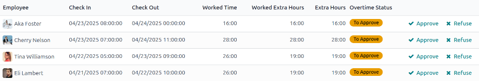
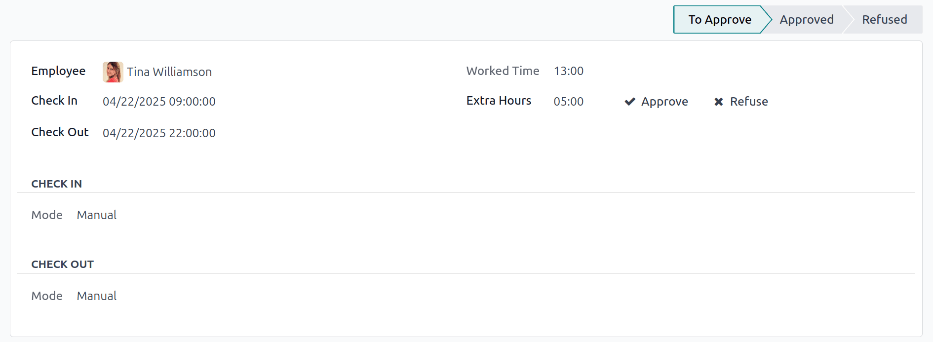

===========================
Work approvals and overtime
===========================

Odoo's **Attendances** app requires management oversight in order to ensure all logged attendances
are correct, especially overtime hours and incomplete shifts.

.. _attendances/dashboard:

Management dashboard
====================

All attendance records that require approval, typically due to overlapping work entries or
unapproved time off, are managed from a centralized management dashboard. To access this, navigate
to :menuselection:`Attendances app --> Management`.

The :guilabel:`Management` dashboard only displays attendance records for current employees that
need to be approved, in a default list view. This is due to the two default filters in the search
bar, the :guilabel:`To Approve` and :guilabel:`Active Employees`.

Each attendance record displays the following information:

- :guilabel:`Employee`: the name of the employee
- :guilabel:`Check In`: the date and time the employee checked in
- :guilabel:`Check Out`: the date and time the employee checked out
- :guilabel:`Worked Time`: the number of worked hours the employee logged
- :guilabel:`Worked Extra Hours`: the amount of overtime worked
- :guilabel:`Extra Hours`: the total extra hours logged
- :guilabel:`Overtime Status`: the status of the attendance record. All attendance records that
  appear on this dashboard have a status of :guilabel:`To Approve`.

.. _attendances/approve-refuse:

Approvals and refusals
======================

Attendance records can be approved and refused directly from the :ref:`Management dashboard
<attendances/dashboard>`. At the far-right of each record, :icon:`fa-check` :guilabel:`Approve` and
:icon:`fa-times` :guilabel:`Refuse` buttons appear. Click the corresponding button to either approve
or refuse the logged attendance record.

.. note::
   When approving or refusing attendance records from the :guilabel:`Management` dashboard, it is
   **not** possible to view the details of the attendance record.

Partial approvals
-----------------

It is possible to approve a portion of the logged :guilabel:`Extra Hours` and not the full amount.
To approve only a portion of overtime, click into an attendance record to view the details.

Click into the :guilabel:`Extra Hours` field and enter the amount of hours being approved. After
editing the :guilabel:`Extra Hours field`, the :guilabel:`Worked Extra Hours` field becomes visible
to display the difference between the :guilabel:`Worked Time` and :guilabel:`Extra Hours` fields.

.. note::
   The :guilabel:`Worked Time` field is the total hours the employee logged (the :guilabel:`Worked
   Time` and :guilabel:`Extra Hours` combined). For example, if an employee is scheduled to work
   eight hours, and worked five extra hours, the :guilabel:`Worked Time` is thirteen hours, and the
   :guilabel:`Extra Hours` is five hours. The :guilabel:`worked Time` field **cannot** be modified.

Click :icon:`fa-check` :guilabel:`Approve` to approve the updated :guilabel:`Extra Hours`. Once
partially approved, the :guilabel:`Worked Extra Hours` field disappears, along with the
:icon:`fa-check` :guilabel:`Approve` button. The difference in hours appears in the :guilabel:`Extra
Hours` field.

Once overtime hours are partially approved, the status changes to :guilabel:`Approved`.

.. important::
   Once partial overtime is approved, it is still possible to deny overtime by clicking
   :icon:`fa-times` :guilabel:`Refuse`. The record can be modified as many times as needed.

.. note::
   Occasionally, verifying an employee's location when checking-in may be needed. The method the
   employee checked-in to work is found on the individual record, in the :guilabel:`Mode` field.

   The :guilabel:`Mode` field is not modifiable, as it only log the method the attendance record was
   created.

   The possible options are:

   - :guilabel:`Kiosk`: the employee physically checked in or out using a :doc:`kiosk <kiosks>`
     device. The employee was present at the kiosk to check-in.
   - :guilabel:`Systray`: the employee checked in or out :doc:`directly from the database
     <check_in_check_out>`. Depending on the :guilabel:`IP Address` displayed on the detailed
     attendance record, the employee's location at the time of check-in can be determined.
   - :guilabel:`Manual`: the record was created manually in the **Attendances** app. This is
     typically done by management, to add a missing record.

Create attendance records
=========================

When necessary, users with the required :ref:`access rights <employees/work-info-tab>` are able to
create attendance records manually in the **Attendances** app. Some situations requiring this is
when employees forget to check in and out for shifts, as employees cannot retroactively create
attendance records.

To add a missing attendance record, navigate to :menuselection:`Attendances app --> Overview`. Click
the :guilabel:`New` button in the upper-left corner. In the :guilabel:`Create` pop-up window, enter
the following information on the form:

- :guilabel:`Employee`: select the employee the record is being created for. The signed-in user
  populates this field, by default.
- :guilabel:`Check In`: using the calendar modal, select the check in date and time, then click
  :icon:`fa-check` :guilabel:`Apply`. By default, the current date is selected, and the time is set
  to `00:00:00`.
- :guilabel:`Check Out`: using the calendar modal, select the check out date and time, then click
  :icon:`fa-check` :guilabel:`Apply`. By default, the following date is selected, and the time is
  set to `00:00:00`.
- :guilabel:`Worked Time`: this field is automatically populated with the difference from the
  selected :guilabel:`Check In` and :guilabel:`Check Out` times. This field **cannot** be modified.
- :guilabel:`Extra Hours`: enter the number of overtime hours, if any, to be approved.

.. important::
   Once :guilabel:`Extra Hours` are added, they are automatically approved by the system. However,
   it is possible to manually refuse them, as explained in the :ref:`Approvals and Refusals
   <attendances/approve-refuse>` section.

.. image:: management/new-record.png
   :alt: An Attendances app record form, filled out for Doris Cole for April 23, 2025.
