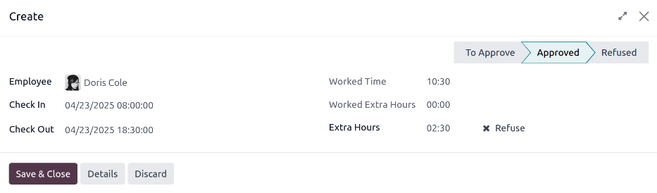

===========================
Work approvals and overtime
===========================

Odoo's **Attendances** app requires management oversight in order to ensure all logged attendances
are correct, especially overtime hours and incomplete shifts.

.. _attendances/dashboard:

Management dashboard
====================

All attendance records that require approval, typically due to overlapping work entries or
unapproved time off, are managed from a centralized management dashboard. To access this, navigate
to :menuselection:`Attendances app --> Management`.

The :guilabel:`Management` dashboard only displays attendance records for current employees that
need to be approved, in a default list view. This is due to the two default filters in the search
bar, the :guilabel:`To Approve` and :guilabel:`Active Employees`.

Each attendance record displays the following information:

- :guilabel:`Employee`: The name of the employee.
- :guilabel:`Check In`: The date and time the employee checked in.
- :guilabel:`Check Out`: The date and time the employee checked out.
- :guilabel:`Worked Time`: The number of worked hours the employee logged.
- :guilabel:`Worked Extra Hours`: The amount of overtime worked.
- :guilabel:`Extra Hours`: The total approved extra hours.

.. image:: management/management-dashboard.png
   :alt: The Attendances app Management dashboard, displaying entries needing approval.

.. _attendances/approve-refuse:

Approvals and refusals
======================

Attendance records can be approved and refused directly from the :ref:`Management dashboard
<attendances/dashboard>`. At the far-right of each record, :icon:`fa-check` :guilabel:`Approve` and
:icon:`fa-times` :guilabel:`Refuse` buttons appear. Click the corresponding button to either approve
or refuse the logged attendance record.

.. note::
   When approving or refusing attendance records from the :guilabel:`Management` dashboard, it is
   **not** possible to view the details of the attendance record.

Partial approvals
-----------------

It is possible to approve a portion of the logged :guilabel:`Extra Hours` and not the full amount.
To approve only a portion of overtime, click into an attendance record to view the details.

The top half of the record displays the specific check in and check out details, including the
method used. The :guilabel:`Check In` and :guilabel:`Check Out` information in the top half of the
form can be modified, if needed. Click into the desired field, and make any needed changes.

The bottom half of the form contains the *Overtime Details* tab. This tab lists the
overtime rules used to calculate the extra hours, along with the pay rate and status. The extra
hours listed in this tab can be modified, allowing for partial overtime approval.

Click into the :guilabel:`Extra Hours (encoded)` field of the line being modified. Enter the amount
of hours being approved in an `HH:MM` format, then click :icon:`fa-check` :guilabel:`Approve` at the
end of the line.

.. image:: management/record.png
   :alt: A detailed attendance record.

After editing and approving the :guilabel:`Extra Hours (encoded)` field, the status changes to
:guilabel:`Approved`, and the :guilabel:`Extra Hours` field in the top half of the form updates to
display the approved overtime.

.. important::
   Once partial overtime is approved, it is still possible to deny overtime by clicking the
   :icon:`fa-times` next to the :guilabel:`Extra Hours` field in the top half of the form, or
   clicking :icon:`fa-times` :guilabel:`Refuse` at the end of the overtime entry in the *Overtime
   Details* tab.

.. note::
   Occasionally, verifying an employee's location when checking-in may be needed. The method the
   employee checked-in to work is found on the individual record, in the :guilabel:`Mode` field.

   The :guilabel:`Mode` field is not modifiable, as it only logs the method the attendance record
   was created.

   The possible options are:

   - :guilabel:`Kiosk`: The employee physically checked in or out using a :doc:`kiosk <kiosks>`
     device. The employee was present at the kiosk to check-in.
   - :guilabel:`Systray`: The employee checked in or out :doc:`directly from the database
     <check_in_check_out>`. Depending on the :guilabel:`IP Address` displayed on the detailed
     attendance record, the employee's location at the time of check-in can be determined.
   - :guilabel:`Manual`: The record was created manually in the **Attendances** app. This is
     typically done by management, to add a missing record.

Convert overtime to time off
============================

Some companies allow for the conversion of overtime into time off. To convert all or a portion of
overtime into time off, navigate to :menuselection:`Attendances app --> Management`. Click on the
desired attendance record to view the specific attendance details.

In the *Overtime Details* tab, adjust the amount of overtime being converted to time off in the
:guilabel:`Extra Hours (encoded)` field, if necessary. Next, click the checkbox in the
:guilabel:`Compensable as Time Off` column, indicating the overtime should be converted to time off.
Click :icon:`fa-check` :guilabel:`Approve` at the end of the line, and the status changes to
:guilabel:`Approved`, and the :guilabel:`Extra Hours` field in the top half of the form updates to
reflect the approved overtime.

.. image:: management/convert-time-off.png
   :alt: An attendance record with 2 ours of overtime converted to time off.

.. _attendances/create-records:

Create attendance records
=========================

When necessary, users with the required :ref:`access rights <employees/work-info-tab>` are able to
create attendance records manually in the **Attendances** app. Some situations requiring this is
when employees forget to check in and out for shifts, as employees cannot retroactively create
attendance records.

To add a missing attendance record, navigate to :menuselection:`Attendances app --> Overview -->
Dashboard`. Click the :guilabel:`New` button in the upper-left corner to open a *Create* pop-up
window. Enter the following information on the form, then click :guilabel:`Save & Close`:

- :guilabel:`Employee`: Select the employee the record is being created for. The signed-in user
  populates this field, by default.
- :guilabel:`Check In`: Using the calendar, select the check in date and time, then click
  :guilabel:`Apply`. By default, the current date is selected, and the time is set to `12:00:AM`.
- :guilabel:`Check Out`: Using the calendar, select the check out date and time, then click
  :guilabel:`Apply`. By default, the following date is selected, and the time is set to `12:00:AM`.
- :guilabel:`Worked Time`: This field is automatically populated with the difference from the
  selected :guilabel:`Check In` and :guilabel:`Check Out` times. This field **cannot** be modified.
- :guilabel:`Extra Hours`: This field is *not* modifiable as overtime must be :ref:`approved
  <attendances/approve-refuse>`. This field displays zero (`00:00`) by default.

