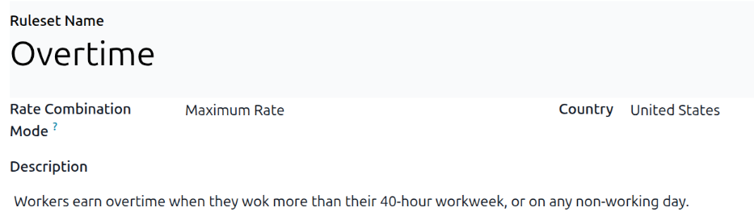
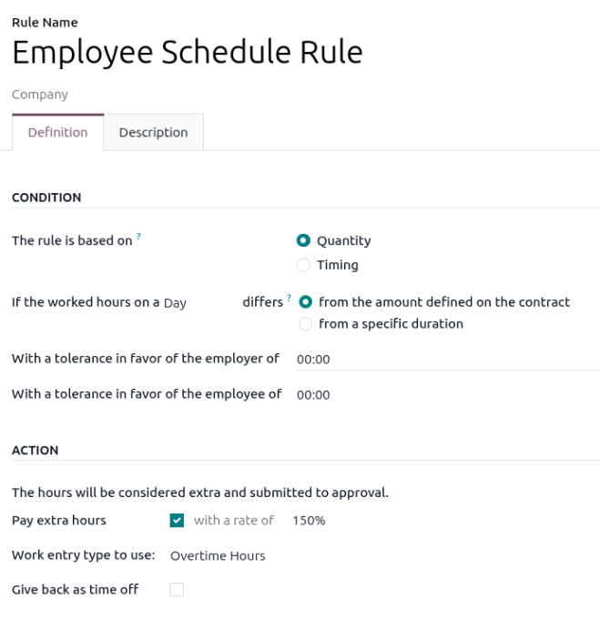
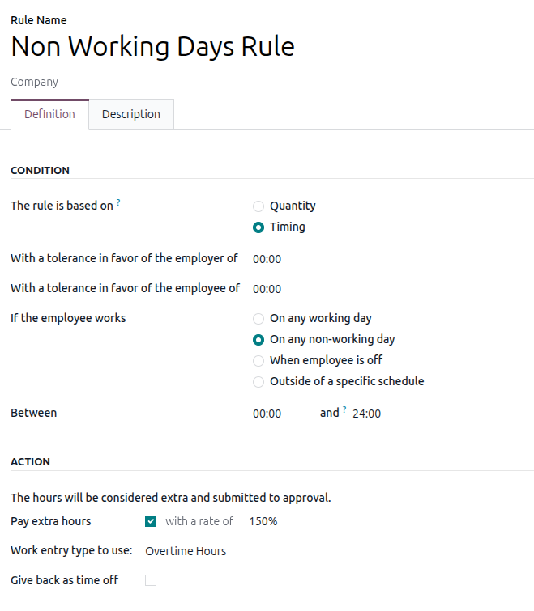

=================
Overtime rulesets
=================

Odoo's **Attendances** app allows for the configuration of overtime rules to determine if and when
employees earn overtime, and at what rate. No overtime rulesets come preconfigured in the
**Attendances** app; all overtime rulesets must be created.

Create an overtime ruleset
==========================

To create an overtime ruleset, navigate to :menuselection:`Attendances app --> Configuration -->
Overtime Rulesets`. Any existing overtime rulesets appear in a default list view, and displays the
ruleset :guilabel:`Name`, the :guilabel:`Rate Mode`, and the :guilabel:`Rules Count` (the number of
rules configured for the ruleset).

Click the :guilabel:`New` button, and a blank :guilabel:`Rulesets` form loads. Enter the following
information on the top-half of the form:

- :guilabel:`Ruleset Name`: Enter a name for the ruleset.
- :guilabel:`Rate Combination Mode`: Using the drop-down menu, select how the overtime rate is
  calculated. The options are:

  - :guilabel:`Maximum Rate`: The highest rate is used to determine the overtime pay. For example,
    if there are two available rates of 150% and 125%, the highest available rate, 150%, is applied.
  - :guilabel:`Sum of all rates`: A combination of all applicable rates are used to calculate the
    overtime pay. For example, if two rates apply, 150% and 120%, a rate of 170% is applied.

- :guilabel:`Description`: Enter a brief description for the ruleset.
- :guilabel:`Country`: Using the drop-down menu, select the country the ruleset applies to.

Overtime rules
--------------

Once the main information of the ruleset is created, the next step is to add the individual rules.
Click :guilabel:`Add a line` at the bottom of the *Overtime Rules* tab of the :guilabel:`Ruleset`
form, and a *Create Rule* pop-up window loads.

Enter the :guilabel:`Rule Name` in the corresponding field. Next, enter the following information in
the *Definition* tab:

Condition section
~~~~~~~~~~~~~~~~~

This section determines what logged time counts as overtime. Rules can be based on :ref:`quantity
<attendnaces/quantity>` or :ref:`timing <attendnaces/timing>`.

.. _attendnaces/quantity:

Based on quantity
*****************

If overtime is accrued when the total logged hours for a day or week exceed what is expected, select
the :guilabel:`Quantity` radio button for the :guilabel:`The rule is based on` field. Configure the
rest of the fields in the *Condition* section as follows:

- :guilabel:`If the worked hours on a (Day/Week) differs`: First, select if the total expected time
  is calculated by the :guilabel:`Day` or :guilabel:`Week`, using the drop-down menu. Next, select
  if the difference is compared:

  - :guilabel:`from the amount defined on the contract`: Select this option if the overtime is based
    on the working hours :ref:`defined on the employees contract <payroll/gen-info>`.
  - :guilabel:`from a specific duration`: Select this option if the overtime is based on a specified
    amount of time. If this is selected, a :guilabel:`Duration to exceed` field appears. Enter the
    number of :guilabel:`hours` in an `HH:MM` format the employee must exceed each :guilabel:`Day`
    or :guilabel:`Week`, depending on what is selected in the :guilabel:`If the worked hours on a
    (Day/Week) differs` field.

- :guilabel:`With a tolerance in favor of the employer of`: This field defines a buffer of time that
  is *not* considered overtime. Enter the amount in a `HH:MM` format. For example, if this field is
  set to `00:15`, and an employee logs an 8 hour and 13 minute workday, the extra 13 minutes is
  **not** counted as overtime.
- :guilabel:`With a tolerance in favor of the employee of`: Enter the amount of extra time given to
  an employee as overtime, in a `HH:MM` format. For example, if this field is set to `00:15`, and an
  employee logs an 8 hour and 48 minute workday, the missing 12 minutes **is** counted as overtime,
  for a total of one full hour of overtime (instead of only 48 minutes of overtime).

.. _attendnaces/timing:

Based on timing
***************

If overtime is accrued only on specific days or at specific times, select the :guilabel:`Timing`
radio button for the :guilabel:`The rule is based on` field. Configure the rest of the fields in the
*Condition* section as follows:

- :guilabel:`With a tolerance in favor of the employer of`: This field defines a buffer of time that
  is *not* considered overtime. Enter the amount in a `HH:MM` format. For example, if this field is
  set to `00:15`, and an employee logs a 40 hour and 13 minute workweek, the extra 13 minutes is
  **not** counted as overtime.
- :guilabel:`With a tolerance in favor of the employee of`: Enter the amount of extra time given to
  an employee as overtime, in a `HH:MM` format. For example, if this field is set to `00:15`, and an
  employee logs a 40 hour and 48 minute workweek, the missing 12 minutes **is** counted as overtime,
  for a total of one full hour of overtime (instead of only 48 minutes of overtime).
- :guilabel:`If the employee works`: Click the radio button to select the period of time defined for
  accruing overtime. The options are:

  - :guilabel:`On any working day`: Select this option if overtime is accrued if an employee works
    outside of a specified set of hours for any working day. When selected, a :guilabel:`Between`
    field appears, listing `00:00` and `24:00` hours, by default. Adjust the working times in an
    `HH:MM` for both fields, defining the specific working hours an employee earns overtime for.

    .. example::
       The :guilabel:`Between` hours are set to `09:00` and `17:00`. An employee works from 7:00 AM
       until 4:00 PM. The employee earns 2 hours of overtime, for the hours between 7:00 AM and 9:00
       AM.

  - :guilabel:`On any non-working day`: Select this option if overtime is accrued if an employee
    works outside of a specified set of hours for any non-working day. When selected, a
    :guilabel:`Between` field appears, listing `00:00` and `24:00` hours, by default. Adjust the
    working times in an `HH:MM` for both fields, defining the specific working hours an employee
    earns overtime for.
  - :guilabel:`When employee is off`: Select this option if overtime is accrued on any day the
    employee is *not* scheduled to work.
  - :guilabel:`Outside of a specific schedule`: Select this option if overtime is accrued when
    employees work outside of a selected :doc:`working schedule <../payroll/working_schedules>`.
    When selected, a :guilabel:`Schedule` field appears. Using the drop-down menu, select the
    working schedule used to determine overtime.

Action section
~~~~~~~~~~~~~~

Once the criteria set in the *Condition* section are met, the *Action* section determines how any
approved extra time is handled.

- :guilabel:`Pay extra hours`: Enable this checkbox if overtime hours are paid out. If enabled, a
  percentage field appears to the right of the checkmark, populated with the rate defined on the
  overtime :ref:`work entry type <payroll/work-entry-types>`.
- :guilabel:`Work entry type to use`: This field only appears if the :guilabel:`Pay extra hours`
  field is enabled. Using the drop-down menu, select what :ref:`work entry type
  <payroll/work-entry-types>` is created for the overtime. By default, :guilabel:`Overtime Hours` is
  selected.
- :guilabel:`Give back as time off`: Enable this checkbox if the overtime should be converted to
  time off, instead of being paid out.

Example overtime ruleset
========================

A United States based company wants to grant time and a half overtime to all employees who work more
than their 40-hour work week, or work on any non-working day. To configure this, they create a
ruleset called `Overtime`, with a :guilabel:`Rate Combination Mode` set to :guilabel:`Maximum Rate`.
The country is set to :guilabel:`United States`, and a :guilabel:`Description` is entered explaining
the overtime rules.

Two rules are configured in the *Overtime Rules* tab: :ref:`Employee Schedule Rule
<attendnaces/schedule-rule>` and :ref:`Non Working Days Rule <attendnaces/hours-rule>`.

.. _attendnaces/schedule-rule:

Employee schedule rule
----------------------

The *Employee Schedule Rule* is based on :guilabel:`Quantity`, and employees accrue overtime if they
work more than the :guilabel:`amount defined on the contract` on any given :guilabel:`Day`. No
tolerance set for either the employee or the employer. If the employee works overtime, they are paid
at a rate of :guilabel:`150%`, and the time is logged as :guilabel:`Overtime Hours` on their
attendance log.

.. _attendnaces/hours-rule:

Non working days rule
---------------------

The *Non Working Days Rule* is based on :guilabel:`Timing`, and employees accrue overtime if they
work :guilabel:`on any non-working day`, regardless of the time. No tolerance is set for either the
employee or the employer. If the employee works overtime, they are paid at a rate of
:guilabel:`150%`, and the time is logged as :guilabel:`Overtime Hours` on their attendance log.

