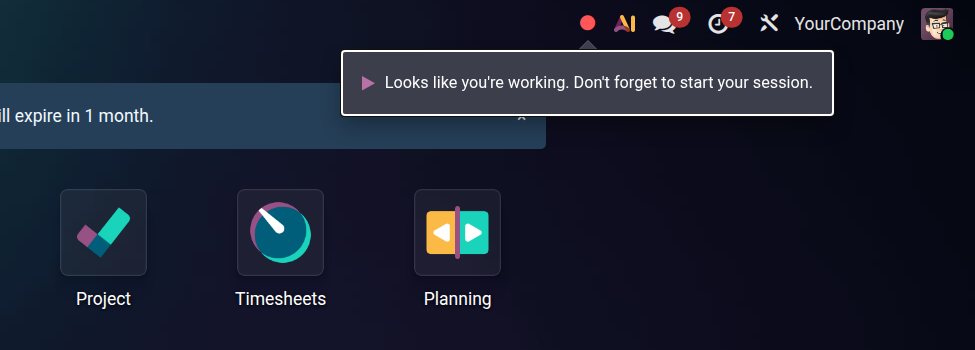
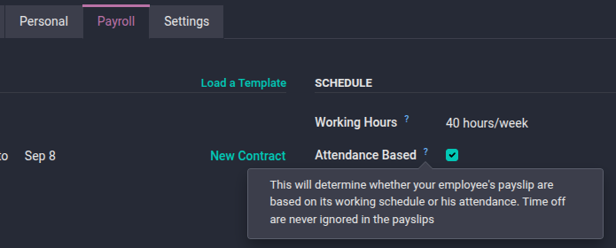
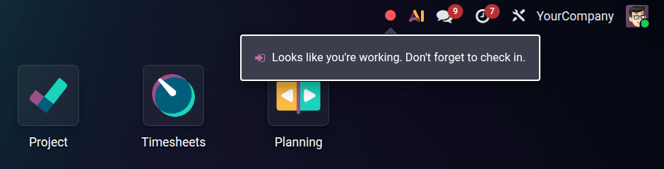
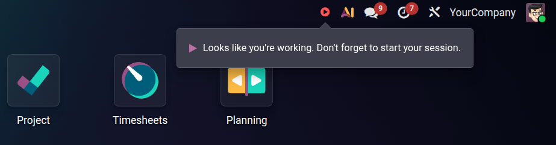

.. _attendances/reminders:

=========
Reminders
=========

Odoo's **Attendances** and **Timesheets** applications include a reminder system that prompts
employees to record their time when they are scheduled to work but have not yet done so. When an
employee first becomes active during working hours, Odoo waits 15 minutes. If the employee still
has not checked in or started a session, a popup appears below the relevant systray icon in the
upper-right corner of the top main header menu.

.. _attendances/reminders/configuration:

Configuration
=============

No dedicated setting is required to enable reminders. The popup appears automatically based on
each employee's configuration and installed apps. To control which reminder an employee receives,
configure the employee's record.

.. _attendances/reminders/configuration/check-in:

Check-in reminder
-----------------

For the check-in reminder to appear, the :guilabel:`Attendance Based` option must be enabled on the
employee's record. To configure this:

#. Open the **Employees** app and open the employee's record.
#. Click the :guilabel:`Payroll` tab.
#. In the :guilabel:`Schedule` section, enable the :guilabel:`Attendance Based` checkbox.
#. Save the record.

.. note::
   The **Work Entries Attendance** app must be installed for the
   :guilabel:`Attendance Based` option to appear.

.. _attendances/reminders/configuration/session:

Session reminder
----------------

For the session reminder to appear, the **Timesheets** app must be installed and the company's
timesheet encoding unit must be set to hours. To verify this, navigate to
:menuselection:`Settings --> Timesheets` and ensure the :guilabel:`Encoding Unit` is set to
:guilabel:`Hours`.

.. _attendances/reminders/types:

Reminder types
==============

The popup message and icon adapt to how the employee is configured to track time.

.. _attendances/reminders/types/check-in:

Check-in reminder
-----------------

Employees with the :guilabel:`Attendance Based` option enabled see the following message below the
:icon:`fa-circle` :guilabel:`(red circle)` attendance icon in the top menu bar:

   *Looks like you're working. Don't forget to check in.*

.. _attendances/reminders/types/session:

Session reminder
----------------

Employees who use **Timesheets** to track time see the following message below the
:icon:`fa-play` :guilabel:`(play)` timesheet icon in the top menu bar:

   *Looks like you're working. Don't forget to start your session.*

.. _attendances/reminders/types/merged:

Both apps installed
-------------------

When both **Attendances** and **Timesheets** are installed, the two systray icons merge into a
single button: the :icon:`fa-circle` :guilabel:`(circle)` attendance icon. The reminder still
appears on that merged icon. The message shown depends on the employee's contract:

- Employees with the :guilabel:`Attendance Based` option enabled see the check-in message.
- All other employees with timesheet access see the session message.

.. _attendances/reminders/behavior:

Behavior
========

.. _attendances/reminders/behavior/timing:

Timing
------

The 15-minute countdown begins the first time Odoo detects the employee is active. The popup
appears only when the employee is actively viewing the Odoo tab. If the tab is in the background
when the 15 minutes elapse, the reminder appears as soon as the employee returns to it.

.. _attendances/reminders/behavior/schedule:

Working schedule
----------------

Odoo checks the employee's assigned working hours and contract status before showing a reminder.
The popup does not appear outside of contracted working hours, on days off, or during approved
leave.

.. _attendances/reminders/behavior/cross-tab:

Multiple tabs
-------------

Reminders are synchronized across browser tabs. Once acted upon in one tab, the popup does not
appear in any other open Odoo tab for the rest of the workday.

.. _attendances/reminders/behavior/reset:

State resets
------------

If an employee checks out during the day and later becomes active again without checking back in,
the reminder reactivates. A new 15-minute wait begins from that point.

.. _attendances/reminders/action:

Responding to a reminder
========================

The popup stays on screen until it is acted upon. It cannot be dismissed by clicking elsewhere or
pressing :kbd:`Escape`.

To respond to the reminder:

#. Click the popup. The attendance or timesheet menu opens automatically.
#. Click :guilabel:`Check In` or :guilabel:`Start Session` to begin recording time.

Once time tracking is underway, the reminder disappears and does not appear again for the rest of
the workday.

.. seealso::
   - :doc:`check_in_check_out`
   - :doc:`/applications/hr/payroll/contracts`
   - :doc:`/applications/services/timesheets`
