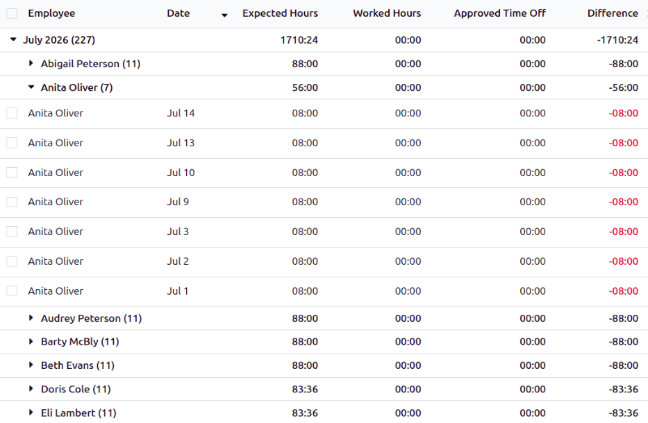

===============
Time off ledger
===============

The *Time Off Ledger* report in the **Attendances** app helps managers by flagging missing hours on
employee attendance records. This allows managers to determine if employees are forgetting to sign
in or out, decide if time off needs to be approved, and potentially flag patterns.

View time off ledger report
===========================

To view the *Time Off Ledger* report, navigate to :menuselection:`Attendances app --> Reporting -->
Time Off Ledger`. The report displays a nested list of missing attendance hours from the last two
months. All entries are grouped by month, then employee. Click the :icon:`fa-caret-right`
:guilabel:`(triangle)` icon to display the list of employees, then click the :icon:`fa-caret-right`
:guilabel:`(triangle)` icon on the individual employee to view all the detailed attendance records.

When expanded, each individual record displays the following information:

- :guilabel:`Employee`: The employee with missing hours.
- :guilabel:`Date`: The date the missing hours are from.
- :guilabel:`Expected Hours`: The number of hours the employee should have worked that day,
  calculated from their :ref:`working schedule <employees/schedule>`, configured on their employee
  record.
- :guilabel:`Worked Hours`: The total logged time the employee worked that day.
- :guilabel:`Approved Time Off`: The approved hours of time off for that day.
- :guilabel:`Difference`: The difference between the :guilabel:`Expected Hours` and the
  :guilabel:`Worked Hours` for the employee that day.

Resolve conflicts
=================

When missing hours appear on the report, the entries should be investigated to determine the issue.
The common reasons for missing attendance records are:

- :ref:`Forgot to log in to work that day. <attendances/forgot-log>`
- :ref:`Forgot to request time off that day. <attendances/forgot-request>`
- :ref:`Their time off request was not approved for that day. <attendances/unapproved-time-off>`
- :ref:`They requested time off for part of their workday, but did not log any attendance records
  for the remainder of the time. <attendances/forgot-partial-log>`

Once the reason for the missing entry is determined, the required records can be updated. Once
updated, the related entries are no longer displayed in the *Time Off Ledger* report.

.. _attendances/forgot-log:

Forgot to log in to work
------------------------

Occasionally, employees forget to log in and out of the **Attendances** app. When this occurs, the
employee's manager must :ref:`create the attendance records <attendances/create-records>`
retroactively in the **Attendances** app.

.. _attendances/forgot-request:

Forgot to request time off
--------------------------

If the employee did not request time off, the employee's manager or time off officer must
:ref:`create the missing time off request <time_off/missing>` retroactively in the **Time Off** app.

.. _attendances/unapproved-time-off:

Time off request was unapproved
-------------------------------

If the employee requested time off and the employee's manager or time off officer did not approve
the request in time, the :ref:`request must be approved <time_off/manage-time-off>` in the **Time
Off** app.

.. _attendances/forgot-partial-log:

Partial time off day missing attendance records
-----------------------------------------------

Occasionally, employees request time off for part of the workday, and are expected to work the
remainder of the day. When employees forget to log in and out for the partial workday, the
employee's manager must :ref:`create the attendance record <attendances/create-records>`
retroactively in the **Attendances** app.
