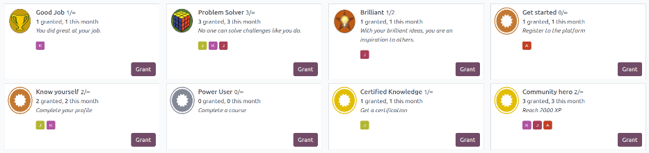
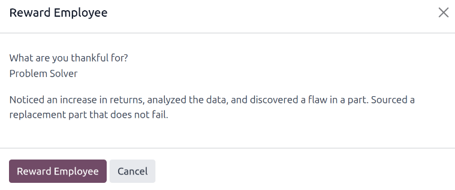

======
Badges
======

In Odoo, employees can earn badges, either automatically through :doc:`challenges created in the CRM
app <../../sales/crm/optimize/gamification>`, through **eLearning** courses, or manually, as
managers decide to award them.

Badges are a way to gamify the work day, can be created for any reason, and can be granted to any
user.

.. important::
   Badges can **only** be awarded to :doc:`users of the database <../../general/users>`, *and* if
   the **eLearning** app is installed.

View available badges
=====================

To view the available badges that are configured by default, navigate to :menuselection:`Employees
app --> Configuration --> Badges`.

All badges appear in a default Kanban view, with the badge's :guilabel:`Name` and image displayed.
Additionally, the number of users awarded the badge for both the current month, and in total,
appears, along with the badge description, and the avatar for each user who received the badge.

Each badge has a :guilabel:`Grant` button to :ref:`award the badge <employees/grant_badge>` from the
:guilabel:`Badges` dashboard.

Create badges
=============

Badges can be created in the database when the default badges are not sufficient. This can be done
from the :guilabel:`Badges` dashboard in the **Employees** app, or from the **CRM** app.

To add a badge in the **Employees** app, first navigate to :menuselection:`Employees app -->
Configuration --> Badges`, then click the :guilabel:`New` button in the upper-left corner.

Fill out the badge form as outlined in the :ref:`CRM documentation <crm/create-rewards>`.

.. seealso::
   :ref:`CRM Gamification <crm/create-rewards>`

View employee badges
====================

To view badges awarded to an employee, open the **Employees** app, and click on an employee record.
Click on the :guilabel:`Received Badges` tab to view any awarded badges.

.. note::
   If this tab is not visible, it means there is no :guilabel:`Related User` in the
   :guilabel:`Settings` tab. Once a user is populated in the :guilabel:`Related User` field, the
   :guilabel:`Badges` tab appears.

.. _employees/grant_badge:

Grant badges
============

To grant a badge to an employee, open the employee record, and click into the :guilabel:`Received
Badges` tab. Click the :guilabel:`Grant a Badge` button to load a :guilabel:`Reward Employee` pop-up
window.

Using the drop-down menu, select the badge being awarded in the :guilabel:`What are you thankful
for?` field. The default options are :guilabel:`Good Job`, :guilabel:`Problem Solver`, and
:guilabel:`Brilliant`.

.. note::
   Additional options appear (e.g., :guilabel:`Get Started`, :guilabel:`Power user`,
   :guilabel:`community Hero`) which are associated with challenges. These are automatically granted
   through completed challenges. While these can be awarded at any time, it is advised to grant
   badges manually that are *not* associated with a challenge.

Next, enter a brief summary of why the badge is being granted in the field displaying
:guilabel:`Describe what they did and why it matters (will be public)` field. Last, click the
:guilabel:`Reward Employee` button, and the badge is awarded, and is visible in the
:guilabel:`Badges` tab.

.. note::
   Users cannot grant themselves badges. An error message appears if attempted.

