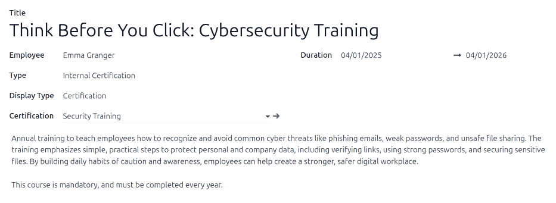

==============
Certifications
==============

When jobs require specific knowledge, it is necessary to track employee certifications to ensure the
necessary knowledge and certifications are in place.

When jobs require specific knowledge, track employee certifications (e.g., classes, tests, seminars)
to verify required skills. Odoo accepts any certification type without restriction.

.. important::
   To add certifications to an employee profile, and to access the *Employee Certifications* report,
   the **Surveys** app **must** be installed.

View certifications
===================

To view a full list of all employee certifications, navigate to :menuselection:`Employees app -->
Reporting --> Certifications`.

All certifications appear in a list view, grouped by employee. Each certification entry displays the
following:

- :guilabel:`Employee`: the employee's name, along with their avatar image.
- :guilabel:`Name`: the title of the certification.
- :guilabel:`Validity Start`: when the employee received the certification.
- :guilabel:`Validity End`: when the certification expires.
- :guilabel:`Certification`: the corresponding course in the **Surveys** app that was completed by
  the employee, if applicable.

The entries are also color-coded. Current certifications that are still valid appear in black,
expired certifications appear in red, and certifications that are going to expire within the next 90
days appear in orange.

.. image:: certifications/certifications.png
   :alt: The list of employee certifications.

.. important::
   **Only** certification records with the *Display Type* set to *Certification* on their
   :ref:`certification form <employees/certifications-form>` appear on the :guilabel:`Employee
   Certifications` report. All other certifications appear in the resume section of the
   :ref:`employee form <employees/resume>`.

View certifications by expiration status
----------------------------------------

When managing a large number of employees with a variety of certifications, it can be difficult to
determine which employees need to keep necessary certifications current in the default list view. In
this scenario, it is beneficial to view the certifications by expiration status.

To do so, navigate to :menuselection:`Employees app --> Reporting --> Certifications`. Next, click
the :icon:`fa-caret-down` :guilabel:`(Toggle Search Panel)` icon in the search bar, then click
:guilabel:`Add Custom Group`  :icon:`fa-caret-down`, revealing a drop-down menu. Click
:guilabel:`Expiration Status`, then click away from the drop-down menu to close it.

After doing so, all the certifications are organized by status, starting with :guilabel:`Expired`
certifications, then certifications that are :guilabel:`Expiring` soon (within the next 90 days),
and lastly, certifications that are still :guilabel:`Valid`.

Filter certifications by expiration status to identify certifications expiring soon, and identify
employees who must renew.

.. image:: certifications/status.png
   :alt: The list of employee certifications, grouped by status.

.. _employees/certifications-form:

Log a certification
===================

To log a certification for an employee, navigate to :menuselection:`Employees app --> Reporting -->
Certifications`. Click :guilabel:`New`, and a blank certification form loads. Enter the following
information on the form:

- :guilabel:`Title`: Enter a short description for the certification in this field.
- :guilabel:`Employee`: Using the drop-down menu, select the employee who received the
  certification.
- :guilabel:`Type`: Using the drop-down menu, select the type of certification received. This field
  determines where on the employee's resume the certification appears. To create a new
  :guilabel:`Type`, enter the type in the field, then click :guilabel:`Create [type]`.

  The default options are:

  - :guilabel:`Experience`: Select this option to have the certification appear in the *Experience*
    section of the *Resume* tab on the :doc:`employee form <new_employee>`. Experience entries are
    typically previous jobs or internships.
  - :guilabel:`Education`: Select this option to have the certification appear in the *Education*
    section of the *Resume* tab on the :doc:`employee form <new_employee>`.
  - :guilabel:`Social Media`: Select this option to have the certification appear in the *Social
    Media* section of the *Resume* tab on the :doc:`employee form <new_employee>`. Social Media
    entries typically relate to certifications relating to digital marketing, social media
    management, and specific trainings from social media platforms.
  - :guilabel:`Internal Certification`: Select this option to have the certification appear in the
    *Internal Certification* section of the *Resume* tab on the :doc:`employee form <new_employee>`.
    Internal certifications entries are tied to courses, training, or programs created by the
    company, that once completed, have a certification associated with it.
  - :guilabel:`Completed Internal Training`: Select this option to have the certification appear in
    the *Completed Internal Training* section of the *Resume* tab on the :doc:`employee form
    <new_employee>`. Completed internal training entries are typically associated with trainings
    created by the company, for company-specific processes. These do not result in any
    certifications, but are logged on the employee profile to indicate completed training.

- :guilabel:`Display Type`: Select the visibility of the certification in this field. The default
  options are:

  - :guilabel:`Classic`: Select this option to have the certification appear in the *Resume* section
    of the employee form, and **not** appear on the *Employee Certifications* report.
  - :guilabel:`Certification`: select this option to have the certification appear in the *Resume*
    section of the employee form, **and** appear on the *Employee Certifications* report. Once this
    is selected, a :guilabel:`Certification` field appears beneath the :guilabel:`Display Type`
    field. Using the drop-down menu, select the corresponding **Surveys** app certification the
    employee took. This field **only** appears if the **Surveys** app is installed.
  - :guilabel:`Course`: Select this option to have the certification appear in the *Resume* section
    of the employee form, and **not** appear on the *Employee Certifications* report. Once this
    option is selected, a :guilabel:`Course` field appears beneath the :guilabel:`Display Type`
    field. Using the drop-down menu, select the corresponding **eLearning** course the employee took.
    This field **only** appears if the **eLearning** app is installed.

- :guilabel:`Description`: Enter a description for the certification in this field.
- :guilabel:`Duration`: Click into the first field, and a calendar pop-over window appears. Click on
  the start and end dates for the certification validity period. When the correct dates are
  selected, click :icon:`fa-check` :guilabel:`Apply`, and both fields are populated.

.. note::
   Once a certification is logged for an employee, a new certification of the *same type* (i.e.
   :guilabel:`Education` or  :guilabel:`Internal Certification`) can be added directly from the
   employee form, instead of the :guilabel:`Employee Certifications` dashboard.

   In the main **Employees** app dashboard, click on an employee profile to open their employee
   form. In the :guilabel:`RESUME` tab, click the :guilabel:`ADD` button at the end of the
   corresponding certification line.

   This :guilabel:`ADD` button **only** appears on employee profiles that already have a
   certification.
